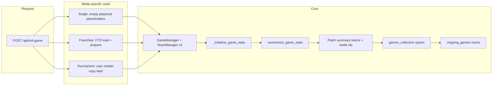

# Game Init System

**Purpose:** Describe end-to-end **game initialization**: how `POST /api/init-game` builds in-memory `GameManager` state, seeds mode-specific team data, writes the first `games` document, and registers the live instance. This is the authoritative place for **franchise FTD → game document** transfer at game start.

**Related:**
- `Settings_Persistence_Guide.md` and `Data_Persistence_System.md` — where settings live before/during/after gameplay.
- `Computer_Team_Game_Init_System.md` — defaults inside `TeamManager` when persisted settings are missing (strategy/playbook layers); complements this HTTP-level flow.

---

## Entry point

- **HTTP:** `POST /api/init-game`
- **Implementation:** `init_game()` in `BackEnd/api/api.py`

The handler creates a new `game_id`, constructs `GameManager`, runs first-pass game stat initialization, builds a summary via `summarize_game_state()`, merges mode-specific fields into `summary["teams"][…]`, **upserts** into `games_collection`, and stores the instance in `ongoing_games[game_id]`.

---

## Request payload (conceptual)

| Field | Role |
|--------|------|
| `home_team`, `away_team` | Display names matching `teams.name` (required). Used for roster load and, in franchise mode, to resolve Mongo `teams._id` for FTD lookup. |
| `mode` | `"single"` \| `"tournament"` \| `"franchise"` (default `"single"`). |
| `tournament_id` | Tournament mode: master doc id. |
| `franchise_id` | Franchise mode: franchise doc id (string/ObjectId-compatible). |
| `user_team_side` | `"home"` \| `"away"` — drives `is_user_team`, persisted `user_team_side`, and franchise community-engagement crowd shift. |

---

## High-level flow



---

## Franchise mode: FTD → `GameManager` → game document

Franchise games use **`franchise_team_data`** (FTD), keyed by `(franchise_id, team_id)` where `team_id` is the **`teams` collection `_id`** for that franchise team.

### 1. Load FTD rows

`init_game()` calls `load_ftd_data_for_team(franchise_id, None, home_team)` and the same for `away_team`. Passing **`team_id=None`** is intentional: init always has reliable **team names** from the client; the backend must resolve the Mongo team id from `teams`.

**`load_ftd_data_for_team`** (`BackEnd/api/api.py`):

1. If `team_id` is a valid `ObjectId` string, use it.
2. Otherwise, if `team_name` is set, resolve `team_object_id` via `teams_collection.find_one({"name": team_name})`.
3. Query `franchise_team_data_collection.find_one({"franchise_id": ObjectId(franchise_id), "team_id": team_object_id})`.
4. Return a dict with `team_attributes`, `strategy_settings`, `playbook_settings`, `plays`, `scouting_data`, or `None` if resolution/query fails.

**Important (April 2026):** Earlier implementations returned `None` whenever `team_id` was falsy *before* attempting the `team_name` lookup, so **`init-game` never loaded FTD** when called with `None`. That produced empty playbook/strategy on the game snapshot until other routes merged FTD. Name-based resolution must run whenever `team_id` is omitted but `team_name` is present.

### 2. Normalize for a fresh game: `prepare_ftd_for_new_game`

**File:** `BackEnd/utils/franchise_ftd_game_seed.py`

Takes the FTD payload (or `None`) and returns pieces for `GameManager`:

- **`team_attributes` / `strategy_settings`:** copied when non-empty; else `None` (downstream defaults apply).
- **`playbook_settings`:** dict copy (may be empty).
- **`plays`:** per-play **`game_stats` reset** to zeros; effectiveness / cloaking / momentum preserved from FTD.
- **`scouting_data`:** deep copy with defense **`game_stats` reset** to the greenfield structure.

This matches the franchise **greenfield Q1** path in `simulate-quarter` when a new `GameManager` is created without an existing cached game.

### 3. Construct `GameManager`

`GameManager` receives prepared attributes, strategy, plays, and scouting for both sides. **Playbook settings** are applied in a follow-up step:

```text
gm.home_team.playbook_settings = dict(home_playbook_for_gm)
gm.away_team.playbook_settings = dict(away_playbook_for_gm)
```

So both **user and CPU** franchise teams enter the first summarize with full FTD playbooks when FTD rows exist.

### 4. First `summarize_game_state` and game doc baseline

After `_initialize_game_stats`, the handler sets scores to zero and calls `summarize_game_state(gm, exclude_animations=True)`, attaches `game_id`, `mode`, `franchise_id`, `user_team_side`, etc.

Then, for franchise mode, it **persists the FTD baseline** under canonical team keys from `gm.home_team.team_id` / `gm.away_team.team_id`:

- `summary["teams"][team_id]["playbook_settings"]` — if non-empty prepared playbook.
- `summary["teams"][team_id]["strategy_settings"]` — if non-empty prepared strategy.

That makes the **game document** a usable snapshot for `GET /api/playbooks?game_id=…` and related reads without relying on silent FTD merge for missing data.

### 5. Logging (operations)

Watch for:

- `⚠️ [INIT-GAME] No FTD row for home/away team=…` — name mismatch, missing FTD doc, or wrong `franchise_id`.
- `✅ [INIT-GAME] FTD loaded for …` — FTD document found.
- `✅ [INIT-GAME] Game doc FTD baseline: … playbook_keys=… strategy_keys=…` — what was written onto `summary["teams"]` before upsert.

---

## Tournament mode init

- **Attributes:** not loaded from FTD; tournament / single paths use other loaders when applicable.
- **Playbook / strategy snapshot:** after summarize, the handler loads the **tournament** document and copies **`playbook_settings` and `strategy_settings` from the user’s tournament team object** into `summary["teams"][user_team_id_in_game]` only. It also applies those dicts onto the corresponding `TeamManager` so gameplay matches the master without extra DB reads.
- **CPU opponent** in that matchup may still rely on `TeamManager` defaults where the tournament block does not copy master data (see `Computer_Team_Game_Init_System.md` for default behavior).

---

## Single game mode init

- **Init handler** initializes `home_playbook_settings` / `away_playbook_settings` as empty dicts and, after summarize, assigns them into `summary["teams"][…]["playbook_settings"]`, and syncs `GameManager` team playbooks to those dicts.
- **Strategy and other team shape** come from `TeamManager` construction (defaults or future request fields). Single-game evolution of playbooks during play is handled by summarize/save paths documented in `Data_Persistence_System.md`.

---

## Database and runtime effects

| Output | Details |
|--------|---------|
| **`games` document** | `update_one({"_id": game_id}, {"$set": summary}, upsert=True)`. `_id` is typically a **string** 24-hex id from `generate_game_id()` (see persistence docs for save/load `_id` parity). |
| **`ongoing_games[game_id]`** | Live `GameManager` for immediate quarter sim and reads until process eviction. |

---

## Parity: `simulate-quarter` greenfield (franchise)

When simulation starts a **new** in-process game for franchise mode (no existing cached GM), the same **`load_ftd_data_for_team` + `prepare_ftd_for_new_game`** pattern is used so Q1 creation matches **`init-game`** seeding (strategy fallback when the request omits a side, plays/scouting normalization, etc.). See the franchise branch in `simulate_quarter_endpoint` logic in `BackEnd/api/api.py` near the `prepare_ftd_for_new_game` import.

---

## What this doc does *not* cover

- **Resuming** an existing game (must **not** call `init-game` when `game_id` is already present — see `Timeout_System.md` / lineup flow).
- **Lazy** creation of tournament/single team objects on first Game Plan / Playbooks visit (`ensure_team_objects_exist` in `gameplan_routes.py`).
- **Season / franchise mode initialization** (`Mode_Init_System.md`, `franchise_manager.initialize_season`).

---

## Key files

| Area | File(s) |
|------|---------|
| HTTP init | `BackEnd/api/api.py` — `init_game()`, `load_ftd_data_for_team()` |
| FTD normalization | `BackEnd/utils/franchise_ftd_game_seed.py` — `prepare_ftd_for_new_game()` |
| In-memory game | `BackEnd/models/game_manager.py` — `GameManager` |
| Per-team state | `BackEnd/models/team_manager.py` — `TeamManager` |
| Summary → DB shape | `BackEnd/utils/shared.py` — `summarize_game_state()` |
| Greenfield Q1 (franchise) | `BackEnd/api/api.py` — franchise branch using `prepare_ftd_for_new_game` |
| Collections | `franchise_team_data`, `teams`, `games` |

---

**Last updated:** April 2026 (FTD name-resolution fix at `init-game` documented alongside full flow.)
