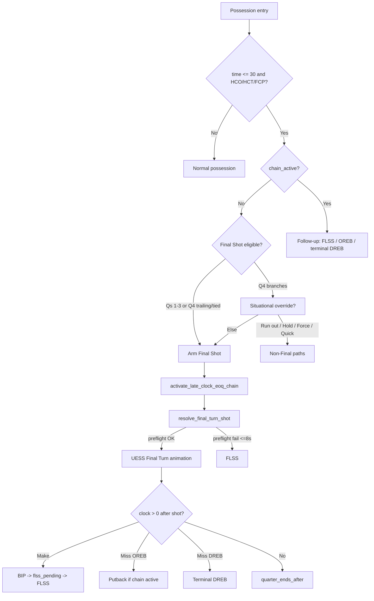

# End of Quarter (EOQ) System

**Status:** Active — clock-driven EOQ with structured Final Shot, FLSS chains, and observability (2026-06).

This document is the **canonical reference** for end-of-quarter gameplay logic and execution: when the period ends, how **Final Shot** arms and runs, how **FLSS** and follow-up possessions work, and which backend flags/API fields agents should inspect.

**Related (do not duplicate here):**
- Q4/OT **score-band** situational rules (Slow It Down, Quick Shot, Force Foul, Run Out) → [`Situational_Logic_System.md`](Situational_Logic_System.md)
- Full-game completion (Q4/OT final, overtime, navigation) → [`End_Of_Game_System.md`](End_Of_Game_System.md)
- OREB putback floors and kickout math → [`Rebound_System.md`](Rebound_System.md)
- Product backlog / polish items → [`projects/EOQ_Perfection_Brief.md`](../projects/EOQ_Perfection_Brief.md)

---

## 1. Design principles

1. **Quarter end is clock-driven.** A period ends when `game_state.time_remaining` reaches **0**, not when a possession flag fires alone.
2. **Final Shot runs once per chain.** The first eligible possession at **≤ 30s** runs the full Final Turn setup (alignment + rolled anchor + UESS schema). Follow-ups use **FLSS**, **OREB putback**, or **terminal DREB** — not a second full Final Turn setup.
3. **Backend owns routing.** The frontend renders turn payloads (`animation_steps`, flags). It must not decide EOQ branches locally.
4. **OREB ≠ EOQ chain.** Offensive rebounds happen all game. They route to putback turns but **do not** start the EOQ chain unless clock ≤ 30 **and** a chain is already active (see §5).

---

## 2. Key files

| Area | Path |
|------|------|
| EOQ routing, chain flags, rebound/make/FT follow-ups | `BackEnd/utils/eoq_clock_progression.py` |
| Final Shot gate, `resolve_final_turn_shot()`, emit | `BackEnd/models/turn_manager.py` |
| Final Turn shot logic, shooter weights, blocking-foul FT rule | `BackEnd/engine/phase_resolution.py` → `resolve_final_turn_shot_logic()` |
| Preflight / anchor budget, FLSS fallback gate | `BackEnd/engine/final_turn_pacing.py` |
| FLSS sprint-and-shoot | `BackEnd/engine/eoq_perfection.py` |
| Structured debug logs (`[EOQ-TRACE]`) | `BackEnd/engine/eoq_debug_log.py` |
| FE trace helper | `FrontEnd/static/js/phaser/utils/eoqDebugLog.js` |
| Q4 situational predicates | `BackEnd/utils/situational_logic.py` |
| Quarter-break chain scrub | `BackEnd/api/api.py` (on `quarter_complete`) |
| Unit tests | `tests/test_eoq_clock_progression.py` |

**Constants** (in `eoq_clock_progression.py`):

| Constant | Value | Meaning |
|----------|-------|---------|
| `LATE_CLOCK_THRESHOLD` | 30 | Late-clock EOQ window (seconds) |
| `OREB_PUTBACK_ONLY_THRESHOLD` | 6 | Under 6s → always putback (no kickout) |
| `FLSS_PREFLIGHT_FALLBACK_MAX_CLOCK` | 8 | Preflight failure routes to FLSS only at ≤ 8s; above that, best-effort Final Turn |
| `LATE_CLOCK_BIP_RUNOFF_SECONDS` | 2 | Game-clock burn on BIP after late-clock make |

---

## 3. Game-state flags

| Flag | Set when | Cleared when | Purpose |
|------|----------|--------------|---------|
| `late_clock_eoq_chain_active` | Final Shot arms; extended during active EOQ chain | `clear_late_clock_eoq_chain()` at quarter boundary | **Blocks re-arming** full Final Shot on follow-up possessions |
| `final_turn_shot_this_turn` | Final Shot gate passes | Popped when turn resolves | Routes turn to `resolve_final_turn_shot()` |
| `final_shot_possession_active` | Same as above | Cleared after turn stamped | Internal arming guard |
| `flss_possession_pending` | After late-clock BIP/SIP make (or FT make in chain) | Popped at FLSS turn start | Next offense turn → FLSS |
| `pending_oreb` | Miss/block OREB | Consumed on putback turn | Putback possession |
| `eoq_trace_seq` / `eoq_trace_turn_in_seq` | EOQ trace enabled | Quarter break clear | Correlate logs FE ↔ BE |

**Turn payload fields** (API / `turns[]`):

| Field | Meaning |
|-------|---------|
| `final_turn` | Structured Final Turn possession |
| `final_shot_possession` | Same pipeline; FE announcement |
| `flss` / `flss_zone` | Forced Last Second Shot turn |
| `late_clock_eoq` | Turn is part of an active late-clock EOQ chain |
| `terminal_dreb_eoq` | Terminal defensive rebound (clock burn, no outlet) |
| `final_turn_anchor_clock` | Rolled shoot/drive anchor (seconds) |
| `quarter_ends_after` | Period ends after this turn; no BIP/OREB follow-up |

---

## 4. Quarter-end authority

- **`quarter_complete`** on simulate-turn when `time_remaining <= 0` after processing (including terminal FTs).
- **Airhorn / quarter break UI:** FE expects turn contract `clock_end === 0` with `clock_start > 0` on the ending turn.
- **EOG vs OT:** Backend `is_final` — see [`End_Of_Game_System.md`](End_Of_Game_System.md). EOQ handles **within-period** clock; EOG handles **game** finality.

On quarter break, `api.py` clears EOQ flags (`clear_late_clock_eoq_chain`, drops `final_turn_shot_this_turn`, timeout fields). EOQ chain flags must **not** survive into the next quarter.

---

## 5. EOQ chain lifecycle



### What starts the chain

**Only these should set `late_clock_eoq_chain_active` for the first time in a quarter:**

1. **Final Shot arming** in `turn_manager.run_micro_turn()` when `final_turn_eligible` passes.
2. **FLSS** paths when entering forced last-second shot (including preflight fallback).

**What extends but does not start the chain:**

- Late-clock **OREB** after a miss — only if `time_remaining ≤ 30` **and** `_late_chain_active()` (chain already started or turn already tagged).
- Late-clock **makes** in chain → `apply_post_make_late_clock_routing`.
- **FLSS** post-emit → `finalize_flss_post_emit`.
- **BIP after make** → `schedule_flss_after_inbound`.

### Critical bug class (fixed 2026-06)

**Do not** call `activate_late_clock_eoq_chain()` on every OREB. Early-quarter OREBs (e.g. at 5:00) used to permanently block Final Shot because the gate requires `not late_clock_eoq_chain_active`. OREB routing still sets `pending_oreb` for putbacks; chain activation is gated in `apply_post_miss_rebound_routing()`.

---

## 6. Final Shot — trigger gate

Evaluated at **possession entry** in `turn_manager.run_micro_turn()` (before state routing):

```text
final_turn_eligible =
    quarter is set
    AND int(time_remaining) <= 30
    AND state != FAST_BREAK
    AND state in (HCO, HCT, FCP)
    AND NOT flss_possession_pending
    AND NOT late_clock_eoq_chain_active
```

**Also:** at start of each quarter, if `_last_final_turn_quarter != quarter`, call `clear_late_clock_eoq_chain()`.

**Excluded at entry (re-evaluated next turn):** Fast Break, OREB putback turn, possessions while `flss_possession_pending` is set, any possession after chain is already active.

**Important:** Eligibility uses clock **at possession start**, not when the shot is released. A possession entering at 0:43 will not arm Final Shot even if the shot occurs at 0:28.

When the gate passes:

1. Set `final_turn_shot_this_turn`, `final_shot_possession_active`.
2. `activate_late_clock_eoq_chain(game_state)`.
3. Log `CHAIN` event `FINAL_SHOT_TRIGGERED` (when EOQ trace enabled).

---

## 7. Final Shot — execution pipeline

When `final_turn_shot_this_turn` is popped during handler routing:

1. **`resolve_final_turn_shot()`** (`turn_manager.py`)
2. **`_build_final_turn_offense_alignment()` / `_build_final_turn_defense_alignment()`** — zone defense, wing/corner/key spots.
3. **`resolve_final_turn_shot_logic()`** (`phase_resolution.py`) — shooter selection, shot type, foul/shot resolve.
4. **Preflight** (`final_turn_pacing.py`) — simulates walk-up from rolled anchor; sets `_step_t_floor_game_seconds` on skeleton step 0.
5. **`_emit_hco_animation_steps()`** → `build_skeleton_animation_steps` — full UESS schema; FE plays from step 0 (no FE alignment tween).
6. Stamp turn: `final_turn`, `final_shot_possession`, `final_turn_anchor_clock`.

### Rolled anchors (once per possession)

| Shot type | Anchor |
|-----------|--------|
| Outside | Shoot at `random.randint(1, 3)` seconds remaining |
| Attack | Drive start at `random.randint(2, 4)` seconds remaining |

### Shooter / play rules

- **Ball handler:** Prefer live `last_ball_handler` if PG/SG/SF; else 60% PG / 30% SG / 10% SF.
- **Shot choice:** 50% Outside / 50% Attack; Q4+ trailing by **exactly 3** → forced Outside three.
- **Shooter weights:** Rank by SH (outside) or SC+AG (attack); weighted random 50 / 30 / 20 / 9 / 1.
- **Blocking foul on attack:** Exactly **2 FTs** (no and-1) when `game_state["final_turn"]` during resolve.

### Preflight → FLSS fallback

If preflight cannot meet the anchor:

- **`time_remaining > 8`:** Best-effort Final Turn still emitted (walk-up consumes clock per design).
- **`time_remaining ≤ 8`:** Route to `resolve_flss_shot_logic()` (`route_flss` / `FINAL_SHOT_BUDGET_FLSS`).

At **game clock ≤ 0** on entry: if `final_turn_shot_this_turn` already set, Final Turn wins over FLSS; else FLSS or FINAL_HOLD per `turn_manager` low-clock branch.

### Frontend announcement

**"Final Shot"** when `turn.final_turn` (or `final_shot_possession`) and `result_type !== 'FINAL_HOLD'`. See [`Announcement_System.md`](Announcement_System.md).

---

## 8. FLSS — Forced Last Second Shot

**When:**

| Condition | Source |
|-----------|--------|
| `flss_possession_pending` after late-clock BIP/SIP | `schedule_flss_after_inbound()` |
| Final Turn preflight budget fail at ≤ 8s | `resolve_final_turn_shot()` |
| Game clock ≤ 0, eligible, Final Turn not already flagged | `turn_manager` low-clock branch |
| Low-clock routing when preflight impossible | `should_route_final_turn_to_flss()` |

**What:** Ball handler sprints for `time_remaining − 1` game seconds, shoots with ~1s on clock. No full alignment / entry-pass graph.

**Implementation:** `eoq_perfection.py` → `resolve_flss_shot_logic()`, `compute_flss_drive_plan()`, `build_flss_skeleton_steps()`.

**Zones:** normal / penalty / heave (heave terminal). See EOQ_Perfection_Brief for zone thresholds.

**Post-emit:** `finalize_flss_post_emit()` — 1s make burn at ≤ 1s clock; quarter drain when terminal.

---

## 9. Post-shot progression (clock > 0)

After shot resolution or the **last FT** of a trip, if `time_remaining > 0`:

| Outcome | Next step |
|---------|-----------|
| **Make, no foul** | BIP/SIP → `schedule_flss_after_inbound` → `flss_possession_pending` → FLSS |
| **Miss / Block, OREB** | `pending_oreb` → putback turn |
| **Miss / Block, DREB** (late chain) | `terminal_dreb_eoq` → DREB animation → clock drain |
| **Miss / Block, DREB** (not in chain) | Normal HCO for defense |
| **Shooting foul** | FTs; after **last** FT apply same rules via `apply_eoq_final_free_throw_routing` |

When `time_remaining == 0`:

- Set `quarter_ends_after`; no BIP / OREB / DREB follow-up.
- FE hold at rim (`holdFinalShotMs`, default 2000 ms) then quarter-break flow.

**BIP clock runoff:** `resolve_late_clock_bip_runoff()` burns up to 2s on inbound after late-clock make.

Turns in an active chain carry `late_clock_eoq: true` when tagged by make/miss/FLSS/OREB-in-chain paths.

---

## 10. OREB rules (EOQ context)

Universal rules (all quarters):

- **Putback vs kickout:** 90% / 10% normally; **100% putback** when `time_remaining < 6`.
- **Putback floor:** `OREB_PUTBACK_MIN_TIME_ELAPSED = 2` (see Rebound_System).
- **Block → OREB:** Same routing as miss when applicable.

**EOQ-specific:**

- Putback turn does **not** re-arm Final Shot if chain already active.
- OREB at **> 30s** or **without active chain:** putback only; no `late_clock_eoq` tag, no chain activation.

---

## 11. Q4 / OT situational branches (summary)

When `final_turn_eligible` and **quarter ≥ 4**, evaluate **before** arming Final Shot (in order):

| Branch | Condition | Result |
|--------|-----------|--------|
| **Run Out** | `should_run_out_clock()` — winning or blowout loss (>18), ≤30s, no force-foul defense | All players move offense-side; clock → 0; no shot |
| **FINAL_HOLD** | Slow It Down, Force Foul false | Hold until 0 |
| **Slow + Force Foul** | Slow It Down + Force Foul | Execute Force Foul; no Final Turn alignment |
| **Quick Shot** | Quick Shot band | Normal quick-shot HCO (no Final Turn setup) |
| **Else (trailing/tied)** | — | Full Final Shot setup |

**Qs 1–3:** Skip situational branches; same structured Final Turn as Q4 trailing/tied.

Full score-band tables and Force Foul timing → [`Situational_Logic_System.md`](Situational_Logic_System.md).

---

## 12. Observability — `[EOQ-TRACE]`

Enabled by default (`game_state['eoq_trace'] !== false`). Filter logs: **`[EOQ-TRACE]`**.

| Event | Meaning |
|-------|---------|
| `CHAIN` / `FINAL_SHOT_TRIGGERED` | Full Final Shot armed — **must appear** for real Final Turn |
| `CHAIN` / `FLSS_POSSESSION_START` | FLSS turn starting |
| `CHAIN` / `FLSS_SCHEDULED_AFTER_INBOUND` | Make + time left → inbound then FLSS |
| `TURN` role `FINAL_SHOT` | Turn has `final_turn` or `final_shot_possession` |
| `TURN` role `EOQ_CHAIN` | `late_clock_eoq` only — **not** full Final Shot |
| `STEP` flow `FINAL_SHOT` / `FLSS` | Pipeline substeps |

**Debugging checklist when Final Shot “didn’t trigger”:**

1. Was `FINAL_SHOT_TRIGGERED` logged? If no → gate failed.
2. Was `late_clock_eoq_chain_active` already true at entry? → premature chain (historically: early OREB bug).
3. Did possession **start** above 30s?
4. Q4 situational branch (Run Out, Quick Shot, Force Foul, Hold)?
5. Turn payload: `final_turn` null → backend never armed it (FE cannot fix).

Disable trace for bulk sims: `game_state['eoq_trace'] = False` or `window.GOB_EOQ_TRACE = false` (FE).

---

## 13. Agent quick-reference — common mistakes

| Symptom | Likely cause |
|---------|----------------|
| No Final Shot all quarter | `late_clock_eoq_chain_active` stuck true before first ≤30 possession |
| Trace says `FINAL_SHOT` but no announcement | Trace role was `EOQ_CHAIN` mislabeled (pre-2026) or `late_clock_eoq` without `final_turn` |
| FLSS loop without ever seeing Final Shot | Chain never started; makes keep scheduling FLSS after inbound in late clock |
| Quarter ends at 0:01, no airhorn | Clock never drained to 0 on terminal turn |
| Resume after timeout, weird EOQ | Stale timeout anchor / chain flags — see [`Mid_Game_Resume_System.md`](../01_Data_Persistence/Mid_Game_Resume_System.md) |

---

## 14. Change log (doc)

| Date | Note |
|------|------|
| 2026-06 | Initial EOQ_System.md; OREB chain gate fix documented; trace role `EOQ_CHAIN` vs `FINAL_SHOT` |
