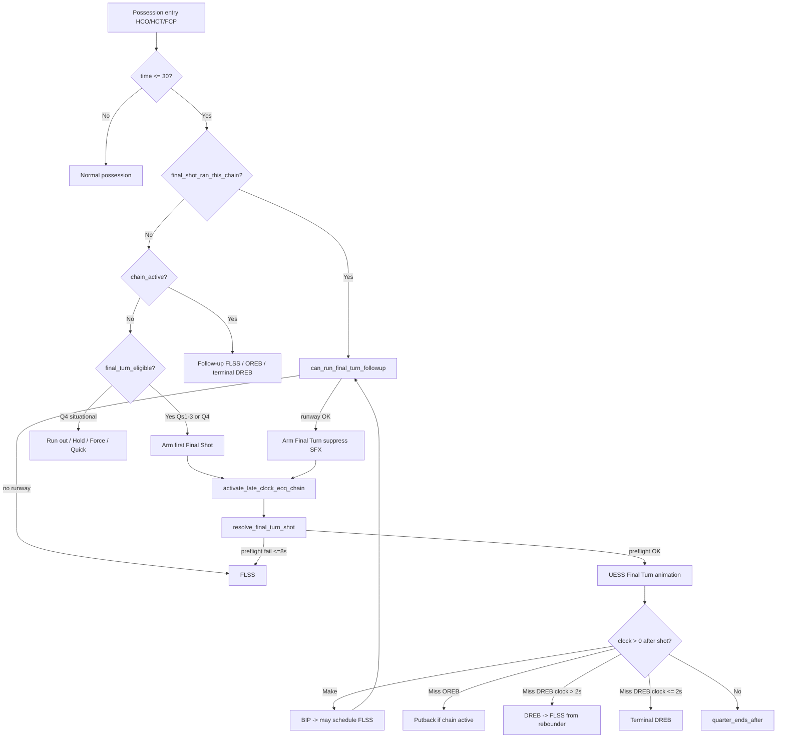

# End of Quarter (EOQ) System

**Status:** Active — clock-driven EOQ with structured Final Shot, runway-based follow-ups, FLSS, and observability (2026-06).

This document is the **canonical reference** for end-of-quarter gameplay logic and execution: when the period ends, how **Final Shot** arms and runs, how **FLSS** and follow-up possessions work, and which backend flags/API fields agents should inspect.

**Related (do not duplicate here):**
- Q4/OT **score-band** situational rules (Slow It Down, Quick Shot, Force Foul, Run Out) → [`Situational_Logic_System.md`](Situational_Logic_System.md)
- Full-game completion (Q4/OT final, overtime, navigation) → [`End_Of_Game_System.md`](End_Of_Game_System.md)
- OREB putback floors and kickout math → [`Rebound_System.md`](Rebound_System.md)
- Product backlog / polish items → [`projects/EOQ_Perfection_Brief.md`](../projects/EOQ_Perfection_Brief.md)

---

## 1. Design principles

1. **Quarter end is clock-driven.** A period ends when `game_state.time_remaining` reaches **0**, not when a possession flag fires alone.
2. **First Final Shot is gate-driven; follow-ups are runway-driven.** The first eligible half-court possession at **≤ 30s** arms full Final Turn setup (alignment + rolled anchor + UESS schema). After the first EOQ terminal shot completes, each subsequent HCO/HCT/FCP entry at ≤ 30s runs **`can_run_final_turn_followup()`**: enough runway → another full Final Turn; otherwise → FLSS.
3. **Backend owns routing.** The frontend renders turn payloads (`animation_steps`, flags). It must not decide EOQ branches locally.
4. **OREB ≠ EOQ chain start.** Offensive rebounds happen all game. They route to putback turns but **do not** start the EOQ chain unless clock ≤ 30 **and** a chain is already active (see §5). OREB kickout → HCO at ≤ 30 with chain inactive still arms the **first** Final Shot.

---

## 2. Key files

| Area | Path |
|------|------|
| EOQ routing, chain flags, rebound/make/FT follow-ups | `BackEnd/utils/eoq_clock_progression.py` |
| Final Shot gate, `resolve_final_turn_shot()`, emit | `BackEnd/models/turn_manager.py` |
| Final Turn shot logic, shooter weights, blocking-foul FT rule | `BackEnd/engine/phase_resolution.py` → `resolve_final_turn_shot_logic()` |
| Preflight / anchor budget, follow-up runway, FLSS fallback gate | `BackEnd/engine/final_turn_pacing.py` → `can_run_final_turn_followup()` |
| FLSS sprint-and-shoot | `BackEnd/engine/eoq_perfection.py` |
| Structured debug logs (`[EOQ-TRACE]`) | `BackEnd/engine/eoq_debug_log.py` |
| FE trace helper | `FrontEnd/static/js/phaser/utils/eoqDebugLog.js` |
| FE Final Shot announcement + SFX suppress | `FrontEnd/static/js/phaser/animation/turnPreparation.js`, `announcements.js` |
| Q4 situational predicates | `BackEnd/utils/situational_logic.py` |
| Quarter-break chain scrub | `BackEnd/api/api.py` (on `quarter_complete`) |
| Unit tests | `tests/test_eoq_clock_progression.py`, `tests/test_final_turn_pacing.py` |

**Constants** (in `eoq_clock_progression.py`):

| Constant | Value | Meaning |
|----------|-------|---------|
| `LATE_CLOCK_THRESHOLD` | 30 | Late-clock EOQ window (seconds) |
| `OREB_PUTBACK_ONLY_THRESHOLD` | 6 | Under 6s → always putback (no kickout) |
| `FLSS_PREFLIGHT_FALLBACK_MAX_CLOCK` | 8 | Preflight failure routes to FLSS only at ≤ 8s; above that, best-effort Final Turn |
| `POST_DREB_FLSS_MIN_CLOCK` | 2 | Post-DREB FLSS when chain active and clock **> 2s**; terminal DREB at ≤ 2s |
| `LATE_CLOCK_BIP_RUNOFF_SECONDS` | 2 | Game-clock burn on BIP after late-clock make or `late_clock_ft_resolution` |
| `FINAL_TURN_HANDOFF_CONVERGE_GRID` | 6.0 | Final Turn handoff **receive radius** — the PG converges to within this many grid of the live handler before the pass (in `constants/__init__.py`). NB: preflight sizes the handoff by the *real* PG→handler travel, not this radius. |

---

## 3. Game-state flags

| Flag | Set when | Cleared when | Purpose |
|------|----------|--------------|---------|
| `late_clock_eoq_chain_active` | EOQ window opens (HCO Final Shot arm **or** HCT/FCP window-only); extended during chain | `clear_late_clock_eoq_chain()` at quarter boundary | Marks ≤30 EOQ window in progress. Blocks first gate for non-HCO; HCO may still arm first Final Shot if `final_shot_ran_this_chain` is false |
| `final_turn_shot_this_turn` | **HCO only** — first gate Final Shot arm or §6b follow-up Final Turn | Popped when turn resolves | Routes HCO to `resolve_final_turn_shot()`. **Never set on HCT/FCP** |
| `final_shot_possession_active` | Same as above (HCO only) | Cleared after turn stamped | Internal arming guard for Final Shot execute |
| `suppress_final_shot_sfx` | Follow-up Final Turn armed (`EOQ_FOLLOWUP_FINAL_TURN`); **and all FLSS turns** (stamped by `resolve_flss_shot_logic`) | Popped when turn resolves; stamped on turn payload | FE skips the Final Shot stinger — on repeat full Final Turns, and on **every FLSS** (which fires its own heave/launch VO instead) |
| `flss_possession_pending` | FLSS follow-up chosen; or `schedule_flss_after_inbound` after chain make | Popped at FLSS turn start | Next offense turn → FLSS (may be overridden at entry by runway check) |
| `final_shot_ran_this_chain` | First EOQ terminal shot completes (`final_turn` or FLSS w/ `final_shot_possession`) | Quarter break clear | Enables runway-based follow-up routing |
| `flss_from_dreb` | After discrete DREB when EOQ chain + clock > 2s | Popped at FLSS resolve | Rebounder = BH; post-DREB FLSS sprint |
| `pending_oreb` | Miss/block OREB | Consumed on putback turn | Putback possession |
| `eoq_trace_seq` / `eoq_trace_turn_in_seq` | EOQ trace enabled | Quarter break clear | Correlate logs FE ↔ BE |

**Turn payload fields** (API / `turns[]`):

| Field | Meaning |
|-------|---------|
| `final_turn` | Structured Final Turn possession |
| `final_shot_possession` | Same pipeline; FE announcement |
| `flss` / `flss_zone` | Forced Last Second Shot turn |
| `late_clock_eoq` | Turn is part of an active late-clock EOQ chain |
| `terminal_dreb_eoq` | Terminal defensive rebound (clock burn, no outlet) |
| `flss_after_dreb` | Miss/block turn in chain: DREB → FLSS when clock > 2s |
| `skip_dreb_outlet_lead_in` | DREB turn payload: FE skips HCO outlet lead-in before FLSS |
| `suppress_final_shot_sfx` | Repeat full Final Turn in same EOQ sequence: FE skips the Final Shot stinger on follow-up full Final Turns (headline may still show) |
| `late_clock_ft_resolution` | Last FT at ≤ 30s resolved: tags turn for BIP runoff only; **does not** start chain |
| `final_turn_anchor_clock` | Rolled shoot/drive anchor (seconds) |
| `quarter_ends_after` | Period ends after this turn; no BIP/OREB follow-up |

---

## 4. Quarter-end authority

- **`quarter_complete`** on simulate-turn when `time_remaining <= 0` after processing (including terminal FTs).
- **Airhorn / quarter break UI:** FE uses `signalQuarterEnded` (`quarterEndAirhorn.js`). Eligible when `quarter_ends_after === true` or turn contract `clock_end === 0` with `clock_start > 0`. `clockTween` defers when `quarter_ends_after`; **`AnimationRouter` universal fallback** fires at end of every turn after boundary tween drain. See [`SFX_System.md`](../11_Design_Systems/SFX_System.md).
- **EOG vs OT:** Backend `is_final` — see [`End_Of_Game_System.md`](End_Of_Game_System.md). EOQ handles **within-period** clock; EOG handles **game** finality.

On quarter break, `api.py` clears EOQ flags (`clear_late_clock_eoq_chain`, drops `final_turn_shot_this_turn`, timeout fields). EOQ chain flags must **not** survive into the next quarter.

---

## 5. EOQ chain lifecycle



### What starts the chain

**Only these should set `late_clock_eoq_chain_active` for the first time in a quarter:**

1. **EOQ first gate** in `turn_manager.run_micro_turn()` when `final_turn_eligible` passes — HCO arms Final Shot (`FINAL_SHOT_TRIGGERED`); HCT/FCP open the window only (`EOQ_WINDOW_OPENED`).
2. **FLSS** paths when entering forced last-second shot (including preflight fallback / `LOW_CLOCK_FLSS`).

**What extends but does not start the chain:**

- Late-clock **OREB** after a miss — only if `time_remaining ≤ 30` **and** `_late_chain_active()` (chain already started or turn already tagged).
- Late-clock **makes** in chain → `apply_post_make_late_clock_routing`.
- **FLSS** post-emit → `finalize_flss_post_emit`.
- **BIP after make** → `schedule_flss_after_inbound`.
- **SIP after FOUL/CHARGE/DEAD_BALL in chain** → `schedule_flss_after_inbound(sip_gate_result)` (source tagged via `tag_result_if_late_clock_eoq_chain` or chain-active gate).
- **DREB after miss/block in chain (clock > 2s)** → `schedule_flss_after_dreb` (rebounder = ball handler; no HCO outlet).

### Critical bug class (fixed 2026-06)

**Do not** call `activate_late_clock_eoq_chain()` on every OREB. Early-quarter OREBs (e.g. at 5:00) used to permanently block Final Shot because the gate requires `not late_clock_eoq_chain_active`. OREB routing still sets `pending_oreb` for putbacks; chain activation is gated in `apply_post_miss_rebound_routing()`.

**Do not** start the chain on the last FT of a trip (`apply_eoq_final_free_throw_routing`). That path tags `late_clock_ft_resolution` on the turn for BIP runoff only. Terminal DREB / post-DREB FLSS on FT miss applies **only when the chain was already active** (e.g. shooting foul during Final Shot). Otherwise FT miss → OREB/DREB → next HCO entry can still arm the **first** Final Shot. When late-clock FT routing rewrites a final missed FT to `next_play_type="DREB"`, `game_manager` still promotes it into a discrete `DREB` row; the DREB row routes to the post-rebound state already stored in `game_state["offensive_state"]` (`HCO` or `FAST_BREAK`).

---

## 6. EOQ window + Final Shot ownership (first gate)

**Ownership rule**

> When clock ≤ 30, the EOQ **window** may open on any eligible possession entry (HCO / HCT / FCP).  
> **Full Final Shot** execute flags are **HCO-only**.  
> HCT / FCP / FB in that window play their normal state until entry clock ≤ 8 (or ≤ 0), then **FLSS**.  
> Never leave `final_turn_shot_this_turn` armed on a state that will not run Final Shot.  
> `final_shot_ran_this_chain` flips only after an **executed** Final Shot or FLSS.

Helpers: `eoq_first_gate_open()`, `should_arm_final_shot_execute_flags()` in `eoq_clock_progression.py`.

Evaluated at **possession entry** in `turn_manager.run_micro_turn()` (before state routing):

```text
first_gate_open =
    NOT late_clock_eoq_chain_active
    OR (state == HCO AND NOT final_shot_ran_this_chain)

final_turn_eligible =
    quarter is set
    AND int(time_remaining) <= 30
    AND state != FAST_BREAK
    AND state in (HCO, HCT, FCP)
    AND NOT flss_possession_pending
    AND first_gate_open
```

**Also:** at start of each quarter, if `_last_final_turn_quarter != quarter`, call `clear_late_clock_eoq_chain()`.

**Excluded at first-gate entry:** Fast Break, OREB putback turn, possessions while `flss_possession_pending` is set (unless overridden — see §6b).

**Important:** Eligibility uses clock **at possession start**, not when the shot is released. A possession entering at 0:43 will not open the EOQ window even if the shot occurs at 0:28.

When the first gate passes (trailing/tied path; Q4 situational branches may short-circuit first):

| Entry state | Action | Trace event |
|-------------|--------|-------------|
| **HCO** | `activate_late_clock_eoq_chain`; set `final_turn_shot_this_turn` + `final_shot_possession_active` | `FINAL_SHOT_TRIGGERED` |
| **HCT / FCP** | `activate_late_clock_eoq_chain` only — **no** Final Shot execute flags; continue normal trap/press | `EOQ_WINDOW_OPENED` |

After an HCT/FCP window-open, a later **HCO** entry with `final_shot_ran_this_chain` still false may still pass the first gate and arm Final Shot (fixes BIP→HCT@30 then later HCO without poisoning the quarter).

After the turn completes, if `final_turn` **or** (`flss` and `final_shot_possession`), set **`final_shot_ran_this_chain`**.

---

## 6b. Follow-up routing (after first EOQ terminal shot)

**Condition** (evaluated at the same possession entry point, **after** the first-gate block):

```text
final_shot_ran_this_chain
AND int(time_remaining) <= 30
AND state != FAST_BREAK
AND state in (HCO, HCT, FCP)
```

**Decision:** `can_run_final_turn_followup()` in `final_turn_pacing.py`:

- Builds conservative Final Turn skeleton scenarios (Outside @ 3s anchor, Attack @ 4s anchor; BH-shooter and pass-to-shooter variants).
- Simulates walk-up from `prior_turn.final_coords`, alignment, the **PG handoff** (converge+pass, sized by real PG→handler travel), and pre-anchor moves via `evaluate_final_turn_pacing()` — which returns a dual verdict (`can_meet_anchor` = base fits; `handoff_fits`) driving the 4-mode BH cascade in §7.
- **If any scenario fits and `state == HCO`** → arm another full Final Turn:
  - Set `final_turn_shot_this_turn`, `final_shot_possession_active`, `suppress_final_shot_sfx`.
  - Clear `flss_possession_pending` if set (overrides inbound-scheduled FLSS).
  - Log `CHAIN` / `EOQ_FOLLOWUP_FINAL_TURN`.
- **If any scenario fits and `state` is HCT/FCP** → **defer** (no execute flags): log `EOQ_FOLLOWUP_DEFER_FINAL_TURN`; next HCO may arm Final Shot, or ≤8 forces FLSS.
- **Else** (runway fail) → FLSS:
  - Set `flss_possession_pending` if not already set.
  - Log `CHAIN` / `EOQ_FOLLOWUP_FLSS`.

**Design intent:** Replace the old “chain active → always BIP → FLSS” loop with a per-entry runway check. Entry context matters: OREB kickout, BIP with runoff, DREB outlet, and press setup all change available time.

**SFX:** First full Final Turn plays the Final Shot stinger (once per quarter dedupe). Follow-up full Final Turns stamp `suppress_final_shot_sfx` — FE shows the “Final Shot” headline but skips the court stinger. FLSS never shows the headline; penalty/heave zones play coach VO via backend-stamped `sfx_on_step_start` on the terminal shoot step. Presentation rules do **not** drive routing.

**Not re-evaluated on:** OREB putback turns, BIP/SIP bypass turns, discrete DREB turns, FT line. The next **half-court entry** after those paths runs this check.

---

## 7. Final Shot — execution pipeline

When `final_turn_shot_this_turn` is popped during handler routing:

1. **`resolve_final_turn_shot()`** (`turn_manager.py`)
2. **`_build_final_turn_offense_alignment()` / `_build_final_turn_defense_alignment()`** — zone defense, wing/corner/key spots.
3. **`resolve_final_turn_shot_logic()`** (`phase_resolution.py`) — shooter selection, shot type, foul/shot resolve.
4. **Preflight** (`final_turn_pacing.py`) — simulates walk-up from rolled anchor; reserves worst-case shot micro-movement burn (+ attack drive reserve); sets `_step_t_floor_game_seconds` on skeleton step 0.
5. **`_emit_hco_animation_steps()`** → `build_skeleton_animation_steps` — full UESS schema; FE plays from step 0 (no FE alignment tween).
6. Stamp turn: `final_turn`, `final_shot_possession`, `final_turn_anchor_clock`.

### Rolled anchors (once per possession)

| Shot type | Anchor |
|-----------|--------|
| Outside | Shoot at `random.randint(1, 3)` seconds remaining |
| Attack | Drive start at `random.randint(2, 4)` seconds remaining |

### Shooter / play rules

- **Ball handler — 4-mode cascade.** The PG is the *preferred* BH; the acting BH depends on whether the ball can be delivered to him within budget. Preflight (`evaluate_final_turn_pacing`) returns a **dual verdict**: `can_meet_anchor` = the base Final Shot (no handoff) fits; `handoff_fits` = base **+** handoff fits. `resolve_final_turn_shot_logic` picks the mode (`final_turn_handoff_mode` on the result):

  | Mode | When | BH | Handoff? |
  |------|------|----|----------|
  | `pg_direct` | PG already held the ball | PG | none |
  | `handoff` | PG didn't, and the handoff fits | PG | **handoff-first** (before alignment) |
  | `skip_handoff` | PG didn't, base fits but the handoff *doesn't* | **live handler** (swapped into the PG's BH spot; PG↔handler alignment swap) | none |
  | `best_effort` | base doesn't fit, `time_remaining > 8` | PG | handoff fires (delivery wins; shot may land late) |
  | *(FLSS)* | base doesn't fit, `time_remaining ≤ 8` | — | routes to FLSS |

  - **Handoff-first ordering.** The handoff is **prepended before alignment** (`_prepend_final_turn_handoff_if_needed` → `build_handoff_step`): the PG sprints from his pre-alignment spot to within `FINAL_TURN_HANDOFF_CONVERGE_GRID` (6) grid of the live handler and receives; the following alignment step then tweens everyone to their Final Shot spots (PG drifts handoff-point→BH spot — no zig-zag). Emitted as 2 sub-steps (converge, pass).
  - **Handoff cost is the *real* converge travel.** `_estimate_entry_pass_seconds` sizes it as *PG's prior spot → live handler's prior spot* (Euclidean / sprint) **+** a short pass — NOT the 6-grid receive radius. A far-apart PG/handler makes the handoff expensive and can (correctly) tip the possession into `skip_handoff` — the ball still gets a structured Final Shot, just run by the live handler in place.
  - **Delivery is guaranteed, not flag-gated.** Step 0 pins the ball to the emitter's own skeleton-BH (`_final_turn_skeleton_bh_id`); in `skip_handoff`/`pg_direct` that BH already holds it (emitter self-skips the handoff via its `prior_owner == bh_id` check), and in `handoff`/`best_effort` the prepended handoff delivered it first. When the pacing `include_entry_pass` resolver disagrees with the emitter's, the handoff still fires (logged) rather than stranding the ball.
- **Idle motion:** Steps 0 (alignment hold) and 1 (off-ball players stand) stamp cosmetic `idle_wander` flourishes (reuses `_roll_subtle_idle_motion`, the Motion subtle-idle roller; zone D → shuffle). Render-only + UESS-safe; rolled *after* `resolve_shot` so the idle RNG never perturbs the shot.
- **Shot choice:** 50% Outside / 50% Attack; Q4+ trailing by **exactly 3** → forced Outside three.
- **Shooter weights:** Rank by SH (outside) or SC+AG (attack); weighted random 50 / 30 / 20 / 9 / 1.
- **Blocking foul on attack:** Exactly **2 FTs** (no and-1) when `game_state["final_turn"]` during resolve.

### Preflight → FLSS fallback

If preflight cannot meet the anchor:

- **`time_remaining > 8`:** Best-effort Final Turn still emitted (walk-up consumes clock per design).
- **`time_remaining ≤ 8`:** Route to `resolve_flss_shot_logic()` (`route_flss` / `FINAL_SHOT_BUDGET_FLSS`).

At **game clock ≤ 0** on entry: if `final_turn_shot_this_turn` already set **and `state == "HCO"`**, Final Turn wins over FLSS (HCO runs the full Final Turn); else FLSS or FINAL_HOLD per `turn_manager` low-clock branch. Non-HCO states (HCT/FCP/FAST_BREAK) never run the full Final Turn, so a stray armed flag no longer suppresses their FLSS.

**Non-HCO forced FLSS (low positive clock):** HCT / FCP / FAST_BREAK possessions that *start* at `0 < time_remaining ≤ 8` route to `resolve_flss_shot_logic(state)` via `should_force_eoq_last_shot()` (branch `LOW_CLOCK_FLSS`), **before** their normal resolvers run. Rationale: these resolvers never consume the armed Final-Turn / `flss_possession_pending` flags (only the HCO `else` branch does), so without this they would play a full trap/press/fast-break at the buzzer. Gate mirrors the HCO Final-Shot gate — Q1-3 always attempt a last shot; Q4/OT only when `would_take_final_shot` (skips run-out / force-foul / quick-shot). Above 8s there is runway for the normal possession (no override); the universal `ensure_quarter_end_clock_drain` still ends the quarter if the clock hits 0 without a forced shot. **OREB is intentionally excluded** — the putback *is* the terminal shot.

### Frontend announcement

**"Final Shot"** secondary headline **only** when `turn.final_turn === true`, `turn.flss !== true`, and `result_type !== 'FINAL_HOLD'`. See [`Announcement_System.md`](Announcement_System.md).

**FLSS does not show the "Final Shot" headline.** Normal-zone FLSS: no announce. Penalty/heave zones: coach VO only (`sfx_on_step_start` on the terminal shoot step — `sammy-launch` / `duke-heave` only; Final Shot SFX explicitly excluded via `BackEnd/constants/flss_sfx.py`).

When `turn.suppress_final_shot_sfx === true` on a Final Turn, pass `suppressCourtSfx` so the stinger does not replay on follow-up full Final Turns in the same chain.

---

## 8. FLSS — Forced Last Second Shot

**When:**

| Condition | Source |
|-----------|--------|
| Follow-up runway check fails (`EOQ_FOLLOWUP_FLSS`) | `turn_manager.run_micro_turn()` after `final_shot_ran_this_chain` |
| `flss_possession_pending` after late-clock BIP/SIP (make **or** FOUL/CHARGE→SIP in chain) | `schedule_flss_after_inbound()` — arms when source has `late_clock_eoq` **or** `late_clock_eoq_chain_active`; may be cleared at entry if follow-up runway favors Final Turn |
| Final Turn preflight budget fail at ≤ 8s | `resolve_final_turn_shot()` |
| Post-DREB when chain active and clock > 2s | `schedule_flss_after_dreb()` |
| Game clock ≤ 0, eligible, Final Turn not already flagged (or state ≠ HCO) | `turn_manager` low-clock branch |
| **HCT / FCP / FAST_BREAK** possession starts at `0 < clock ≤ 8` | `should_force_eoq_last_shot()` → `LOW_CLOCK_FLSS` branch (see §7) |

**What:** Ball handler sprints for `time_remaining − 1` game seconds, shoots with ~1s on clock. No full alignment / entry-pass graph.

**Implementation:** `eoq_perfection.py` → `resolve_flss_shot_logic()`, `compute_flss_drive_plan()`, `build_flss_skeleton_steps()`.

**Zones:** normal / penalty / heave (heave terminal). See EOQ_Perfection_Brief for zone thresholds.

**Post-emit:** `finalize_flss_post_emit()` — 1s make burn at ≤ 1s clock; quarter drain when terminal.

**Schema emit contract (Final Shot + FLSS):** `_emit_hco_animation_steps` must produce non-empty `animation_steps`. On empty emit / emitter exception, stamp `eoq_schema_emit_failed: true` and log error (`_assert_eoq_animation_steps`). FE must **not** treat that turn as a rendered MAKE (no `_finishFinalTurnQuarterEnd` → `SHOT_MAKE`, no legacy "It's Good!" on empty anim). Scoring still applies.

**Quick foul vs pending FLSS:** When `flss_possession_pending` is set at HCO entry, quick foul is skipped so the HCO branch consumes FLSS. FOUL must not strand the pending flag across FOUL→SIP.

**SIP/BIP → FLSS seam:** Emitter seeds FLSS step 0 from `prior_turn.final_coords`. If shooter is missing, fall back to `final_ball_coords` / prior ball-handler body — never park shooter at drive-end (zero-length sprint).

**Micro-movements:** FLSS does **not** use shot micro-movements — no family selection, no `inject_shot_micro_before_post_shot` (see [`Shot_Micro_Movements_System.md`](Shot_Micro_Movements_System.md)).

**FLSS AIRBALL animation:** On `shot_variant === "AIRBALL"`, backend rolls a random short landing (`2–5` grid x-units out from the attacking basket, y `basket_y ± 5`) via `roll_flss_airball_animation_coords()` — stamped as `flss_airball_land_*` / `flss_airball_oob_*` on the turn. Schema `[ball_flight]` ends at the landing; OOB continuation tweens to the sideline at the **same y** (`airball_oob` trigger, `airball.wav` unchanged). No **Airball!** headline on heave-zone FLSS. FG/FT AIRBALL paths are unchanged. See [`Tunable_Constants.md`](../11_Design_Systems/Tunable_Constants.md) § FLSS.

---

## 9. Post-shot progression (clock > 0)

After shot resolution or the **last FT** of a trip, if `time_remaining > 0`:

| Outcome | Next step |
|---------|-----------|
| **Make, no foul** (in chain) | BIP → `schedule_flss_after_inbound` may set `flss_possession_pending` → **next HCO/HCT/FCP entry runs §6b runway check** (Final Turn or FLSS) |
| **Non-shooting FOUL / CHARGE / DEAD_BALL → SIP** (in chain) | Tag source with `late_clock_eoq` via `tag_result_if_late_clock_eoq_chain` (or chain-active gate in `schedule_flss_after_inbound`) → SIP → next HCO consumes FLSS (quick foul deferred while pending) |
| **Miss / Block, OREB** | `pending_oreb` → putback turn; kickout → HCO may arm first Final Shot or §6b follow-up |
| **Miss / Block, DREB** (late chain, clock **> 2s**) | Discrete DREB → `schedule_flss_after_dreb` → FLSS (rebounder = BH; no HCO outlet) |
| **Miss / Block, DREB** (late chain, clock **≤ 2s**) | `terminal_dreb_eoq` → DREB animation → clock drain |
| **Miss / Block, DREB** (not in chain) | Normal HCO for defense; next entry at ≤ 30 may arm first Final Shot |
| **Last FT at ≤ 30s** | `apply_eoq_final_free_throw_routing` → OREB / BIP / DREB with `late_clock_ft_resolution` — **does not** start chain; next half-court entry arms first Final Shot or §6b follow-up |

When `time_remaining == 0`:

- Set `quarter_ends_after`; no BIP / OREB / DREB follow-up.
- FE hold at rim (`holdFinalShotMs`, default 2000 ms) then quarter-break flow.

**BIP clock runoff:** `resolve_late_clock_bip_runoff()` burns up to 2s on inbound when prior turn has `late_clock_eoq` **or** `late_clock_ft_resolution`.

Turns in an active chain carry `late_clock_eoq: true` when tagged by make/miss/FLSS/OREB-in-chain paths, **and** when FOUL/CHARGE (etc.) occur while `late_clock_eoq_chain_active` so SIP can re-arm FLSS.

---

## 10. OREB rules (EOQ context)

Universal rules (all quarters):

- **Putback vs kickout:** 90% / 10% normally; **100% putback** when `time_remaining < 6`.
- **Putback floor:** `OREB_PUTBACK_MIN_TIME_ELAPSED = 2` (see Rebound_System).
- **Block → OREB:** Same routing as miss when applicable.

**EOQ-specific:**

- Putback turn does **not** run Final Shot on itself; kickout → next HCO/HCT/FCP entry uses first gate (§6) or follow-up runway (§6b).
- OREB at **> 30s** or **without active chain:** putback only; no `late_clock_eoq` tag, no chain activation.

---

## 11. Q4 / OT situational branches (summary)

When `final_turn_eligible` and **quarter ≥ 4**, evaluate **before** arming Final Shot (in order):

| Branch | Condition | Result |
|--------|-----------|--------|
| **Run Out** | `should_run_out_clock()` — winning or blowout loss (>18), ≤30s, no force-foul defense | All players move offense-side; clock → 0; no shot |
| **FINAL_HOLD** | Slow It Down, Force Foul false | Hold until 0 |
| **Slow + Force Foul** | Slow It Down + Force Foul | Execute Force Foul; no Final Turn alignment |
| **Quick Shot** | Quick Shot band | Normal quick-shot HCO (no Final Turn setup) |
| **Else (trailing/tied)** | — | Full Final Shot setup |

**Qs 1–3:** Skip situational branches; same structured Final Turn as Q4 trailing/tied.

Full score-band tables and Force Foul timing → [`Situational_Logic_System.md`](Situational_Logic_System.md).

---

## 12. Observability — `[EOQ-TRACE]`

Enabled by default (`game_state['eoq_trace'] !== false`). Filter logs: **`[EOQ-TRACE]`**.

| Event | Meaning |
|-------|---------|
| `CHAIN` / `FINAL_SHOT_TRIGGERED` | **First** full Final Shot **armed on HCO** — must appear before HCO runs Final Shot |
| `CHAIN` / `EOQ_WINDOW_OPENED` | EOQ window opened on HCT/FCP without Final Shot execute flags |
| `CHAIN` / `EOQ_FOLLOWUP_DEFER_FINAL_TURN` | Follow-up runway would allow Final Turn but entry is HCT/FCP — deferred |
| `CHAIN` / `EOQ_FOLLOWUP_FINAL_TURN` | Runway check passed → repeat full Final Turn (SFX suppressed) |
| `CHAIN` / `EOQ_FOLLOWUP_FLSS` | Runway check failed → FLSS on this entry |
| `CHAIN` / `FLSS_POSSESSION_START` | FLSS turn starting |
| `CHAIN` / `FLSS_SCHEDULED_AFTER_INBOUND` | Make + time left → inbound; next entry may override via §6b |
| `CHAIN` / `FLSS_SCHEDULED_AFTER_DREB` | Chain DREB + time left → FLSS (no outlet) |
| `TURN` role `FINAL_SHOT` | Turn has `final_turn` or `final_shot_possession` |
| `TURN` role `EOQ_CHAIN` | `late_clock_eoq` only — **not** full Final Shot |
| `STEP` flow `FINAL_SHOT` / `FLSS` | Pipeline substeps |

**Debugging checklist when Final Shot “didn’t trigger”:**

1. Was `FINAL_SHOT_TRIGGERED` logged? If no → first gate failed (see below).
2. Was `final_shot_ran_this_chain` already true? → look for `EOQ_FOLLOWUP_FINAL_TURN` or `EOQ_FOLLOWUP_FLSS` instead.
3. Was `late_clock_eoq_chain_active` true **before** first Final Shot? → premature chain (FT trip or early OREB bug).
4. Did possession **start** above 30s?
5. Q4 situational branch (Run Out, Quick Shot, Force Foul, Hold)?
6. Turn payload: `final_turn` null and no `flss` → backend never armed terminal EOQ shot.

Disable trace for bulk sims: `game_state['eoq_trace'] = False` or `window.GOB_EOQ_TRACE = false` (FE).

---

## 13. Agent quick-reference — common mistakes

| Symptom | Likely cause |
|---------|----------------|
| No Final Shot all quarter | `late_clock_eoq_chain_active` stuck true before first ≤30 possession (FT trip or early OREB) |
| Trace says `FINAL_SHOT` but no announcement | Trace role was `EOQ_CHAIN` mislabeled or `late_clock_eoq` without `final_turn` |
| FLSS loop, never saw first Final Turn | Chain started on FT path before fix; or every entry fails §6b runway (check clock after BIP runoff) |
| Full Final Turn after make when expecting FLSS | §6b runway check passed; `EOQ_FOLLOWUP_FINAL_TURN` in trace |
| Final Shot stinger twice in last 30s | Missing `suppress_final_shot_sfx` on follow-up Final Turn |
| Quarter ends at 0:01, no airhorn | Missing `quarter_ends_after` on terminal turn (check `ensure_quarter_end_clock_drain` when clock already 0); or turn index missing so dedupe key is empty; or `scene.skipToEnd` |
| Full HCO outlet after Final Shot DREB in chain | `flss_after_dreb` not set or FE ran outlet despite `skip_dreb_outlet_lead_in` |
| Kickout → HCO, no Final Shot | Chain already active from side door; or clock > 30 at HCO entry |
| Resume after timeout, weird EOQ | Stale timeout anchor / chain flags — see [`Mid_Game_Resume_System.md`](../01_Data_Persistence/Mid_Game_Resume_System.md) |

---

## 14. Change log (doc)

| Date | Note |
|------|------|
| 2026-06 | Runway-based follow-up routing (`can_run_final_turn_followup`, §6b); repeat Final Turn SFX suppress |
| 2026-06 | FT last-shot routing no longer starts chain (`late_clock_ft_resolution`); first Final Shot preserved after FT/OREB paths |
| 2026-06 | Post-DREB FLSS when chain active and clock > 2s; terminal DREB at ≤ 2s |
| 2026-07 | Unified `signalQuarterEnded` airhorn helper; `quarter_ends_after` playback path for FT / hold / FINAL_HOLD |
