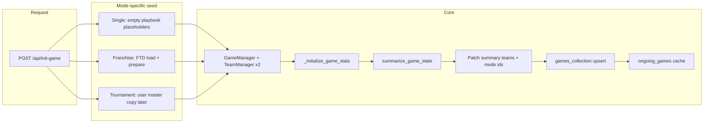

# Game Init System

**Purpose:** Describe end-to-end **game initialization**: how `POST /api/init-game` builds in-memory `GameManager` state, seeds mode-specific team data, writes the first `games` document, and registers the live instance. This is the authoritative place for **franchise FTD → game document** transfer at game start.

**Related (init family):**
- `Settings_Persistence_Guide.md` and `Data_Persistence_System.md` — where settings live before/during/after gameplay.
- `Computer_Team_Game_Init_System.md` — defaults inside `TeamManager` when persisted settings are missing (strategy layer); complements this HTTP-level flow.
- `../06_GMO_Supporting_Systems/Mode_Init_System.md` — owner of the `initialize_playbook_settings` shape + team play-copy fields (play/playbook identity).
- `../06_GMO_Supporting_Systems/Season_Init_System.md` — franchise new-season rollover (what persists / resets).

---

## Entry point

- **HTTP:** `POST /api/init-game`
- **Implementation:** `init_game()` in `BackEnd/api/api.py`

The handler creates a new `game_id`, constructs `GameManager`, runs first-pass game stat initialization, builds a summary via `summarize_game_state()`, merges mode-specific fields into `summary["teams"][…]`, **upserts** into `games_collection`, and stores the instance in `ongoing_games[game_id]`.

---

## Request payload (conceptual)

| Field | Role |
|--------|------|
| `home_team`, `away_team` | Display names matching `teams.name` (required). Used for roster load and, in franchise mode, to resolve Mongo `teams._id` for FTD lookup. |
| `mode` | `"single"` \| `"tournament"` \| `"franchise"` (default `"single"`). **`single` and `tournament` are SUNSET** (not user-facing); their init branches still exist in code. **Franchise** is the live mode. See sunset notes on the Tournament / Single sections below and `bugs.md` (sunset mode code removal). |
| `tournament_id` | Tournament mode: master doc id. |
| `franchise_id` | Franchise doc id (string/ObjectId-compatible). When present, **always** written on the game summary (not gated on `mode`) so **`GET /api/game`** can enrich rank/W–L. |
| `user_team_side` | `"home"` \| `"away"` — drives `is_user_team`, persisted `user_team_side`, and franchise community-engagement crowd shift. |

---

## High-level flow



---

## Franchise mode: FTD → `GameManager` → game document

Franchise games use **`franchise_team_data`** (FTD), keyed by `(franchise_id, team_id)` where `team_id` is the **`teams` collection `_id`** for that franchise team.

### 1. Load FTD rows

`init_game()` calls `load_ftd_data_for_team(franchise_id, None, home_team)` and the same for `away_team`. Passing **`team_id=None`** is intentional: init always has reliable **team names** from the client; the backend must resolve the Mongo team id from `teams`.

**`load_ftd_data_for_team`** (`BackEnd/api/api.py`):

1. If `team_id` is a valid `ObjectId` string, use it.
2. Otherwise, if `team_name` is set, resolve `team_object_id` via `teams_collection.find_one({"name": team_name})`.
3. Query `franchise_team_data_collection.find_one({"franchise_id": ObjectId(franchise_id), "team_id": team_object_id})`.
4. Return a dict with `team_attributes`, `strategy_settings`, `playbook_settings`, `plays`, `scouting_data`, or `None` if resolution/query fails.

**Important (April 2026):** Earlier implementations returned `None` whenever `team_id` was falsy *before* attempting the `team_name` lookup, so **`init-game` never loaded FTD** when called with `None`. That produced empty playbook/strategy on the game snapshot until other routes merged FTD. Name-based resolution must run whenever `team_id` is omitted but `team_name` is present.

### 2. Normalize for a fresh game: `prepare_ftd_for_new_game`

**File:** `BackEnd/utils/franchise_ftd_game_seed.py`

Takes the FTD payload (or `None`) and returns pieces for `GameManager`:

- **`team_attributes` / `strategy_settings`:** copied when non-empty; else `None` (downstream defaults apply).
- **`playbook_settings`:** dict copy (may be empty).
- **`plays`:** per-play **`game_stats` reset** to zeros; effectiveness / cloaking / momentum preserved from FTD.
- **`scouting_data`:** merged onto the **canonical scouting template** (`normalize_scouting_data_for_gameplay` in `team_manager.py`) so every defense row has the full shape (top-level **`used` / `success`**, **`game_stats`**, **`season_stats`**, etc.). Then defense **`game_stats`** (and top-level **`used` / `success`**) are **zeroed** for the new game while training-carried effectiveness / momentum / cloaking and **`season_stats`** remain.

This matches the franchise **greenfield Q1** path in `simulate-quarter` when a new `GameManager` is created without an existing cached game.

### 3. Construct `GameManager`

Whenever **`TeamManager`** is constructed with **`scouting_data`** (franchise, tournament, or **DB reload**), it runs the same **template merge** so partial or legacy FTD/game-doc rows cannot omit keys that **`run_micro_turn`** and stat tracking expect.

`GameManager` receives prepared attributes, strategy, plays, and scouting for both sides. **Playbook settings** are applied in a follow-up step:

```text
gm.home_team.playbook_settings = dict(home_playbook_for_gm)
gm.away_team.playbook_settings = dict(away_playbook_for_gm)
```

So both **user and CPU** franchise teams enter the first summarize with full FTD playbooks when FTD rows exist.

### 4. First `summarize_game_state` and game doc baseline

After `_initialize_game_stats`, the handler sets scores to zero and calls `summarize_game_state(gm, exclude_animations=True)`, then attaches `game_id`, `mode`, `user_team_side`, etc.

**`franchise_id`:** written to **`summary["franchise_id"]` whenever the request includes `franchise_id`** (not gated on `mode`). The court’s **`GET /api/game`** path uses this field to re-merge **FTD rank + franchise `results` W–L** onto team rows; omitting it on older saves broke scoreboard metadata until re-init.

**Scoreboard metadata (franchise):**

| Field | Where it lives |
|--------|------------------|
| **`natl_rank`** | **`franchise_team_data`** (FTD), same keying as settings: `(franchise_id, team_id)` with `team_id` = **`teams._id`**. |
| **Season W–L** | **`franchises.results`** (via `calculate_franchise_standings`), not on FTD as the ledger. |
| **Display `name` on the game** | **`teams`** / `GameManager` → `game.teams[…].name` — **not** copied from FTD for labeling. |

- **`summarize_game_state`** (`BackEnd/utils/shared.py`): if GM teams expose **`franchise_id`**, calls **`enrich_franchise_teams_scoreboard_meta`** so the first `teams` snapshot can include rank/W–L before upsert.
- **`GET /api/game`**: resolves slot keys (`resolve_home_away_teams_slot_keys`), runs **`enrich_franchise_teams_scoreboard_meta`** when **`franchise_id`** is on the doc, builds **`team_scoreboard_meta`** keyed like **`score`** (display names). Resolver: **`resolve_mongo_team_id_string`** (hex `ObjectId` or `teams` lookup by name / `team_id` / `code`).
- **Ops logs:** `🔍 [INIT-GAME SCOREBOARD POST-SUMMARIZE]` after summarize; **`enrich_franchise_teams_scoreboard_meta OK`** / **`abort_no_valid_team_oids`** on enrich.

**Court frontend:** `initializeGameStats` (`FrontEnd/static/js/phaser/utils/loadGameStats.js`) loads **`GET /api/game`**. Simulate payloads often omit **`team_scoreboard_meta`**; **`gameScene.js`** keeps a merged copy so per-turn scoreboard updates do not reset rank/record to placeholders.

Then, for franchise mode, it **persists the FTD baseline** under canonical team keys from `gm.home_team.team_id` / `gm.away_team.team_id`:

- `summary["teams"][team_id]["playbook_settings"]` — if non-empty prepared playbook.
- `summary["teams"][team_id]["strategy_settings"]` — if non-empty prepared strategy.

That makes the **game document** a usable snapshot for `GET /api/playbooks?game_id=…` and related reads without relying on silent FTD merge for missing data.

### 5. Logging (operations)

Watch for:

- `🔍 [INIT-GAME SCOREBOARD POST-SUMMARIZE]` — franchise id on summary vs param, GM `team_id`s, `teams` snapshot (`natl_rank` / wins / losses).
- **`enrich_franchise_teams_scoreboard_meta`** `OK` vs **`abort_no_valid_team_oids`** — FTD + standings merge (see `BackEnd/utils/game_team_scoreboard_enrichment.py`).
- `⚠️ [INIT-GAME] No FTD row for home/away team=…` — name mismatch, missing FTD doc, or wrong `franchise_id`.
- `✅ [INIT-GAME] FTD loaded for …` — FTD document found.
- `✅ [INIT-GAME] Game doc FTD baseline: … playbook_keys=… strategy_keys=…` — what was written onto `summary["teams"]` before upsert.

---

## Tournament mode init

> **⚠️ SUNSET MODE.** Tournament is no longer offered to users. The init branch below still exists in code and is documented for accuracy, but it is a dead-end path slated for removal — do not build on it. Tracked in `bugs.md` (sunset mode code removal).

- **Attributes:** not loaded from FTD; tournament / single paths use other loaders when applicable.
- **Playbook / strategy snapshot:** after summarize, the handler loads the **tournament** document and copies **`playbook_settings` and `strategy_settings` from the user’s tournament team object** into `summary["teams"][user_team_id_in_game]` only. It also applies those dicts onto the corresponding `TeamManager` so gameplay matches the master without extra DB reads.
- **CPU opponent** in that matchup may still rely on `TeamManager` defaults where the tournament block does not copy master data (see `Computer_Team_Game_Init_System.md` for default behavior).

---

## Player-level data ingestion

Independent of mode (single / tournament / franchise), every game begins by loading rosters and constructing in-memory `Player` objects. This is where biographical fields like `height`, `weight`, `jersey`, `name`, and `photo` enter the gameplay system.

### Source of truth in MongoDB

| Mode | Collection | Notes |
|------|-----------|-------|
| Single / Tournament | `players` | Canonical player documents, queried by string `_id`. Each doc carries `first_name`, `last_name`, `height`, `weight`, `jersey`, `year`, `attributes`, optional `position_ratings`, optional `photo`. |
| Franchise | `franchise_players_data` (FPD), with fallback to `players` | FPD holds per-franchise overrides of `attributes`, `position_ratings`, and `meta` (which includes `height`, `weight`, `jersey`, `year`, `first_name`, `last_name`). When FPD `meta` provides a field, it overrides the base `players` doc. |

### Load path: `load_roster` → `Player(data)`

1. **`TeamManager.__init__`** ([Backend/models/team_manager.py](Backend/models/team_manager.py)) calls `self._load_roster()`.
2. **`_load_roster()`** calls `load_roster(team_name, franchise_id=…)` from [Backend/utils/roster_loader.py](Backend/utils/roster_loader.py).
3. **`load_roster`** assembles raw player dicts. For franchise mode, it merges `franchise_players_data.{pid}.meta.height` (and other meta fields) onto the base players-collection doc — FPD wins when set.
4. Each player dict is passed to the **`Player(data)`** constructor at [Backend/models/player.py:14](Backend/models/player.py#L14), which extracts:
   - `self.player_id`, `self.first_name`, `self.last_name`, `self.name` (composed)
   - `self.team`, `self.jersey`, `self.year`, `self.photo`
   - `self.height = data.get("height", data.get("HT", 75))` — **integer inches**, defaults to 75" (6'3") if both missing (legacy `HT` field name supported)
   - `self.weight = data.get("weight", data.get("WT", 200))`
   - `self.attributes` via `_extract_attributes()` — includes `EM`, `CH`, `MO`, `NG` plus anchor copies for all attrs
   - `self.position_ratings` — per-position rating dict (franchise/universal rosters only)
   - `self.stats` — game stats template

### What ends up on the game document

`summarize_game_state` ([Backend/utils/shared.py](Backend/utils/shared.py)) builds the per-player projection that lands on the `games` doc. The projection includes only what gameplay + frontend systems need — **not the full Player object**. Current per-player fields:

| Field | Source on `Player` |
|-------|-------------------|
| `playerId` | `player.player_id` |
| `name` | `player.name` (composed first + last) |
| `team` | `"home"` / `"away"` (lineup side) |
| `team_id` | `team_obj.team_id` |
| `pos` | Lineup position (`PG`/`SG`/`SF`/`PF`/`C`) or `None` for bench |
| `jersey` | `player.jersey` |
| `height` | `player.height` (integer inches) — **added May 2026** for v2 player sprite (height-linked headshot radius) |
| `photo` | `player.photo` |
| `primary_color` / `secondary_color` | `team_obj.primary_color` / `secondary_color` |
| `x` / `y` | `player.coords` |
| `stats` | `player.stats["game"]` |
| `attributes` | `{EM, CH, MO, NG}` only — most attributes stay in-memory and aren't persisted |

**Not on the game doc:** `weight`, `year`, `position_ratings`, `anchor_*` attributes, `metadata`. These live on the in-memory `Player` only. To expose any of them to the frontend or persist them, they need to be added to the `players.append({…})` blocks in `summarize_game_state`.

### Per-game stat arrays in `stats["game"]` (list-typed)

Most `stats["game"]` entries are numeric, but a few are **lists** scoped to a single game (they ride `stats["game"]`, so they persist into the game doc and restore on timeout resume, and are wiped at game init — never aggregated to season/career):

| Key | Meaning | Init / reset | Written | Read |
|---|---|---|---|---|
| `Outlet_Score_List` | fast-break outlet scores | `player.py` `_init_stats` / `reset_stats` | `phase_resolution.py` | averaged into `Outlet_Score` |
| `Shot_Result_List` | per-shot outcomes: `True`=made FG/putback, `False`=miss/block; **shooting-foul misses & free throws excluded** | `player.py` `_init_stats` / `reset_stats` (game level only) | `Player.record_shot_result()` from `resolve_shot` (guard `made or not d_foul`) + the putback branch in `shared.py` | Player Momentum System (see `projects/Player_Momentum_System.md`) |

**Gotcha when adding a list-typed game stat:** code that iterates the *actual* `stats["game"]` keys and does numeric math must skip it, or it crashes on list ops. The two such iterators are the per-turn delta loops (`turn_manager.py`, skip-list) and team aggregation (`team_manager.update_team_stats`, skips lists). Code that iterates `BOX_SCORE_KEYS` instead is safe (these keys are intentionally **not** in `BOX_SCORE_KEYS`). `record_shot_result()` is defensive (re-creates the list if a reset left it non-list).

### Frontend access path

The simulate-quarter response body uses `summarize_game_state(gm, exclude_animations=False)` as its payload. Whatever lands on the per-player dict in `summarize_game_state` flows directly to `simData.players` on the frontend (which becomes `actualPlayers` in `loadPhaserPlayers`, which becomes the `player` arg destructured by `createPhaserPlayer`).

The `/api/game/{game_id}` endpoint takes a different path — it re-projects players from the saved `games` doc via a separate `players_with_energy` loop in `api.py` (~lines 1769 and 1851). When adding a new player field, **update both** so the field is available whether the court loads via simulate-quarter (mid-game) or via /api/game (initial scoreboard load on the court page).

### When you need to add a new player field

Three-step recipe:

1. Confirm the field is on the **Python `Player` object** (or add it to `Player.__init__` reading from `data.get("...")`).
2. Add it to the player dict in **all three `players.append({…})` blocks** in `summarize_game_state` (`shared.py`). This puts the field on the game doc and on simulate-quarter responses.
3. Add it to **both `players_with_energy` projections** in `api.py` (`/api/game/{game_id}` endpoint) so initial court loads include it.

---

## Single game mode init

> **⚠️ SUNSET MODE.** Single Game is no longer offered to users. The init branch below still exists in code and is documented for accuracy, but it is a dead-end path slated for removal — do not build on it. Tracked in `bugs.md` (sunset mode code removal).

- **Init handler** initializes `home_playbook_settings` / `away_playbook_settings` as empty dicts and, after summarize, assigns them into `summary["teams"][…]["playbook_settings"]`, and syncs `GameManager` team playbooks to those dicts.
- **Strategy and other team shape** come from `TeamManager` construction (defaults or future request fields). Single-game evolution of playbooks during play is handled by summarize/save paths documented in `Data_Persistence_System.md`.

---

## Database and runtime effects

| Output | Details |
|--------|---------|
| **`games` document** | `update_one({"_id": game_id}, {"$set": summary}, upsert=True)`. `_id` is typically a **string** 24-hex id from `generate_game_id()` (see persistence docs for save/load `_id` parity). |
| **`ongoing_games[game_id]`** | Live `GameManager` for immediate quarter sim and reads until process eviction. |

---

## Parity: `simulate-quarter` greenfield (franchise)

When simulation starts a **new** in-process game for franchise mode (no existing cached GM), the same **`load_ftd_data_for_team` + `prepare_ftd_for_new_game`** pattern is used so Q1 creation matches **`init-game`** seeding (strategy fallback when the request omits a side, plays/scouting normalization, etc.). See the franchise branch in `simulate_quarter_endpoint` logic in `BackEnd/api/api.py` near the `prepare_ftd_for_new_game` import.

---

## What this doc does *not* cover

- **Resuming** an existing game (must **not** call `init-game` when `game_id` is already present — see `Timeout_System.md` / lineup flow).
- **Lazy** creation of tournament/single team objects on first Game Plan / Playbooks visit (`ensure_team_objects_exist` in `gameplan_routes.py`).
- **Season / franchise mode initialization** (`Mode_Init_System.md`, `franchise_manager.initialize_season`).

---

## Key files

| Area | File(s) |
|------|---------|
| HTTP init | `BackEnd/api/api.py` — `init_game()`, `load_ftd_data_for_team()`, `GET /api/game/{id}` scoreboard merge |
| FTD normalization | `BackEnd/utils/franchise_ftd_game_seed.py` — `prepare_ftd_for_new_game()` |
| Franchise scoreboard enrich | `BackEnd/utils/game_team_scoreboard_enrichment.py` — `enrich_franchise_teams_scoreboard_meta`, `resolve_mongo_team_id_string` |
| Game doc team slot keys | `BackEnd/utils/resolve_game_teams_slot_keys.py` — `resolve_home_away_teams_slot_keys` |
| Scouting shape (gameplay) | `BackEnd/models/team_manager.py` — `normalize_scouting_data_for_gameplay()` |
| In-memory game | `BackEnd/models/game_manager.py` — `GameManager` |
| Per-team state | `BackEnd/models/team_manager.py` — `TeamManager`, `_load_roster()` |
| Roster loading | `BackEnd/utils/roster_loader.py` — `load_roster()` (players collection + FPD merge for franchise) |
| Player class | `BackEnd/models/player.py` — `Player.__init__`, biographical + attribute extraction |
| Summary → DB shape | `BackEnd/utils/shared.py` — `summarize_game_state()` |
| Greenfield Q1 (franchise) | `BackEnd/api/api.py` — franchise branch using `prepare_ftd_for_new_game` |
| Court load + header | `FrontEnd/static/js/phaser/utils/loadGameStats.js` — `initializeGameStats`, `displayAccumulatedHeaderState` |
| Sim vs scoreboard meta | `FrontEnd/static/js/phaser/gameScene.js` — merged `team_scoreboard_meta` across turns |
| Collections | `franchise_team_data`, `franchise_players_data`, `franchises`, `teams`, `players`, `games` |

---

**Last updated:** May 2026 — Player-level data ingestion section added (`roster_loader` → `Player(data)` → `summarize_game_state` projection); `height` added to per-player game-doc projection for v2 player sprite. Prior: April 2026 — `franchise_id` always on game doc when provided; GET + enrich scoreboard pipeline; `team_scoreboard_meta` + frontend merge; FTD name-resolution at `init-game`; scouting template merge for defense `used` / full row shape.


**Computer Team Strategy Logic**
1. Identify active players to determing logic
  -Game init settings are calculatd using the active five starters using the same logic we use for them in teh Scouting Reprot tab of the FCC
  -Updatd game plan settings at each quarter break, timeout and player foul out instance are set using the five active players coming out of the break (LMK if we need to adjust order of calculating this per our current code)


2. Determine any outlier offense strengths or weaknesses
  - Inside Offense Score = cum SC of all active starters
  - Outside Offense Score = cum SH of all active starters
  - Attack Offense Score = (cum SC of all active starters + cum AG of all active starters) / 2

  - Middle Value = the middle value of those three.
    - if the Higest Value - 70 > Middle Value, that represents a strong tendency (i.e. if Outside Offense Score is the upper value in this scenario, then Outside offense is a strong tendency)
    - if the lowest value + 70 < middle value, that is a weak tendency

  - if strong tendency exists, set that Offense type (inside, attack or outside) at random.rantint(3,4)
  - always set the middle value and any non strong or weak tendencies at random.randint(1,3)
  - if weak tendence exists, set it at random.randint(0,1)

3. Determine endurance based settings
  -Get cum ND score by adding the ND of teh five active startes
    -if cum ND < 200 = weak endurance
    -elif cum ND > 350 = strong endurance
    -else middle endurance

  -Get cum Endurance D score by adding the AG + OD of all five active players
  -Get cum Endurance O score by adding the AG + SC of all give active players
  -Get cum Intelligence score by adding the IQ of all five active players

  -if weak endurance
    - HC Traps FC Presses, and Fast Breaks, and Aggression each get their own roll of random.randint(0,2)
  -elif strong endurance
    - if Cum Endurance D > 600: FC Press and HC Trap each get their own roll of random.randint(0,4)
    - if Cum Endurance O > 600: Fast Breaks gets a random roll of random.randint(1,4)
    - if cum Intelligence > 300: Aggression get a random roll of random.randint(2,4)

  - if HC Trap, FC Press, Aggression, or Fast Break did not receive a roll per the above crieria, they get aour standard logic for rolls.

4. Determine Defensive Strengths Scale
  - Get cum D Ability by add the AG + ID + OD of the five active players
  - if cum D Ability > 1200: defense = random.randint(0,2)
  - elif cum D Ability > 900: defense = random.randint(0,3)
  - elif cum D Ability > 700: defense = random.randint(0,4)
  - elif cum D Ability > 500: defense = random.randint(1,4)
  - else: defense = random.randint(2,4)

5. Tempo and Play Alteration (CPU only)
  - **Game init and Q1–Q3:** `tempo` and `alterations` each get an independent weighted roll centered on **2** (`init_tempo_random()` — weights `[10,20,50,20,10]` on 0–4).
  - **Q4+ (including OT):** `alterations` keeps the same weighted roll. `tempo` uses score/time logic from the **computer team's** perspective:
    - **Score difference** = winning team's score − losing team's score (ties = 0).
    - **If computer team winning:** if score difference > `time_remaining / 30` → `tempo = 0`; else weighted roll centered on 2.
    - **If computer team losing and `time_remaining > 90`:** if score difference > `time_remaining / 30` → `tempo = 4`; else weighted roll centered on 2.
    - **If computer team losing and `time_remaining ≤ 90`:** if score difference > `time_remaining / 4` → `tempo = 0`; elif score difference > `time_remaining / 30` → `tempo = 4`; else weighted roll centered on 2.
    - **If tied:** weighted roll centered on 2.

6. Leave as is with current logic for now for
  - offense
  - rebounding
  - play_calling (legacy weighted rolls — see implementation notes)

### Implementation notes (finalized 2026-06-16)

**Scope:** computer teams only (user game plan is never auto-set). Applied at **game init** and at every **quarter break / timeout / foul-out**. `offense`, `rebounding`, and `play_calling` keep their legacy rolls. **`tempo`** uses the weighted center-2 roll for game init and Q1–Q3, then Q4+ score/time logic when `game_state` is available (timeouts, quarter breaks, foul-outs). **`alterations`** always uses the same weighted center-2 roll as tempo at init/Q1–Q3.

**Active five (point 1):** at game init the lineup isn't built yet, so the five come from `team_identity.projected_starting_five` — a **greedy** best (player, open position) fill by rating. At in-game events the lineup is already rebuilt first, so the actual five active players are used (no ordering change needed).

> ⚠️ This is **no longer the same selection as the FCC Scouting Report.** As of August 2026 the display surfaces run the exact max-weight assignment the game uses (`CPU_Team_Rotation_System.md` §6); this greedy picker was deliberately left alone because the frozen identity constants were calibrated against it. Ticketed in `projects/bugs.md`.

**Attribute source:** cumulative sums use each player's **`anchor_<attr>` baseline** (fallback to raw `<attr>`), matching the Scouting Report tab — so tendencies reflect talent, not transient in-game fatigue/momentum.

**"Standard logic for rolls" = the existing legacy weighted distributions** (not flat `randint(0,4)`):
- `fast_breaks` → weights `[5,15,60,15,5]`
- `hc_trap`, `fc_press` → weights `[34,40,20,5,1]` (skew low), rolled **independently** (legacy shared a single roll; now separate)
- `aggression` → weights `[10,20,40,20,10]`

**Point 3 correction:** in the strong-endurance branch, if `cum Intelligence ≤ 300`, **aggression** also falls back to its standard roll (it was accidentally omitted from the original else).

**Code:** `TeamManager._compute_strategic_strategy_settings(game_state=None)`, `_compute_cpu_tempo()`, and `_resolve_strategy_active_five()` (`BackEnd/models/team_manager.py`); applied at construction (computer teams) and via `autoset_strategy_settings(team, game_state=None)` (`BackEnd/utils/db_utils.py`). Quarter-break and timeout autoset pass live `game_state` so Q4+ tempo reflects current score and clock.
