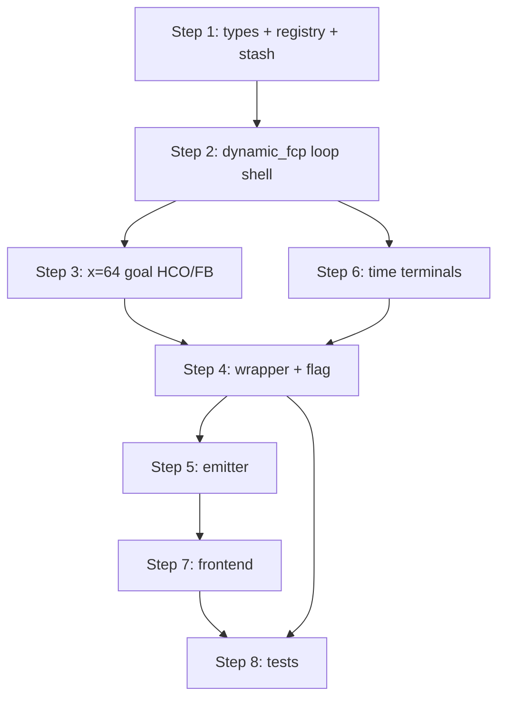

# Dynamic FCP (Full Court Press) Turns

> **Status:** Design brief — **PR1 decisions locked** (§1.1). **Build checklist:** §11. Ready to implement `fcp_straight_pressure`.
>
> **References:** Live legacy FCP → [`FCP_HCT_System.md`](../06_Gameplay_Systems/FCP_HCT_System.md). Dynamic HCT pattern → [`HCT_System.md`](../06_Gameplay_Systems/HCT_System.md) + [`Z-Completed/Dynamic_HCT_Brief.md`](./Z-Completed/Dynamic_HCT_Brief.md). When shipped, this brief should gain a sibling operational bible (`FCP_System.md`) mirroring the HCT split.

---

## Executive take

**Yes — dynamic FCP should mirror dynamic HCT**, with the same three-layer shape (wrapper → engine loop → pluggable press plays → emitter → optional shot resolver), but at **full-court scale**:

| Dimension | HCT (built) | FCP (target) |
|-----------|-------------|--------------|
| Court span | Half court (BIP receiver ~x=44 → ABA at x=64) | Full court (BIP receiver ~x=12–18 → press loop → **success at x=64**) |
| BIP setup | Static `HCT_SETUP_POSITIONS` + zone centroids | Randomized `FCP_OFFENSE_SETUP_RANGES` / `FCP_DEFENSE_SETUP_RANGES` (keep) |
| Primary success | ABA entry (x>64) → §7 HCO / FB read (same y-band) | **Same moment at x=64** — reuse HCT goal-achievement / broken-press FB logic |
| Walk-up | Step 0 walk-up to engage point | **None** — loop starts immediately after BIP entry pass |
| Moment geometry | `MOMENT_RANGE = 11` | **Same 11** (start PR1; tune only if playtesting demands) |
| Play selection | `hc_trap` gate + `hc_traps` weights | `fc_press` gate + **`fc_presses`** weights; keys **`fcp_*`** (see §1.1) |
| Animation | Abandon skeleton when `USE_DYNAMIC_HCT=True` | Abandon `fcp_skeletons` + stopper when `USE_DYNAMIC_FCP=True` |

The shared primitives already extracted for HCT — **`pass_contest.py`**, **`cutoff_resolution.py`**, AG-scaled movement, `player_read` thresholds, bat-OOB FE path — should carry over with **FCP-tuned constants**, not a fork.

---

## §0 — Scope & Architecture Contract

**One FCP turn = one full press-break possession.** The engine (`compute_dynamic_fcp_turn` — **not yet written**) runs the read → detect → move loop internally to completion and returns intermediate step data. The emitter (`build_dynamic_fcp_animation_steps` — **not yet written**) assembles schema `animation_steps[]`. The legacy fixed skeleton + stopper path is the degenerate case we are replacing.

**Engine vs emitter (same split as HCT §0)**

- **Engine:** loop, reads, moment detection, decision resolution, outcome selection, per-segment target coords + durations. Returns intermediate data only.
- **Emitter:** consumes engine output + `prior_turn.final_coords` / `prior_turn.final_ball_handler_id`; stamps tween durations and clock state.

**Loop iteration = one animation segment.** Moment detection runs at **segment boundaries** (euclidean distance), not on a fixed tick.

**Orientation.** Home-on-offense coords; flip via `get_away_player_coords` / `getAwayTeamCoords` when away is on offense.

**Feature flag (proposed).** `USE_DYNAMIC_FCP = True` in `phase_resolution.py`; when `False`, keep today's `resolve_full_court_press_logic()` skeleton + BSM/DST path.

**Inbound contract (unchanged).** BIP owns SF→receiver inbound. FCP turn must **not** duplicate inbound steps (same `_get_fcp_hct_post_inbound_start_index` rule today). Clocks start when the inbound receiver has the ball.

**No walk-up.** First dynamic FCP segment begins at BIP-end coords (receiver already has ball). There is no HCT-style step-0 bring-up tween.

---

## §1.1 — Locked Decisions (user, 2026-06-21)

| # | Decision |
|---|----------|
| **Plays** | Long term: **3 FCP plays** mirroring HCT (`fcp_standard_trap`, `fcp_straight_pressure`, `fcp_standard_diamond`). **PR1:** implement and run **`fcp_straight_pressure` only** (Straight Pressure logic at full-court scale). |
| **Keys / UI** | DB/code keys prefixed `fcp_`; UI labels match HCT names ("Straight Pressure", etc.). Playbook field: `playbook_settings["fc_presses"]` (mirror `hc_traps`). |
| **Success line** | Press break / goal zone = **x=64** (home-on-offense), not half court (x=50). At this moment, run the **same HCO vs Fast Break read** as HCT §7 (3-tier goal achievement + broken-press FB branch). |
| **10-second rule** | **10 game-seconds** from possession start; violation if BH has not reached **x=64** before limit (mirror HCT timing model, success boundary adjusted). |
| **Walk-up** | **None.** |
| **Engagement** | After BIP, before converge: BH ↔ def PG meet per **aggression calls** (see §2.1). |
| **SF inbounder** | Valid pass target once he is **no longer at the BIP inbound spot / OOB**. |
| **BSM/DST** | **Retired** for dynamic FCP — outcomes emerge from the spatial loop (see glossary below). Legacy skeleton path keeps old math when `USE_DYNAMIC_FCP=False`. |
| **Moment range** | **`MOMENT_RANGE = 11`** grid spots (same as HCT) for PR1. |

**PR1 playbook wiring:** Hard-default to `fcp_straight_pressure` (stash `game_state["fcp_press_play"]` even before `fc_presses` UI lands). Full weight map + franchise UI deferred to PR3.

---

## §1 — Current State Audit (Legacy FCP)

### What exists today

| Piece | Location | Notes |
|-------|----------|-------|
| Entry | `resolve_full_court_press_logic()` | ~L5868 in `phase_resolution.py` |
| Outcome math | BSM=400 + fight; DST=600; PG-weighted offense/defense scores × `randint(1,6)` | **No spatial loop** — single roll then weighted result |
| Outcomes | Success → HCO or (if dominant) D_FOUL/HCO/SHOT; Failure → O_FOUL/DEAD_BALL/STEAL | SHOT uses skeleton + `shot_manager.resolve_shot()` |
| Animation | MongoDB `fcp_skeletons` + `apply_stopper_system_to_skeleton()` | Variants `"base"` / `"shot"`; UESS via `build_skeleton_animation_steps(..., turn_type="FCP")` |
| BIP setup | `TurnManager._build_fcp_setup_positions()` | Randomized offense/defense ranges; SF chemistry-aware y |
| Pressure gate | `TurnManager._select_defensive_pressure_type()` | `fc_press` 0–4 vs `hc_trap`; weighted vs HCO |
| Stats | `_record_fcp_stats()` | `FCP_A/S`, `FCP_A_D/S_D`; team `def_scouting["defense"]["FCP"]` |
| Steal aftermath | STEAL → `fast_break_probability_from_slider(aggression)` → FAST_BREAK or HCO | Sets `last_stealer` / coords from skeleton animation |
| Tests | `test_fcp_hct_stopper_system.py`, `test_transition_system.py` | Skeleton/stopper focused |

### What does **not** exist (HCT has these)

- `USE_DYNAMIC_FCP` flag
- `dynamic_fcp.py`, `fcp_press_plays.py`, `constants/fcp_press_play_types.py`
- `dynamic_fcp_step_emitter.py`, `dynamic_fcp_shot.py` (if needed)
- `game_state["fcp_press_play"]` stash at `determine_defensive_pressure_type()`
- `playbook_settings["fc_presses"]` weight map + `ensure_fc_presses()` migration
- Per-play scouting `scouting_data["defense"]["fcp_press_plays"][key]`
- Frontend schema path for dynamic FCP (HCT uses `build_dynamic_hct_animation_steps` + `AnimationEngine` hooks)

### HCT mirror (built reference)

| Layer | HCT module |
|-------|------------|
| Flag | `USE_DYNAMIC_HCT` |
| Wrapper | `_resolve_half_court_trap_dynamic_first_cut` |
| Engine | `dynamic_hct.py` → `compute_dynamic_hct_turn` |
| Plays | `hct_trap_plays.py` + `HCTPlay` interface |
| Emitter | `dynamic_hct_step_emitter.py` |
| Shots | `dynamic_hct_shot.py` (ABA + broken-trap FB) |
| Shared | `pass_contest.py`, `cutoff_resolution.py` |

---

## §2 — Scale Mapping (HCT → FCP)

### Spatial phases (locked)

```
BACKCOURT / PRESS ZONE          SUCCESS / GOAL ZONE
x < 64 (home)                   x ≥ 64 — same boundary as HCT ABA entry
(BIP receive ~x=12–18)          §7 HCO / Fast Break read (inherited from HCT)
```

Half court (x=50) is **not** the FCP success terminal. The 10-second clock runs until **x=64** is reached.

HCT effectively starts at **engage ~x=44** with defenders already at half court. FCP starts with offense **scattered in backcourt** (PG/SG x=12–18, PF/C already near midcourt per setup ranges) and defense **between ball and frontcourt** (PG x=20–25, wings x=26–31, PF x=50–55, C x=71–76).

### §2.1 — FCP engagement step (locked)

Parallel to HCT step-1 BH bring-up to x=44: the first FCP loop segment after BIP is **`fcp_engagement`**, before the **`hct_converge`** beat. Both teams' per-turn **`aggression_call`** (`strategy_calls`, same source as HCT D8) decides who closes on whom from their **BIP setup spots**:

| Condition | Mover | Target |
|-----------|-------|--------|
| Offense **aggressive** & defense ≠ aggressive | **Offense BH** | Def PG setup spot, within **2 x** (approach side), def PG **y** |
| Offense **normal** & defense **passive** | **Offense BH** | Same |
| Defense **aggressive** & offense ≠ aggressive | **Def PG** | BH setup spot, within **2 x**, BH **y** |
| Defense **normal** & offense **passive** | **Def PG** | Same |
| **Else** (equal aggression) | **Both** | **x** = midpoint of setup x coords; **y** = BH setup **y** |

Then **`hct_converge`** runs (defense re-poses around the post-engagement BH; off-ball offense keeps sprinting to setup). No walk-up step.

**Engine:** `_fcp_engagement_ends` / `_apply_fcp_engagement` in `dynamic_hct.py` (`turn_mode="fcp"` only). **Emitter:** generic loop step via `reason="fcp_engagement"`.

**Debug trace:** set `LOG_FCP_STEP_COORDS = True` in `BackEnd/engine/fcp_step_trace.py` (default on). Server stdout prints `[FCP STEP TRACE]` (engine intent per segment, labeled Step N FCP) and `[FCP EMITTER TRACE]` (rendered schema steps). Emitter bail reasons log as `[FCP EMITTER TRACE] BAIL: …`. Set `False` when done playtesting.

### §2.2 — FCP off-ball attack routing (locked)

During **`hct_advance`** (after attack beats pressure) and on **open-floor broken-trap drives** (ABA flood until cutoff RETAIN):

| Role | Behavior |
|------|----------|
| **Backcourt non-BH** (PG/SG/SF) | Target **x∈[46,53]**, **y = start y ± 6** at assignment; chase at **sprint** until reached |
| **PF** | Hold while ball progress **x < 34**; then random point within **6 euclid** of **FCP deep key** (anchor **x=47**, backcourt-side of half court); at **x ≥ 50** random among **key / midWings / wings** (true random upper/lower) |
| **C** | Hold while progress **x ≤ 34**; **34 < x ≤ 50** random **topLane / apex / midCorner / wing** on **BH vertical half**; **x > 50** **midLane** + same-half **lowPost / midPost / midBaseline / corner / midCorner / bird** |

Ball progress **x** = BH **x** (home); away mirrored. BH half: **y > 25 → upper**, else lower. Destinations persist until reached, phase change, or terminal; **backtrack** re-applies the band rules. Broken-trap **RETAIN** → revert to incremental routing. Engagement/converge/hold/pass unchanged (setup hustle).

**Module:** `BackEnd/engine/fcp_offball_attack.py`

### Terminals (dynamic target)

| Terminal | Dynamic target |
|----------|----------------|
| **HCO / FAST_BREAK_SHOT** | BH reaches **x=64** → HCT §7 goal-achievement read (HCO settle vs broken-press FB shot) |
| **STEAL** | Emergent from pass contest / on-ball moment resolution; steal→FB aftermath mirrors HCT wrapper |
| **DEAD BALL** | Emergent + **10-second** / shot-clock violations → SIDE_INBOUND |
| **FOUL** (O/D) | Emergent from moment resolution (mirror HCT D8) |
| **Bat-OOB pass** | Reuse HCT offense-retains path (open — default **yes** to match HCT) |
| **Legacy SHOT roll** | **Dropped** — no dominant-success BSM/DST SHOT branch in dynamic path |

---

## §3 — Proposed File Map (when approved)

```
BackEnd/engine/dynamic_fcp.py              # compute_dynamic_fcp_turn(game, play)
BackEnd/engine/fcp_press_plays.py          # FCPPlay registry + implementations
BackEnd/constants/fcp_press_play_types.py  # keys, DEFAULT_FCP_PRESS_WEIGHTS, play_key_for_fcp_press()
BackEnd/engine/dynamic_fcp_step_emitter.py # build_dynamic_fcp_animation_steps()
BackEnd/engine/dynamic_fcp_shot.py         # optional: transition shot / press-break layup (if SHOT terminal kept)
BackEnd/engine/phase_resolution.py         # USE_DYNAMIC_FCP, _resolve_full_court_press_dynamic_first_cut()
BackEnd/models/turn_manager.py             # stash game_state["fcp_press_play"] when pressure == "FCP"
BackEnd/utils/playbook_settings_utils.py   # ensure_fc_presses() migration (mirror ensure_hct_trap_plays)
BackEnd/utils/cpu_playbook_customization.py # CPU default press weights
FrontEnd/static/js/phaser/animation/       # AnimationEngine dynamic FCP playback (mirror HCT hooks)
_documentation_master/06_Gameplay_Systems/FCP_System.md  # post-ship operational bible
```

**Wrapper responsibilities** (mirror `_resolve_half_court_trap_dynamic_first_cut`):

- Energy decay + `FCP["used"]` scouting
- Merge engine dict → turn result shape (`result_type`, `text`, `current_turn`, `next_play_type`, `offensive_state`, possession flip)
- Stat parity via `_record_fcp_stats`
- Steal → FB probability + `last_stealer` coords
- Foul bonus / FREE_THROW routing
- Bat-OOB offense-retains branch (if adopted)
- Emit `animation_steps[]`; drop skeleton/stopper when dynamic

---

## §4 — Reuse Inventory (likely verbatim or lightly tuned)

| Primitive | HCT source | FCP note |
|-----------|------------|----------|
| Pass contest lanes | `pass_contest.py` | Same API; may tune `PASS_LANE_DIST`, safety base |
| Drive cutoff race | `cutoff_resolution.py` | Relevant if press break includes drive-to-rim / transition shot |
| Moment radius | `MOMENT_RANGE = 11` | **Locked: same 11** for PR1 |
| BH read thresholds | `player_read` + dynamic BH/AG gates | Same table or FCP-specific? |
| Defender motion | `_move_defense`, AG rates, PF/C sprint | Same; targets come from `FCPPlay.defense_targets` |
| Pass receiver selection | `_select_pass_receiver` + backcourt guard | **Extend** for full-court outlet logic (PF/C already upcourt) |
| Step emitter pattern | `dynamic_hct_step_emitter.py` | New module; same segment/tween contract |
| Play selection machinery | `play_key_for_hct_trap`, stash at choke point | Clone for `fc_presses` |
| Bat-OOB animation | `batOobAnimation.js`, `_runSchemaBatOobBallSend` | Reuse if pass contests enabled |
| BIP setup | `_build_fcp_setup_positions()` | **Keep** — do not replace with static spots |

---

## §5 — Press Play Architecture (proposed, mirrors HCT §13)

| Layer | Today (FCP) | Target |
|-------|-------------|--------|
| Selection | `determine_defensive_pressure_type()` → `"FCP"` only | Same fn also picks *which press* → `game_state["fcp_press_play"]` |
| Dispatch | `resolve_full_court_press_logic()` monolith | `compute_dynamic_fcp_turn` resolves `FCPPlay` from registry |
| Behavior | MongoDB skeleton variants | Each play: `detect_moment`, `defense_targets`, `select_trappers`, optional `begin_possession` |

**Dual gate (mirror HCT):**

- `strategy_settings["fc_press"]` (0–4) — *how often to press*
- `playbook_settings["fc_presses"]` — *which press* once FCP is chosen

**Canonical keys (locked naming — mirror HCT with `fcp_` prefix):**

| Key | UI label | HCT analog |
|-----|----------|------------|
| `fcp_standard_trap` | Standard Trap | `standard_trap` |
| `fcp_straight_pressure` | Straight Pressure | `straight_pressure` |
| `fcp_standard_diamond` | Standard Diamond | `standard_diamond` |

**PR1:** registry contains **`fcp_straight_pressure` only**; default weight 100%. PR3 adds the other two + `fc_presses` UI.

**PR1 play spec:** Port HCT §13.6 Straight Pressure seams (`begin_possession`, sticky man deny, rover/trapper, key at x=64, trap only when rover in range) onto FCP BIP-start geometry. Full-court inherited logic at x=64 matches HCT §7.

---

## §6 — Frontend & Animation Gaps

| Area | Current | Needed |
|------|---------|--------|
| Turn routing | `current_turn: "FCP"` + skeleton or legacy animator | Schema `animation_steps[]` from dynamic emitter |
| BIP → FCP | `runInboundSetup(..., pressureType="FCP")` | Unchanged; dynamic turn must not re-run inbound |
| Setup tween | `fromInbound && isFCPHCT` skips redundant setup (HCT pattern) | Confirm same guard for dynamic FCP |
| Announcements | PRESS!, turnover types | Wire SHOT_CLOCK / EIGHT_SECOND / TEN_SECOND if clock terminals added |
| Playbook UI | `fc_press` slider only in strategy | New defensive `fc_presses` weights (mirror `hc_traps` in franchise command center) |

---

## §7 — Phased Implementation Cuts (draft — order depends on §8 answers)

| Cut | Scope | Exit criteria |
|-----|-------|---------------|
| **PR0** | Brief locked (§1.1) | ✅ Done |
| **PR1** | `fcp_straight_pressure`: BIP-end → loop → x=64 goal read; emitter; wrapper; `USE_DYNAMIC_FCP=True` | FCP animates without skeleton; HCO + FB branches at x=64 |
| **PR2** | Pass contest + emergent STEAL/DEAD BALL/FOUL + 10-second terminal | HCT D8/D9 parity |
| **PR3** | `fcp_standard_trap` + `fcp_standard_diamond`; `fc_presses` playbook + scouting | CPU weights; franchise UI |
| **PR4** | Bat-OOB offense-retains (if not in PR2) | FE announcement parity |
| **PR5** | Deprecate skeleton fallback / `fcp_skeletons` builder | Flag default True |

---

## §8 — Questions & Gaps

### Resolved (see §1.1)

Items 1–5, 7–8, 10, 12, 14 (PR1 defer), 19 — locked.

### Still open (defaults OK for PR1)

| # | Question | PR1 default |
|---|----------|-------------|
| 6 | Bat-OOB offense-retains? | **Yes** — match HCT |
| 9 | Shot clock per segment? | **Yes** — same as HCT loop |
| 11 | FCP-specific geometric bands beyond x=64? | Reuse HCT `_is_backcourt_offender` (x<64) + ABA y-band at goal |
| 13 | Trap rule at full court? | Straight Pressure: **rover-only trap** (HCT §13.6); no zone gate for PR1 |
| 15 | Per-play scouting at launch? | Defer to PR3; team-level `FCP` stats only in PR1 |
| 16 | CPU press-play gates? | Defer; PR1 always `fcp_straight_pressure` for CPU |
| 17 | Keep skeleton fallback? | **Yes** — `USE_DYNAMIC_FCP=False` like HCT |
| 18 | Steal → FB after emergent steal? | HCT wrapper pattern (not legacy aggression slider alone) |
| 20–23 | Tests, doc split, announcements, UI | Backend-first PR1; reuse HCT "10-Second Violation!" copy |

---

## §8.1 — Glossary (legacy terms)

**BSM / DST** — the old **single-roll** FCP outcome math in `resolve_full_court_press_logic()` (documented in `FCP_HCT_System.md`):

- **BSM (Base Success Modifier):** starts at 400 + (10 × offense fight), then adjusted by team chemistry and the offense/defense press-trap team attributes (`pt_opp_modifier`, `pt_efficiency`). Added to the offense score.
- **DST (Defense Safety Threshold):** fixed at **600** for FCP, plus discipline/chemistry adjustments. If `(offenseScore + BSM) > defenseScore` **and** `offenseScore - defenseScore > DST`, the legacy path rolled a **dominant success** (30% foul / 40% HCO / 30% SHOT). Otherwise a normal press break was just HCO.

Dynamic FCP **does not use this roll**. Success/failure comes from the spatial loop (reads, moments, passes, x=64 goal achievement) — same philosophy as dynamic HCT.

**Moment range (`MOMENT_RANGE = 11`)** — in `dynamic_hct.py`, a defender is **“in range”** of the ball handler if they are within **11 euclidean grid spots** (court distance). That gates:

- **Pressure** — at least one in-range defender ahead of the BH on x
- **Trap** — two or more in-range defenders (with at least one ahead), subject to play rules (Straight Pressure caps trap unless the **rover** is in range)

PR1 uses **the same 11** for FCP unless playtesting shows full-court spacing needs a tweak.

---

## §9 — Documentation & Code Trace Index

### Docs to read before implementing

| Doc | Relevance |
|-----|-----------|
| [`FCP_HCT_System.md`](../06_Gameplay_Systems/FCP_HCT_System.md) | Legacy FCP outcomes, BIP ranges, stats, skeleton contract |
| [`HCT_System.md`](../06_Gameplay_Systems/HCT_System.md) | Target architecture bible |
| [`Z-Completed/Dynamic_HCT_Brief.md`](./Z-Completed/Dynamic_HCT_Brief.md) | Loop spec, §13 multi-play plan, question tracker format |
| [`Stopper_System.md`](../06_Gameplay_Systems/Stopper_System.md) | What FCP dynamic replaces |
| [`BIP_System.md`](../06_Gameplay_Systems/BIP_System.md) | BASELINE_INBOUND → FCP setup, clock start |
| [`Shot_System.md`](../06_Gameplay_Systems/Shot_System.md) | If SHOT terminal kept |
| [`Fast_Break_System.md`](../06_Gameplay_Systems/Fast_Break_System.md) | Steal aftermath, cutoff reuse |
| [`Announcement_System.md`](../06_Gameplay_Systems/Announcement_System.md) | Violation / PRESS announcements |
| [`Playcall_Center.md`](../06_Gameplay_Systems/Playcall_Center.md) | `fc_press` / press-trap override |
| [`projects/Tutoraial_Pages_Copy/press-trap-subpage.md`](./Tutoraial_Pages_Copy/press-trap-subpage.md) | User-facing press/trap flavor (FCP copy TBD) |

### Code touchpoints (ordered)

1. **`phase_resolution.resolve_full_court_press_logic`** — entire legacy path; SHOT branch ~L5970–6126; non-shot ~L6128–6400+
2. **`phase_resolution._resolve_half_court_trap_dynamic_first_cut`** — wrapper template
3. **`dynamic_hct.compute_dynamic_hct_turn`** — loop structure to clone
4. **`hct_trap_plays.py` / `hct_trap_play_types.py`** — play registry pattern
5. **`dynamic_hct_step_emitter.py`** — emitter pattern
6. **`turn_manager.determine_defensive_pressure_type`** — add FCP play stash (~L5210–5236)
7. **`turn_manager._build_fcp_setup_positions`** — keep as BIP contract
8. **`constants/__init__.py`** — `FCP_*_SETUP_RANGES`
9. **`playbook_settings_utils.ensure_hct_trap_plays`** — migration template
10. **`gameplan_routes.py` / `franchise-command-center.js`** — strategy + playbook persistence
11. **Frontend:** `turnAnimation.js`, `AnimationEngine.js` — HCT dynamic hooks to mirror

### Tests referencing FCP today

- `tests/test_fcp_hct_stopper_system.py`
- `tests/test_transition_system.py` (FCP press break)
- `tests/test_defensive_pressure_after_scores.py`
- `tests/test_possession_changes.py`

---

## §10 — Next step

Follow **§11 — PR1 Implementation Plan** in order. Do not start coding out of sequence unless a step explicitly allows parallel work.

Remaining §8 open items use PR1 defaults unless you override before a step that touches them.

---

## §11 — PR1 Implementation Plan (step-by-step)

Maintained as we build. Mirrors the HCT brief’s §10 cut tracker, scoped to **`fcp_straight_pressure` only**.

### PR1 architecture constraint

**Prefer import-and-adapt over fork-and-diverge.** `dynamic_fcp.py` should call the same helpers HCT already uses (`pass_contest`, `cutoff_resolution`, `_resolve_moment`, `_move_defense`, `_straight_pressure_*`, goal-achievement + FB shot resolvers) wherever behavior is identical. Only extract FCP-specific constants and seams (no walk-up, x=64 success / 10-second boundary, BIP coord seeding, SF pass eligibility).

### PR1 cut status

| Cut | Scope | Status |
|-----|-------|--------|
| **PR1-A** | Scaffolding + play stash | ✅ Done |
| **PR1-B** | Engine loop shell (no walk-up, Straight Pressure defense) | ✅ Done |
| **PR1-C** | x=64 goal achievement (HCO + broken-press FB shot) | Not started |
| **PR1-D** | Wrapper + flag + stats/possession parity | ✅ Done |
| **PR1-E** | Emitter + `turn_manager` wiring | ✅ Done |
| **PR1-F** | Frontend announcements + schema playback | 🟡 Partial (Press subtitle; playtest pending) |
| **PR1-G** | Smoke tests + manual playtest | Not started |

---

### Step 1 — Play types + registry (PR1-A)

**Goal:** Single press play is selectable and stashed before the FCP turn runs.

**Create**

- `BackEnd/constants/fcp_press_play_types.py`
  - `FCP_STRAIGHT_PRESSURE = "fcp_straight_pressure"`
  - `FCP_PRESS_PLAY_KEYS`, `FCP_PRESS_PLAY_LABELS` ("Straight Pressure")
  - `play_key_for_fcp_press(playbook_settings)` → **`fcp_straight_pressure`** until PR3 (ignore weights / default 100%)

**Create**

- `BackEnd/engine/fcp_press_plays.py`
  - `FCPPlay` base interface (mirror `HCTPlay` seams: `begin_possession`, `detect_moment`, `defense_targets`, `select_trappers`, `run`)
  - `StraightPressureFCP` — delegate to `_straight_pressure_*` helpers (initially import from `dynamic_hct.py`; relocate shared helpers only if circular imports force it)
  - `FCP_PRESS_PLAYS` registry + `get_fcp_press_play(key)`

**Edit**

- `BackEnd/models/turn_manager.py` — in `determine_defensive_pressure_type()`, when return is `"FCP"`, stash `game_state["fcp_press_play"] = play_key_for_fcp_press(...)` (mirror HCT block ~L5223–5234; defending team = post-score `offense_team`)

**Edit**

- `BackEnd/models/game_manager.py` (or wherever `_append_turn` surfaces `hct_trap_play`) — copy `fcp_press_play` onto turn payload for FE announcements

**Verify:** Unit test or import smoke — `play_key_for_fcp_press(None) == "fcp_straight_pressure"`; stash written when pressure type is FCP.

**Do not yet:** `fc_presses` playbook UI, `ensure_fc_presses()`, CPU weights (PR3).

---

### Step 2 — Engine module shell (PR1-B)

**Goal:** `compute_dynamic_fcp_turn(game, play)` runs a bounded loop from BIP-end coords without walk-up.

**Create**

- `BackEnd/engine/dynamic_fcp.py`

**Constants (FCP-specific)**

| Constant | Value | Notes |
|----------|-------|-------|
| `FCP_SUCCESS_X` | 64 | Home-on-offense press-break line (mirror HCT ABA entry x) |
| `FCP_TEN_SECOND_LIMIT` | 10.0 | Elapsed game-seconds; violation if BH not past success line |
| `MOMENT_RANGE` | 11 | Import/reuse from HCT — do not duplicate |
| `MAX_LOOP_ITERATIONS` | 15 | Same backstop as HCT |

**Seed state (no walk-up)**

- Read `prior_turn.final_coords` for all 10 players (fallback: lineup `.coords` from BIP setup).
- BH = `prior_turn.final_ball_handler_id` → lineup position (usually PG inbound receiver; not hardcoded PG if BIP targeted SG).
- Defenders start at BIP-end defense coords from prior turn.
- **Do not** call `_walk_up_loop_start_offense` or emit a walk-up segment.

**Loop skeleton (first landing — attack-only OK briefly)**

Mirror `compute_dynamic_hct_turn` iteration order:

1. Time terminals (Step 6 — can stub shot-clock / 10-second on first landing, must be complete before PR1-G)
2. Zone check — BH past `FCP_SUCCESS_X` → hand off to Step 3 (goal achievement)
3. `play.detect_moment` → read → resolve (attack / hold / pass)
4. Move offense + defense; append `loop_segments` entry

**Straight Pressure wiring**

- `play.begin_possession(...)` → fresh stateful instance (`_straight_pressure_begin`)
- `play.defense_targets(...)` → `_straight_pressure_targets`
- `play.detect_moment(...)` → rover-capped trap (HCT §13.6)

**SF inbound rule**

- SF is a valid pass target when his coords are **not** the BIP baseline inbound spot (x≈3 home, chemistry y). Gate in pass-receiver selection (extend HCT guard).

**Verify:** Offline harness — given fixed BIP-end coords, loop produces `loop_segments` list and terminates at x=64 or max iterations without exception.

**Defer to PR2:** Full pass-contest pipeline, D8 emergent foul/steal/dead-ball from `_resolve_moment` on every branch (PR1 may use simplified attack-only path until Step 6).

---

### Step 3 — Goal achievement @ x=64 (PR1-C)

**Goal:** When BH crosses x=64 (and y in ABA band), run **the same HCO vs Fast Break decision** as HCT §7.

**Implement**

- Reuse HCT goal-achievement read thresholds and branches (`FAST_BREAK_SHOT` vs `HCO`).
- **HCO terminal:** `result_type = "HCO"`; stamp `final_ball_handler_id` for next-turn HCO entry (mirror HCT wrapper — suppress PG override on HCO handoff).
- **FB terminal:** `result_type = "FAST_BREAK_SHOT"`; seed `fb_seed` from engine state.

**Shot resolution**

- Prefer `dynamic_fcp_shot.py` thin wrapper calling `resolve_hct_fast_break_shot` (rename/parametrize only if turn type strings must say FCP).
- Wrapper assembles FCP stat parity on MAKE/MISS/BLOCK turns.

**Verify:** Harness — open-floor BH reaching x=64 yields either `HCO` or `FAST_BREAK_SHOT` (not legacy BSM roll); FB path returns real shot result dict.

---

### Step 4 — Phase resolution wrapper + flag (PR1-D)

**Goal:** Dynamic path replaces skeleton when flag is on; legacy path untouched when off.

**Edit**

- `BackEnd/engine/phase_resolution.py`
  - `USE_DYNAMIC_FCP = True` ( beside `USE_DYNAMIC_HCT`)
  - `_resolve_full_court_press_dynamic_first_cut(game, def_scouting, text)` — clone structure from `_resolve_half_court_trap_dynamic_first_cut`:
    - Resolve `fcp_press_play` from stash (fallback `play_key_for_fcp_press`)
    - `dyn = get_fcp_press_play(play_key).run(game)`
    - Branch `FAST_BREAK_SHOT` → shot resolver → `_assemble_fcp_fb_shot_result` (mirror HCT)
    - Branch `HCO` / `STEAL` / `FOUL` / `DEAD BALL` → possession, stats, foul bonus, steal coords
    - Bat-OOB: `bat_oob=True` offense retains (PR2 if not wired here)
  - Top of `resolve_full_court_press_logic()` — if `USE_DYNAMIC_FCP`: early return via wrapper

**Stats parity (same call sites as legacy FCP)**

- `def_scouting["defense"]["FCP"]["used"]` (+ `success` on defensive wins)
- `_record_fcp_stats` for produced outcomes
- Momentum on steals (`MO_STEAL_DELTA`)
- Steal aftermath: `last_stealer`, `last_stealer_coords` from engine (not skeleton animation end)

**Verify:** Flag `False` → legacy BSM/DST path unchanged. Flag `True` → no `get_fcp_skeleton()` calls on happy path.

---

### Step 5 — Step emitter (PR1-E)

**Goal:** Engine `loop_segments` → schema `animation_steps[]`; **no walk-up step 0**.

**Create**

- `BackEnd/engine/dynamic_fcp_step_emitter.py`
  - Fork from `dynamic_hct_step_emitter.py`
  - **Remove** `build_walk_up_step` / step-0 walk-up entirely
  - First step starts at BIP-end coords from `prior_turn.final_coords`
  - Reuse segment builders: converge/advance/hold/pass-flight, moment FX, post-shot sub-steps for FB branch
  - `build_dynamic_fcp_animation_steps(result, game)` entry point

**Edit**

- `BackEnd/models/turn_manager.py` — FCP branch (~L1405): when dynamic result has no pre-built `animation_steps`, call `build_dynamic_fcp_animation_steps` (mirror HCT branch ~L1448–1473); skip `build_skeleton_animation_steps` when dynamic payload present

**Verify:** Turn result includes non-empty `animation_steps`; first step start coords match BIP-end positions; no duplicate inbound tween.

---

### Step 6 — Time terminals (PR1-B complete / PR2 overlap)

**Goal:** Loop cannot run forever; 10-second rule matches §1.1.

**Wire in `dynamic_fcp.py` each iteration**

- Shot clock ≤ 0 → `DEAD BALL` + `turnover_type = "SHOT_CLOCK"`
- Elapsed ≥ `FCP_TEN_SECOND_LIMIT` and BH not past **`FCP_SUCCESS_X`** → `DEAD BALL` + `turnover_type = "TEN_SECOND"`
- Quarter-end disable when &lt;10s remain at possession start (mirror HCT)

**Wrapper + FE**

- Carry `turnover_type` on DEAD BALL result
- Announcement: reuse HCT **"10-Second Violation!"** string (success boundary is x=64, not half court — doc comment only)

**Verify:** Harness with slow BH never reaches x=64 → TEN_SECOND terminal; possession flips → SIDE_INBOUND.

---

### Step 7 — Frontend (PR1-F)

**Goal:** Dynamic FCP turns render and announce like dynamic HCT.

**Edit**

- `FrontEnd/static/js/phaser/utils/announcements.js` — `getFcpPressPlayLabel(fcp_press_play)` mapping `fcp_straight_pressure` → `"Straight Pressure"`; wire **"Press!"** subtitle (mirror `getHctTrapPlayLabel`)
- `FrontEnd/static/js/phaser/utils/gameAnnouncements.js` — pass `turnData.fcp_press_play` into press announcement
- `FrontEnd/static/js/phaser/animation/animateGameTurns.js` / `AnimationEngine.js` — confirm FCP path consumes `animation_steps[]` when `current_turn === "FCP"` (likely already works if schema-compatible; add FCP-specific hooks only if HCT needed them)
- `runInboundSetup(..., pressureType="FCP")` — no change; confirm `fromInbound && isFCPHCT` skips redundant setup tween for dynamic FCP

**Verify:** Manual playtest — made basket → BIP → FCP animates without skeleton flash; announcement shows "Press! Straight Pressure".

**Defer:** Franchise command center `fc_presses` editor (PR3).

---

### Step 8 — Tests + smoke (PR1-G)

**Goal:** Regressions caught without full game sim.

**Add**

- `tests/test_dynamic_fcp_straight_pressure.py` (or extend HCT dynamic tests):
  - Play key defaults to `fcp_straight_pressure`
  - Engine seeds from prior-turn coords (no walk-up segment in emitter output)
  - Loop terminates at x=64 → HCO or FAST_BREAK_SHOT
  - TEN_SECOND when BH stuck behind x=64
  - `USE_DYNAMIC_FCP=False` legacy path still callable

**Keep unchanged (for now)**

- `tests/test_fcp_hct_stopper_system.py` — legacy skeleton; still valid behind flag

**Manual playtest checklist**

- [ ] Made shot → FCP → clean break → HCO next turn
- [ ] Made shot → FCP → broken press → transition shot (MAKE/MISS)
- [ ] Steal / foul / dead ball (when PR2 lands) → correct next play type
- [ ] Away offense coord flip correct at x=64 boundary
- [ ] SF receives press-break pass after clearing inbound spot

---

### PR1 exit criteria (ship gate)

All must pass before calling PR1 done:

1. `USE_DYNAMIC_FCP=True` default; legacy skeleton behind `False`
2. Only play: **`fcp_straight_pressure`**
3. No walk-up; loop starts at BIP-end coords
4. Success / 10-second boundary at **x=64**
5. Goal moment uses **HCT HCO / FB** logic
6. Schema animation plays in browser without MongoDB FCP skeleton
7. FCP team + player stats parity for outcomes produced in PR1

---

### PR2+ roadmap (stay at milestone level until PR1 ships)

| Phase | Build when PR1 done |
|-------|---------------------|
| **PR2** | Full pass contest (`pass_contest.py`); D8 `_resolve_moment` on all branches; emergent STEAL / FOUL / DEAD BALL; bat-OOB offense-retains |
| **PR3** | `fcp_standard_trap`, `fcp_standard_diamond`; `fc_presses` playbook + `ensure_fc_presses()`; per-play scouting; franchise UI; CPU weights |
| **PR4** | Announcement polish; any FE edge cases from PR2 bat-OOB |
| **PR5** | Deprecate skeleton builder; `FCP_System.md` operational bible; trim legacy content from `FCP_HCT_System.md` |

---

### PR1 dependency graph



**Parallel OK:** Step 6 can land alongside Step 2–3. Step 7 can start once Step 5 produces sample `animation_steps` JSON.

---

### Open items during PR1 build (track here)

| ID | Item | When |
|----|------|------|
| FCP-D8 | Emergent foul/steal/dead-ball on pressure/trap/hold | PR2 (PR1 may ship with attack-forward loop only if playtesting demands early pass branch — prefer minimal pass routing in PR1-B) |
| FCP-D11 | Mid-flight pass intercept | PR2 |
| FCP-BAT | Bat-OOB offense retains | PR2 (default yes) |
| FCP-UI | `fc_presses` playbook editor | PR3 |

---

## §12 — (reserved)

_Post-ship: fold PR1 cut status into a future `FCP_System.md` operational bible._
