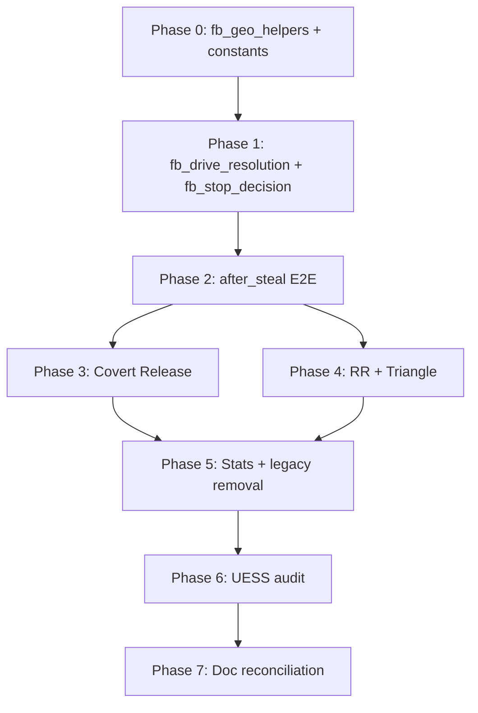

# FB Drive Cutoff & Stop Decision — Work Plan

> **Status:** Approved design, implementation pending (June 2026)  
> **Canonical spec:** [`../06_Gameplay_Systems/Fast_Break_System.md`](../06_Gameplay_Systems/Fast_Break_System.md) — section **FB Drive Cutoff & Stop Decision**  
> **Tracks:** bugs.md item 32 (*Fast Break shots — defender cut off drive*)

This document is the implementation work plan. The Fast Break Bible holds the gameplay spec; this file holds phases, files, tests, flags, and rollout. A **full reconciliation** of `Fast_Break_System.md` (removing legacy subsections) happens in **Phase 7** after code lands.

---

## Goals

1. **One resolver** — `resolve_fb_drive_step()` for all **attack-drive** FB paths across `covert_release`, `rim_runner`, `triangle`, `after_steal`.
2. **Remove split logic** — CR outlet-phase cutoff (Steps 5–6 in `resolve_fast_break_logic`) and the point-race **`compute_fb_shot_geometry`** helper.
3. **UESS compliance** — resolvers stamp `turn_result["fb_drive_resolution"]`; emitters are pure renderers (coords, archetypes, advance triggers).
4. **Safe rollout** — per-play feature flags; legacy paths retained until migration verified.

---

## Approved spec summary (reference)

| Topic | Rule |
|---|---|
| **Cutoff scope** | **`shot_type = attack`** drives only |
| **Contest scope** | **All FB shot types** — `CONTEST_EUCLIDEAN_RADIUS` (11) + `FB_CONTEST_MAX_X_TRAIL` (3); FB-only |
| **Spot-up shots** (Triangle wing/corner 3) | No drive cutoff; contest via 11 + x-trail only |
| **RR hold-up** (OR declines lane pass, no cutoff) | Auto-**HCO**; dynamic stop tree does not run |
| **Outlet cutoff** | **Removed** — outlet completes → shot-drive step runs resolver |
| **BH path** | Straight line, drive-step start → pre-rolled `shot_spot` (rim band); **sprint** rate |
| **Defender pool** | All five; geo-gated via corridor + race; no hard get-back/outlet exclusions |
| **Corridor / slack** | `path_corridor = 14`, `defender_time_slack = 1.0`; no aggression re-roll |
| **Cutoff winner** | Earliest meet on path; others → `basketSpot` |
| **Failed prior stopper** | Permanently excluded from second cutoff; **drift** on drive step |
| **After-steal meet filter** | Meet `x` must be ≥1 toward basket from BH start `x` (steal entry only) |
| **Meet resolution** | D8 → charge (never double foul) → POS_O / NEUTRAL / no meet / terminal |
| **NEUTRAL decision** | Pass (geo + SH>49) → shoot (`calculate_shot_score >= threshold`) → HCO; read 200/125 |
| **Stop-and-shoot type** | ≤15 from basket → `inside`; else `outside` pull-up |
| **POS_O animation** | **Single step**: start → meet → shimmy (±2 grid) → `shot_spot` |
| **NEUTRAL animation** | **Two steps**: dual-gate meet → shoot / pass / HCO |
| **Shimmy axis** | Mostly ±x drive → ±2 **y**; mostly ±y → ±2 **x**; arc → perpendicular 2 grid |
| **Stats** | Gameplay geo-only; track get-back IDs + geo participants by **player id** |

---

## Planned modules

| Module | Path | Role |
|---|---|---|
| Geo helpers | `BackEnd/utils/fb_geo_helpers.py` | Distance, label proximity, geo gates, contest check, steal x-filter, shimmy point |
| Drive resolver | `BackEnd/engine/fb_drive_resolution.py` | `resolve_fb_drive_step()` — cutoff, meet outcomes, per-player ends, timing |
| Stop decision | `BackEnd/engine/fb_stop_decision.py` | `resolve_fb_stop_decision()` — optimal tree + read gate |
| Constants | `BackEnd/constants/fast_break_constants.py` | Corridor, slack, geo radii, label sets, shimmy magnitude |

**Payload:** `turn_result["fb_drive_resolution"]` — consumed by all FB step emitters.

---

## Dependency graph

Phases **3** and **4** can run in parallel after Phase **2** validates the `fb_drive_resolution` contract.

---

## Phase 0 — Foundation (pure helpers + tests) ✅ *Complete (June 2026)*

**Deliverables**

| File | Contents |
|---|---|
| `BackEnd/utils/fb_geo_helpers.py` | `euclidean_to_basket()`; `nearest_spot_label()`; shoot/pass geo gates (≤24 Euclidean **or** label sets); `fb_defender_contests_shot()` (11 + x-trail ≤ 3); `steal_meet_x_ahead_valid()`; `compute_pos_o_shimmy_point(meet, stopper, drive_dir, magnitude=2)` |
| `BackEnd/constants/fast_break_constants.py` | `FB_DRIVE_CUTOFF_PATH_CORRIDOR = 14`, `FB_DRIVE_CUTOFF_TIME_SLACK = 1.0`, `FB_SHOOT_GEO_RADIUS = 24`, shoot/pass label frozensets, `FB_POS_O_SHIMMY_MAGNITUDE = 2` |

**Shimmy implementation notes**

- Compare `\|dx\|` vs `\|dy\|` on drive segment into meet (or meet → rim).
- `\|dx\| ≥ \|dy\|` → offset **±2 y** away from stopper.
- `\|dy\| > \|dx\|` → offset **±2 x** away from stopper.
- Else → unit vector **perpendicular** to drive, scale to **2** grid Euclidean (both axes).
- Clamp to court bounds [1, 49] y / sensible x bounds.

**Tests:** `tests/test_fb_geo_helpers.py`

- Key at 27 Euclidean still qualifies shoot via **nearest label** = `key`.
- Contest edge cases at 11 radius and x-trail 3/4.
- Shimmy axis cases (horizontal, vertical, diagonal).
- Steal x-ahead filter HOME/AWAY.

**Exit criteria:** All helper tests green; no play wiring. ✅ `tests/test_fb_geo_helpers.py` (20 tests).

**Next action:** Phase 3 — Covert Release outlet cutoff removal.

---

## Phase 1 — Core resolver (no play wiring) ✅ *Complete (July 2026)*

**Deliverables**

| File | Contents |
|---|---|
| `BackEnd/engine/fb_stop_decision.py` | Optimal: pass → shoot (`calculate_shot_score` vs threshold, stopper contests) → HCO. Read gate 200/125. Random (≤125) among geo-valid: shoot + HCO always; pass if pass geo valid. |
| `BackEnd/engine/fb_drive_resolution.py` | `resolve_fb_drive_step(...)` orchestrates: `best_cutoff_on_drive` → steal filter → D8 → `calculate_charge` → branch POS_O / NEUTRAL / NO_MEET / terminal. Assign defender ends (`basketSpot`, drift, meet). Build `fb_drive_resolution` payload. |

**Inputs (resolver API sketch)**

- `bh`, `bh_start`, `shot_spot`, `off_lineup`, `def_lineup`, `def_starts`
- `steal_entry: bool`
- `excluded_stopper_ids: set[str]` (failed prior stopper)
- `drift_defender_ids: set[str]` (committed cutoff / outlet denial)
- `is_away_offense`, `game` / teams for foul & shot helpers

**Outputs (`fb_drive_resolution` sketch)**

- `outcome`: `NO_MEET` \| `POS_O` \| `NEUTRAL` \| `DEAD_BALL` \| foul types \| `CHARGE` \| `BLOCKING_FOUL`
- `meet_x/y`, `stopper_id`, `bh_path_knots` (for POS_O: start, meet, shimmy, shot_spot)
- `defender_end_coords`, `defender_archetypes` (sprint / drift)
- `stop_decision`: `shoot` \| `pass` \| `HCO` + receiver id if pass
- `shot_defender_id`, `contested`, `t_drive_game_seconds`, advance trigger metadata
- `geo_participant_defender_ids` (for stats)

**Internal flow**

1. `best_cutoff_on_drive()` — reuse `BackEnd/engine/cutoff_resolution.py`.
2. After-steal: filter meets failing x-ahead rule.
3. `resolve_cutoff_contest()` (D8, steal excluded).
4. `calculate_charge()` — only if D8 did not terminal.
5. `NEUTRAL` → `resolve_fb_stop_decision()`.
6. No meet → BH to `shot_spot`; defenders to `basketSpot`; contest at shot time.

**Tests:** `tests/test_fb_drive_resolution.py`

- No meet → clean rim path, all defenders basketSpot.
- NEUTRAL → each decision branch.
- POS_O → path knots include shimmy.
- D8 foul before charge (no double foul).
- Excluded stopper not re-selected.
- Steal trailing defender invalid meet.

**Exit criteria:** Resolver unit-tested in isolation. ✅ `tests/test_fb_drive_resolution.py` (8 tests) + `tests/test_fb_geo_helpers.py` (20 tests).

**Next action:** Phase 2 — after-steal E2E + `USE_FB_DRIVE_RESOLUTION_AFTER_STEAL` flag.

---

## Phase 2 — After-steal vertical slice (first E2E) ✅ *Complete (July 2026)*

**Why first:** Single drive step; no outlet; UESS migrated; steal x-gate; enables contract validation before CR overhaul.

**Backend changes**

| File | Change |
|---|---|
| `BackEnd/engine/after_steal_fast_break.py` | Replace inline geometry + `compute_fb_shot_geometry` with `resolve_fb_drive_step(steal_entry=True)`. Handle stop, meet fouls/charge, pass-to-teammate, HCO. |
| `BackEnd/engine/after_steal_fast_break_step_emitter.py` | Render from `fb_drive_resolution`: 1-step (POS_O, no meet, terminal); 2-step (NEUTRAL); pass sub-step; HCO via `transition_bridge`. |

**Feature flag:** `USE_FB_DRIVE_RESOLUTION_AFTER_STEAL = True` in `BackEnd/constants/__init__.py`.

**Tests:** Extend `tests/test_after_steal_fast_break*.py` — stop → HCO; stop → pull-up; POS_O shimmy coords; uncontested rim.

**Exit criteria:** After-steal sim + `animation_steps` with flag on; legacy path when flag off. ✅ Flag `USE_FB_DRIVE_RESOLUTION_AFTER_STEAL`; integration module + emitter + `tests/test_after_steal_drive_resolution.py`.

**UESS multi-knot decision (Phase 2 spike):** FE `playAnimationStep` still tweens each player **start → end** in one linear segment. POS_O `bh_path_knots` are stamped on `fb_drive_resolution` and drive-step `advance_trigger.metadata.path_knots` for Phase 6 waypoint playback; **Phase 2 animation uses straight-line BH motion to `shot_spot`** (shimmy is gameplay/logic-only until FE support lands).

**Next action:** Phase 3 — Covert Release outlet cutoff removal.

---

## Phase 3 — Covert Release (largest behavioral change)

**Backend changes**

| File | Change |
|---|---|
| `BackEnd/engine/phase_resolution.py` | **Remove** Steps 5–6 outlet cutoff (~1594–1740). Outlet always → shot path. Call `resolve_fb_drive_step` on attack SHOT branch. Remove `num_getback in (1,2)` defender gates. |
| `BackEnd/engine/covert_release_step_emitter.py` | Remove sharp-outlet IQ cutoff positioning on outlet step. Drive step(s) from `fb_drive_resolution`. Replace fixed DEFENSIVE_STOP → HCO step-2-only with dynamic stop branches. |
| `BackEnd/engine/covert_release.py` | Verify coords-only; no cutoff logic expected. |

**Feature flag:** `USE_FB_DRIVE_RESOLUTION_CR = True`.

**Tests:** New `tests/test_covert_release_drive_resolution.py`.

**Exit criteria:** CR never stops at outlet; dynamic stop tree; all CR `animation_steps` result types.

---

## Phase 4 — Rim Runner + Triangle attack paths

**Rim Runner**

| File | Change |
|---|---|
| `BackEnd/engine/rim_runner_fast_break.py` | Replace `_apply_universal_geometry_for_rr_shot` + `compute_fb_shot_geometry` on finisher attack shots. **Leave RR hold-up → HCO unchanged.** |
| `BackEnd/engine/rim_runner_step_emitter.py` | Drive step from `fb_drive_resolution`; pass branch on stop decision. |

**Triangle**

| File | Change |
|---|---|
| `BackEnd/engine/rim_runner_fast_break.py` | Attack branches: `triangle_bh_drive`, RR post/feeds, lane-pass quick shot → drive resolver. Wing/corner 3: contest only (11 + x-trail; remove 6-spot rule). |
| `BackEnd/engine/triangle_step_emitter.py` | Drive / stop / pass from payload. |

**Feature flags:** `USE_FB_DRIVE_RESOLUTION_RR`, `USE_FB_DRIVE_RESOLUTION_TRIANGLE`.

**Exit criteria:** RR finisher + Triangle attack drives on new resolver; spot-up 3s unified contest.

---

## Phase 5 — Stats, shot resolution, legacy cleanup

| Area | Change |
|---|---|
| `_record_fast_break_stats()` in `phase_resolution.py` | Geo participants + get-back IDs for `FB_A_D`; failed cutoff = `FB_A_D` not `FB_S_D` |
| Team stats | `zero/one/two_defenders_back` from geo count |
| `shot_manager.py` | FB contest 11 + x-trail consistently; skip charge at meet if resolver already terminal; pull-up `inside`/`outside` from stop |
| `fast_break_shot_geometry.py` | Deprecate → delete when all flags default True |
| `USE_UNIVERSAL_FB_SHOT_GEOMETRY_RR/CR` | Remove after migration |
| `animator.py` / legacy `fastBreak.js` | Minimal touch; schema path primary |

**Exit criteria:** No `compute_fb_shot_geometry` callers when all flags on; stats match spec.

---

## Phase 6 — UESS / animation audit

**Per play key checklist**

| Play | Verify |
|---|---|
| **after_steal** | 1-step / 2-step drive; pass; HCO handoff/kickout/walk-up; triggers + archetypes |
| **covert_release** | Outlet step 0 unchanged; drive step(s); post-shot sub-steps |
| **rim_runner** | Burst/outlet unchanged; finisher drive resolution |
| **triangle** | Setup/decision unchanged; attack drive + spot-up contest |

**Cross-cutting**

- `T_game_seconds` matches `_ag_grid_per_game_sec(player, archetype)`.
- Drift on drive step only for committed defenders.
- POS_O multi-knot path renders correctly.
- No advance-trigger hangs (see `projects/bugs.md` § Fast Break animation backlog).

**Exit criteria:** Manual sim on all four play keys; automated tests green.

---

## Phase 7 — Doc reconciliation + rollout

- Full pass on [`Fast_Break_System.md`](../06_Gameplay_Systems/Fast_Break_System.md) — remove legacy 8-step cutoff flow, update universal geometry section, sync play-key subsections.
- Update [`Step_By_Step_System.md`](../05_UESS_System/Step_By_Step_System.md) FB sections.
- Mark **bugs.md** item 32 resolved.
- Default all feature flags **True**; delete legacy branches after soak period.

---

## Feature flags (rollout)

| Flag | Play key | Default (initial) |
|---|---|---|
| `USE_FB_DRIVE_RESOLUTION_AFTER_STEAL` | `after_steal` | `False` until Phase 2 verified |
| `USE_FB_DRIVE_RESOLUTION_CR` | `covert_release` | `False` until Phase 3 verified |
| `USE_FB_DRIVE_RESOLUTION_RR` | `rim_runner` | `False` until Phase 4 verified |
| `USE_FB_DRIVE_RESOLUTION_TRIANGLE` | `triangle` | `False` until Phase 4 verified |

Remove `USE_UNIVERSAL_FB_SHOT_GEOMETRY_RR` / `CR` when respective migrations complete.

---

## Suggested commit sequence

1. `feat(fb): add fb_geo_helpers + unit tests`
2. `feat(fb): add fb_drive_resolution + fb_stop_decision + tests`
3. `feat(fb): wire after_steal drive resolution + emitter`
4. `feat(fb): migrate covert_release off outlet cutoff`
5. `feat(fb): migrate rim_runner + triangle attack drives`
6. `feat(fb): stats + contest unification + remove legacy geometry`
7. `docs(fb): reconcile Fast_Break_System.md`

---

## Risks and mitigations

| Risk | Mitigation |
|---|---|
| **UESS multi-knot BH path** (meet → shimmy → rim in one step) | Phase 2 spike; add `waypoints` on step metadata if start/end insufficient |
| **Stop → pass → finisher shot** | New turn shape; wire `resolve_shot` with receiver at meet; emitter pass + shot sub-steps |
| **Stop → HCO same turn vs next turn** | Same FB turn step 2 + `next_play_type=HCO`; align with RR hold-up / CR stop patterns |
| **Charge at meet vs pull-up in `resolve_shot`** | Resolver owns meet charge; pass flag e.g. `meet_foul_resolved` so shot path skips duplicate charge |
| **Large `phase_resolution.py` diff** | Isolate CR cutoff removal in dedicated commit |
| **Logic vs animation speed mismatch** | Every step stamps `T_game_seconds` from same AG sprint/drift rates as resolver |

---

## Effort estimate (rough)

| Phase | Size |
|---|---|
| 0–1 | Medium — pure logic + tests |
| 2 | Medium — first E2E + emitter |
| 3 | **Large** — phase_resolution + CR emitter |
| 4 | Large — RR + Triangle branches |
| 5–6 | Medium |
| 7 | Small–medium |

---

## Supersedes (post-implementation)

- CR Steps 5–6 outlet cutoff + `map_cutoff_outcome_to_fb` → universal HCO stop
- `compute_fb_shot_geometry` point-race + first-arriver freeze
- Get-back-only `fb_roles["defender"]` assignment
- CR outlet-pass sharp-outlet IQ read cutoff positioning
- Triangle corner-3 **6-spot** defender radius
- After-steal **MAKE/MISS-only** (no stop branch)

---

## Discussion log

Design aligned through chat sessions June 2026. Key decisions captured in Fast Break Bible **FB Drive Cutoff & Stop Decision** section. This work plan created from that spec.

~~**Next action:** Phase 0 + Phase 1 (helpers + resolver + tests, no play wiring).~~ Phases 0–2 done → **Phase 3** next.
