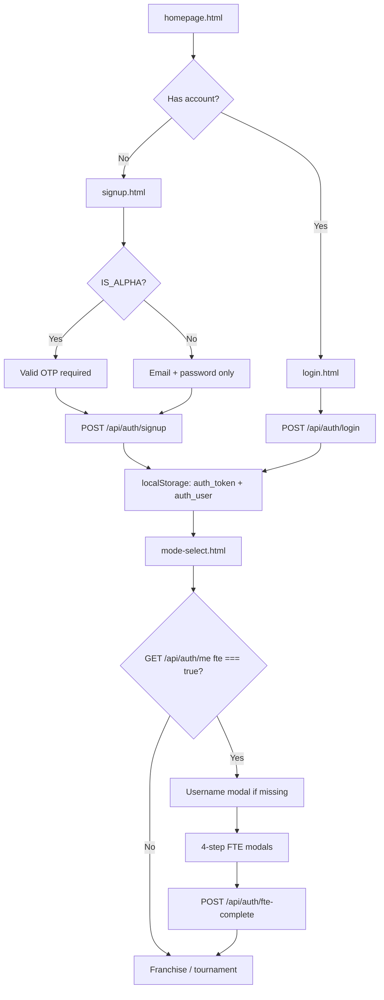

# New User Onboarding — Overview

**Purpose:** Single reference for humans and AI assistants (e.g. Claude) describing how a **new player** gets from the marketing site into the product today. This doc summarizes behavior as implemented in the repo; it is not a product spec for future work.

**Last aligned with:** Alpha-era auth + First-Time Experience (FTE) modals (2025–2026).

---

## At a glance

| Phase | What happens | Primary entry |
|-------|----------------|---------------|
| 1. Discovery | Land on homepage, read CTAs | `homepage.html` / `homepage-v3.html` |
| 2. Account | Sign up (alpha OTP) or log in | `signup.html`, `login.html` |
| 3. First-time UX (FTE) | Username (if needed) + welcome modals | `authBarInit.js` on first protected page |
| 4. Product | Mode select → franchise / tournament | `mode-select.html` → FCC / tournament hubs |

**Not covered here:** In-game tutorials, lineup/gameplay teaching, or franchise-season mechanics. Those are separate systems (see [Active_Page_Analysis.md](../00_General_Systems/Active_Page_Analysis.md) for navigation after onboarding).

---

## End-to-end flow



### Typical happy path (alpha)

1. User visits `/` → Netlify redirects to `homepage.html`.
2. User opens **Sign Up** → `signup.html`.
3. Frontend calls `GET /api/auth/config`; if `otp_required`, shows Alpha Access Code field and disclaimer.
4. User submits email, password, OTP → `POST /api/auth/signup` creates user with `fte: true`, consumes OTP.
5. Browser stores JWT + user payload, redirects to **`/mode-select.html`**.
6. `authGuard.js` loads on mode-select (protected page) → injects `authBarInit.js`.
7. `authBarInit` calls `GET /api/auth/me`; if `fte === true`, runs **FTE**:
   - **Username modal** (if `username` empty) → `POST /api/auth/set-username`
   - **Four welcome steps** (copy in code + design doc)
   - **Done** → `POST /api/auth/fte-complete` sets `fte: false` in DB + localStorage
8. User continues on mode-select: start franchise (`franchise-select-team.html`) or enter existing franchise (`franchise-command-center.html`), or tournament paths.

Returning users with `fte: false` skip step 7.

---

## Phase 1 — Discovery & public pages

### Pages (no login required)

`authGuard.js` allowlist — these paths do **not** require `auth_token`:

| Path | File |
|------|------|
| `/`, `/homepage.html` | `FrontEnd/static/homepage.html` (also `homepage-v3.html`) |
| `/login.html` | `FrontEnd/static/login.html` |
| `/signup.html` | `FrontEnd/static/signup.html` |
| `/reset-password.html` | `FrontEnd/static/reset-password.html` |
| `/faqs.html` | `FrontEnd/static/faqs.html` |

**Routing:** `netlify.toml` redirects `/` → `/homepage.html`.

**Related copy / marketing:**

| Topic | File |
|-------|------|
| FAQs | `_documentation_master/projects/Website_Copy/faqs.md` |
| Tutorials page (linked from nav) | `FrontEnd/static/tutorial.html` |

---

## Phase 2 — Account creation & login

### Frontend

| Concern | File |
|---------|------|
| Signup UI, OTP field, Request Access Code link + thanks modal | `FrontEnd/static/signup.html` |
| Login UI, redirect query param | `FrontEnd/static/login.html` |
| Password reset | `FrontEnd/static/reset-password.html` |
| Shared auth styling | `FrontEnd/static/auth.css` |
| Page protection + load auth bar on protected routes | `FrontEnd/static/js/shared/authGuard.js` |
| API base URL / headers | `FrontEnd/static/js/shared/api-config.js` (if present; signup uses `API_CONFIG`) |

**Redirects after success:**

- Signup → `/mode-select.html` (`signup.html` ~line 161)
- Login → `?redirect=` param or `/mode-select.html` (`login.html`)

### Backend

| Concern | File |
|---------|------|
| All auth endpoints | `BackEnd/api/auth_routes.py` |
| OTP validate / consume | `BackEnd/utils/otp_validator.py` |
| Password hashing, JWT | `BackEnd/utils/auth.py` |
| Mongo collections index | `BackEnd/db.py` (`users`, `alpha_otps`, `access_code_requests`, `password_reset_tokens`) |
| Rate limits on auth | `BackEnd/utils/rate_limiter.py` |

### Key API endpoints

| Method | Path | Role in onboarding |
|--------|------|-------------------|
| GET | `/api/auth/config` | `is_alpha`, `otp_required` for signup UI |
| POST | `/api/auth/request-access-code` | Email-only waitlist; admin sends OTP manually |
| POST | `/api/auth/signup` | Create user; sets `fte: true`, `subscription: "alpha"` |
| POST | `/api/auth/login` | JWT; does not reset FTE |
| GET | `/api/auth/me` | Profile; **`fte`** flag drives FTE modals |
| POST | `/api/auth/set-username` | FTE username step |
| POST | `/api/auth/fte-complete` | Marks onboarding modals complete |
| POST | `/api/auth/reset-request` | Forgot password (not onboarding core) |
| POST | `/api/auth/reset-password` | Reset with token |

### Alpha OTP (when `IS_ALPHA=true`)

| Concern | File |
|---------|------|
| Env flag | `_documentation_master/ENV_VARIABLES.md` (`IS_ALPHA`) |
| Implementation guide (archive) | `docs/To Do/Archive/OTP_Implementation_Guide.md` |
| Alpha launch checklist | `docs/To Do/Archive/0_alpha_launch_plan.md` (Steps 0–1) |
| Used-code tracking (ops, not runtime) | `_documentation_master/projects/Website_Copy/used_otp_codes.md` |
| Generate codes script | `scripts/generate_alpha_otps.py` |

**Request Access Code flow:** User on signup clicks link → `POST /api/auth/request-access-code` → document in `access_code_requests` with `status: "pending"`. No automated email yet; admin fulfills manually.

### User document fields (onboarding-relevant)

Created at signup (`auth_routes.py`):

- `email`, `password_hash`, `role: "user"`
- `subscription: "alpha"`
- `geek_points: 0`
- **`fte: true`** — show first-time modals until `fte-complete`
- `username` / `username_lower` — optional until FTE username step
- `account_settings.display_color: "default"`
- `version: 1`

---

## Phase 3 — First-Time Experience (FTE)

FTE is **post-auth**, **client-driven**, triggered on the first protected page load after login/signup (typically **mode-select**).

### Implementation (source of truth for behavior)

| Concern | File |
|---------|------|
| FTE steps, username modal, account settings shell, `runFTE()` | `FrontEnd/static/js/shared/authBarInit.js` |
| Modal styles | `FrontEnd/static/css/fte.css` |
| Sammy image | `FrontEnd/static/images/sammy_tutorial.png` |
| Mark FTE complete (API) | `BackEnd/api/auth_routes.py` → `POST /fte-complete` |
| Backfill `fte` on users | `scripts/add_fte_field_to_users.py` |

### FTE step sequence (in code)

Defined in `authBarInit.js` as `FTE_STEPS`:

1. **Hey Coach!** — Welcome to Geeked-Out Basketball.
2. **We assume you know hoops.** — Now learn GOB.
3. **Tutorial button** — Points to top-nav Tutorials (preview UI in modal).
4. **YouTube** — Deeper breakdowns on YouTube channel → **Done** calls `fte-complete`.

**Before steps 1–4:** If `GET /api/auth/me` has no `username`, **Choose a username** modal runs first (`set-username`).

### Copy & design references

| Concern | File |
|---------|------|
| Modal copy spec | `_documentation_master/projects/Website_Copy/fte-copy.md` |
| Stub doc (placeholder) | `_documentation_master/00_General_Systems/fte.md` |

### Pages where FTE does **not** run

`authBarInit.js` skips the auth bar (and thus FTE injection path) on:

- `court.html`, `set-lineup.html` (gameplay)
- `training.html`, `training-report.html`
- `box-score.html`, `game-plan.html`, `playbooks.html`
- Play-builder admin pages (listed in `PAGES_WITHOUT_AUTH_BAR`)

FTE still runs on **mode-select** and most locker-room / hub pages.

### Account modal (post-onboarding, same file)

Account settings (username display, Scouting Ambience toggle) — spec in:

- `_documentation_master/00_General_Systems/Account_Modal_System.md`

---

## Phase 4 — Entering the product

After FTE (or immediately if `fte: false`):

| Step | Page | Notes |
|------|------|--------|
| Hub | `FrontEnd/static/mode-select.html` | Franchise cards, alpha disclaimer box, leaderboard hooks |
| New franchise | `FrontEnd/static/franchise-select-team.html` | Pick program |
| Existing franchise | `FrontEnd/static/franchise-command-center.html` | “Locker room” |
| Tournament | `FrontEnd/static/tournament-select.html` → `tournament.html` | Parallel path |

**Navigation map (broader product, not just onboarding):**

- `_documentation_master/00_General_Systems/Active_Page_Analysis.md` — homepage → mode-select → FCC / gameplay pipeline
- `docs/user-flow.md` — older instance-type diagram (account creation marked TBD in places; prefer Active_Page_Analysis + this doc for auth)

**Mode-select alpha copy:**

- `_documentation_master/projects/Website_Copy/alpha_mode_select_copy.md`
- `_documentation_master/projects/Website_Copy/alpha-box-copy.md` (referenced in `mode-select.html` comment)

---

## Documentation index (for Claude)

Use this table when you need depth on a slice of onboarding:

| If you need… | Read first |
|--------------|------------|
| Full auth API, OTP, password reset, request-access-code | `_documentation_master/00_General_Systems/User_Account_System.md` |
| Page graph after login | `_documentation_master/00_General_Systems/Active_Page_Analysis.md` |
| Alpha launch / OTP / legal checklist | `docs/To Do/Archive/0_alpha_launch_plan.md` |
| Manual QA (signup, login, modes) | `_documentation_master/00_General_Systems/Manual_QA_Checklist.md` |
| Env vars (`IS_ALPHA`, email, etc.) | `_documentation_master/ENV_VARIABLES.md` |
| FTE behavior & code | `FrontEnd/static/js/shared/authBarInit.js` |
| Signup/login UI behavior | `FrontEnd/static/signup.html`, `FrontEnd/static/login.html` |

---

## Client-side auth state

After signup or login, the browser stores:

- `localStorage.auth_token` — JWT for `Authorization: Bearer …`
- `localStorage.auth_user` — JSON user object (email, username, `fte`, etc.)

Protected pages: missing token → redirect to `/login.html?redirect=<path>`.

---

## Testing & E2E

| Concern | File |
|---------|------|
| Homepage auth scripts load | `tests/e2e/homepage-v3-auth.spec.js` |
| General manual pass | `_documentation_master/00_General_Systems/Manual_QA_Checklist.md` |

---

## Known gaps / not documented elsewhere

- **No single product spec** for onboarding existed before this file; `fte.md` is still a stub.
- **Transactional email** for access codes and password reset depends on SendGrid env vars (see User_Account_System.md); request-access-code does not email users yet.
- **Homepage variants:** `homepage.html`, `homepage-v3.html`, and related JS may differ; production redirect targets `homepage.html` per `netlify.toml`.
- **Gameplay onboarding** (how to play a quarter) is separate from account/FTE onboarding.

---

## Quick file tree (onboarding-critical)

```
FrontEnd/static/
  homepage.html, homepage-v3.html
  signup.html, login.html, reset-password.html
  mode-select.html
  js/shared/authGuard.js      # public vs protected; loads authBarInit
  js/shared/authBarInit.js    # FTE + username + auth bar
  css/fte.css, auth.css

BackEnd/
  api/auth_routes.py
  utils/otp_validator.py, auth.py

_documentation_master/
  00_General_Systems/User_Account_System.md
  00_General_Systems/Active_Page_Analysis.md
  projects/Website_Copy/fte-copy.md, used_otp_codes.md, alpha-box-copy.md
  projects/onboard_overview.md   # this file
```
