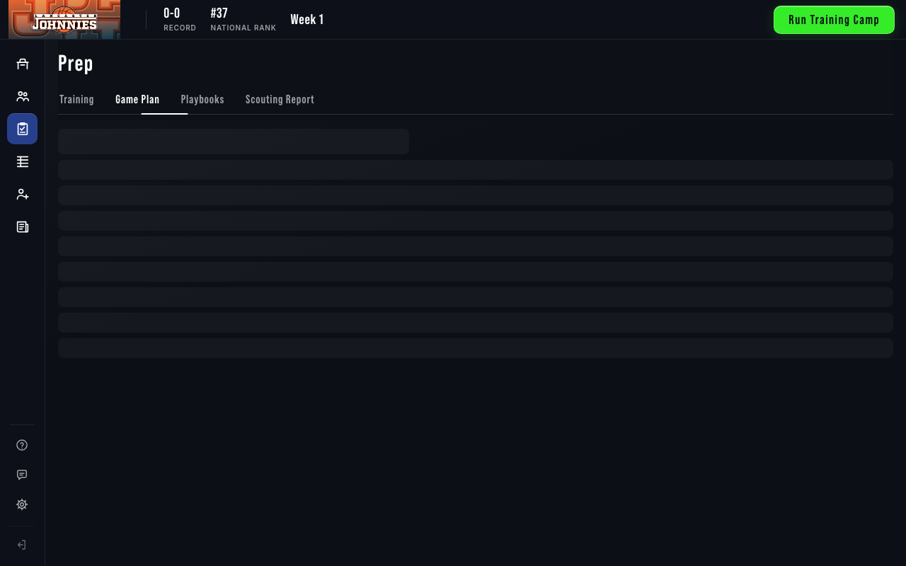
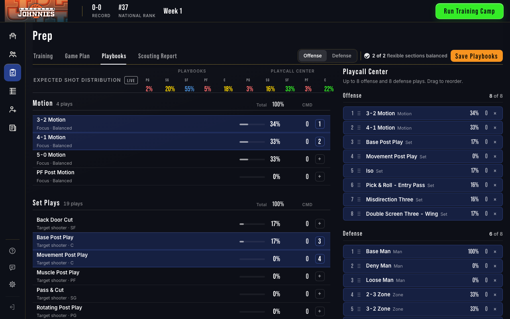
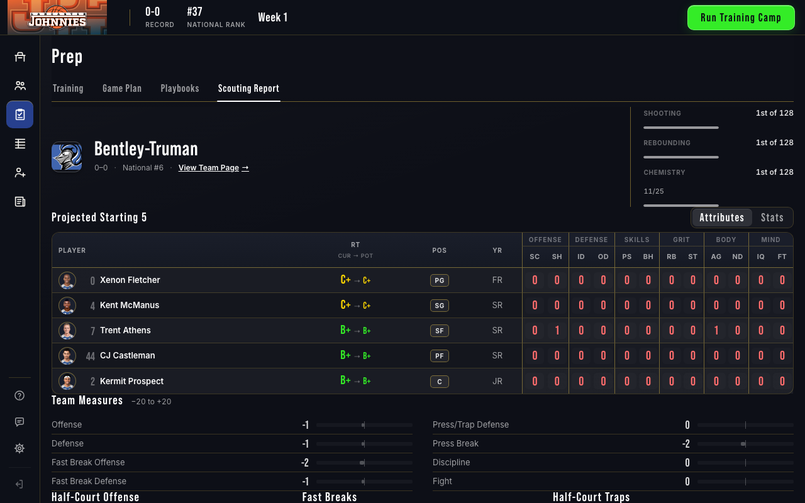
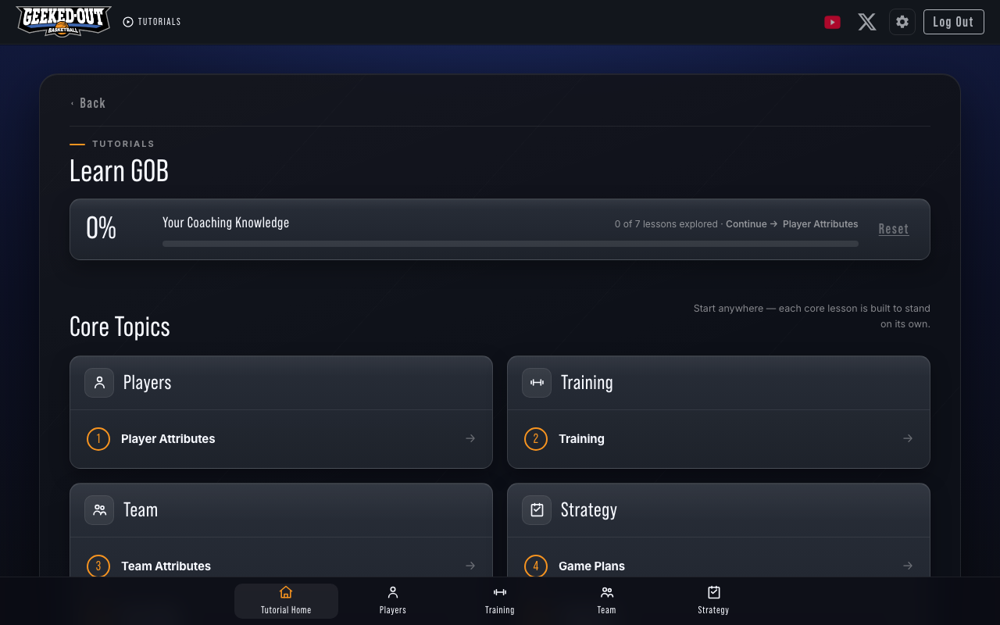

# Coverage map + tab-vs-page timing audit — 2026-09-29

Branch `docs/coverage-map` (from `origin/develop` 5d8c9e9f6). Report only: no product code changed. Data: `reports/coverage-map-2026-09-29.csv` (same rows as the tables below). Measuring script: `scripts/measure_nav_timing.js`.

## Headline

**Screens by kind** (62 reachable screens, plus 21 redirect stubs and 19 unreached/admin pages):

| Kind | Count | Warm open (median range) |
|---|---|---|
| IN-APP VIEW (FCC module views, drill-ins, rail panels) | 19 | 3–43 ms (team view via page reload: 91–92 ms) |
| EMBED BRIDGE (Training, Game Plan, Playbooks, Training Report) | 4 | 5–12 ms |
| FULL PAGE, new design (Recruiting, Box Score) | 2 | Recruiting 295–305 ms |
| FOCUS PAGE (Set Lineup, Court, Cut Players, Playbook Report, Training Squad Report, Training Playbooks, Game Plan timeout/tutorial) | 7 | not timed (flow pages) |
| LEGACY PAGE (Tutorials, Home Base, franchise select, auth, account, archetypes, FAQs, legal, FTE flow) | 30 | Tutorials 28–33 ms, Home Base 105 ms |

**No screen is over 800 ms warm.** The slowest warm open measured anywhere was 398 ms (Recruiting, desktop, worst of 10). Every in-app view opens in under 45 ms warm and under 175 ms cold.

**Online/offline gaps**
- **Broken offline (verified by running):** Player view. Opening a player from the Roster on desktop shows "This player could not be opened" in 10 of 10 runs, while online works (170 ms cold, 5 ms warm). `player-detail.html` links land in the same broken state.
- **Broken in both profiles (verified by running):** the Office rail button does nothing from the Player and Team views, while the Team and League buttons work.
- **Missing online (verified by running):** the Feedback rail button is absent on `recruiting.html` and `stats.html`. `gobShell.js:1259` hides it when the page has no `#feedback-btn`.
- **Hidden offline by design (read in code):** the Feedback modal and `alpha-feedback.html`, Account, the first-time tutorial flow (persona intro, situation, pick opponent), Coaching Archetypes and its leaderboard, and the Home Base community panels. Login, signup and reset password are n/a on desktop.
- **Not verified by running:** Tournament bracket content (locked at week 1), Box Score game content, `training-playbooks.html` (needs session keys from Training), and the Game Plan timeout/tutorial focus mode.
- No page threw a JavaScript error, and no page requested a non-local host, in either profile (smoke pass, 79 pages × 2 profiles).

**Slowest 10** (median of 10 opens, slower profile shown):

| # | Screen | Open | Median / worst | Kind |
|---|---|---|---|---|
| 1 | Recruiting | cold, rail | 311 / 347 ms (online) | FULL PAGE |
| 2 | Recruiting | warm, rail | 305 / 398 ms (desktop) | FULL PAGE |
| 3 | Command Center app load | cold | 232 / 267 ms (online) | IN-APP shell |
| 4 | Player view | cold, drill-in | 170 / 190 ms (online; desktop broken) | IN-APP VIEW |
| 5 | Scouting Report | cold, sub-tab | 154 / 180 ms (desktop) | IN-APP VIEW |
| 6 | Home Base | cold, Exit | 140 / 175 ms (desktop) | LEGACY PAGE |
| 7 | Team Stats | cold, sub-tab | 132 / 151 ms (desktop) | IN-APP VIEW |
| 8 | Team view | cold, drill-in | 132 / 158 ms (desktop) | IN-APP VIEW via page reload |
| 9 | Home Base | warm, Exit | 105 / 134 ms (desktop) | LEGACY PAGE |
| 10 | Playbooks | cold, sub-tab | 100 / 127 ms (desktop) | EMBED BRIDGE |

**Top 5 recommendations**
1. **Fix the desktop player drill-in.** It is the only broken offline screen. The desktop session state has no `player_id`, and `CommandCenterTabs.show` → `updateUrl` rebuilds the URL without it (see Findings).
2. **Make the team drill-in an in-app push, like the player view, and map the detail views in `TAB_SECTION`.** Today every team link reloads the whole Command Center through the `team-roster-view.html` stub: 91–92 ms warm, against 5 ms for the in-app player view, and `return_url` nests on each drill. Adding `player-view`/`team-view` to `TAB_SECTION` (gobShell.js:58-91) would make the Office rail button work from both.
3. **Repoint the live links that still go through redirect stubs.** Each one costs a stub load plus a full Command Center load (about 220 ms cold) instead of a 5–150 ms in-app open. Worst offenders are on hot paths: `officeHome.js:147/158/421`, `gobTables.js:237`, `rankingsView.js:84`, `gobAdvance.js:378`, `training.js:1196/1545`. The full list is below.
4. **Fix the three visual-stability issues.**
   - Playbooks: the skeleton is a generic bar stack and the real two-column layout lands on top of it. Layout-shift score 0.354 on every first open.
   - Scouting: the panel is re-rendered on every reopen, leaving it empty for 4–5 frames. This is also why its warm open is 39–43 ms, the slowest warm module view.
   - Tutorials hub: the core cards push Advanced Topics down (score 0.086).
5. **Keep the tab-vs-page split as it is.** Module views and embed bridges stay in-app, because nothing is near the 800 ms budget. Recruiting stays a full page for now at about 300 ms. It is the largest single saving available (about 250 ms per open) if it later becomes an in-app view. Delete the 9 dead pages and 2 orphans, and fix the UX_System §7/§9/§14 drift.

## Method

- **Script:** `scripts/measure_nav_timing.js`.
  - It starts its own `tests/e2e/helpers/seed_and_serve_desktop.py` server (loopback app, SQLite in `/tmp`) on a free port.
  - It creates its own franchise per timing sequence (`POST /franchise/select-team`, Lancaster) and deletes only that franchise afterwards.
  - Passes:
    - `static`: file scan for html classes, tokens link, redirects, embed guards, inbound `file:line` links and specs.
    - `probe`: Back after each kind of move, and rail from the detail views.
    - `smoke`: every page in both profiles.
    - `timing`: 5 runs × 2 profiles.
    - Capture: screencast frames for anything flagged blank, white or jump in at least half the runs.
- **Profiles** (same local server and same SQLite for both):
  - **desktop / loopback:** `GOB_BUILD_PROFILE=desktop`, as the desktop app runs.
  - **online:** the web profile. The desktop cookie is hidden and auth uses the e2e stub from `tests/e2e/helpers/auth.js`. Online numbers therefore measure client-side cost only, with no network or production API latency.
- **"Content painted"** means a stable real selector is visible and has non-empty text, not the skeleton. Examples: roster `#roster-view .gob-tbl tbody tr`, scouting `.opp-n`, playbooks `#playbooks-view .playbooks-main .play`, Office `#home-tab .office-col .nx-name`, player/team view `.gob-hero-n`. The full list is in the script.
- **Cold vs warm:**
  - For in-app views, cold is the first open in the page's lifetime (view module, CSS and data), and warm is a reopen in the same page.
  - The first tab of each section is opened from the rail starting at Office. Other tabs are opened from their section's sub-tabs.
  - For full pages, cold is the first navigation in a fresh browser context and warm is the second.
  - The app load is from a blank same-origin page to Office painted.
- **Environment:** macOS, headless Chromium via Playwright, 1280×800, one worker, `CI` unset, port 8121 (8010/8088/8157 not used). The server was stopped after each run.
- **Data state:** a fresh franchise at week 1. Tournament is locked, awards are empty, and box score, cut players and playbook report have no flow data.
- **Runs:**
  - Two earlier runs (A, then B before a screenshot-frame fix) gave the same timings.
  - The final script ran **end to end twice (runs C and D), both exit 0, about 1062 s each**. The tables pool the 10 opens per cell from C and D.
- **Stability between C and D:**
  - Identical flags and timeout counts on every screen.
  - Median difference ≤ 5 ms on 71 of 84 timed cells, and at most 34 ms (Recruiting online cold, 290 vs 324 ms). The cells that moved more than 5 ms are all page loads (app load, Recruiting, Home Base, Tutorials), Scouting warm online, and three cold sub-tabs at 6–9 ms.
  - Probe results identical.
  - Smoke results identical except for 3 dead pages, where the harness's `/api/auth/me` 404 was only caught in one run.
- **Evidence codes in the tables:** **R** = verified by running (runs C/D), **C** = read in code.

## Part 1 — Coverage map

Columns follow the brief. "Back" means browser Back returns to where you came from. The Playwright column names specs that reference the view id or page file (`+n` = more in the CSV).

### In-app views (Command Center, `franchise-command-center.html`)

| Screen | View id | Rail | How you get there | Kind | GOBNav | Back | Online | Offline | Ev. | New design | Playwright |
|---|---|---|---|---|---|---|---|---|---|---|---|
| Office | `home-tab` | office | rail / landing | IN-APP VIEW | push | yes | works | works | R | yes | app-router, navigation-history, shell-1 (+5) |
| Roster | `roster-view` | team | rail | IN-APP VIEW | push | yes | works | works | R | yes | t2-roster, shell-1, attr-tiles (+6) |
| Player Stats | `player-stats-view` | team | sub-tab | IN-APP VIEW | replace | yes | works | works | R | yes | player-stats, fcc-roster-data (+4) |
| Team Attributes | `team-attributes-view` | team | sub-tab | IN-APP VIEW | replace | yes | works | works | R | yes | shell-1, t2-roster (+3) |
| Team Schedule | `team-schedule-view` | team | sub-tab | IN-APP VIEW | replace | yes | works | works | R | yes | schedule-views, shell-1 (+3) |
| Practice Squad | `practice-squad-view` | team | sub-tab | IN-APP VIEW | replace | yes | works | works | R | yes | practice-squad-view, shell-1b |
| Training | `training-view` | prep | rail | IN-APP VIEW | push | yes | works | works | R | yes | shell-1, shell-1b |
| Game Plan | `game-plan-view` | prep | sub-tab | IN-APP VIEW | replace | yes | works | works | R | yes | shell-1, shell-2 (+2) |
| Playbooks | `playbooks-view` | prep | sub-tab | IN-APP VIEW | replace | yes | works (jump) | works (jump) | R | yes | shell-1, store-client (+1) |
| Scouting Report | `scouting-view` | prep | sub-tab | IN-APP VIEW | replace | yes | works | works | R | yes | prep-scouting, shell-1 (+1) |
| Training Report | `training-report-view` | prep | Office card / after training (via stub) | IN-APP VIEW | push (stub load) | yes (C) | works | works | R load / C entry | yes | shell-1b |
| Standings | `standings-view` | league | rail | IN-APP VIEW | push | yes | works | works | R | yes | app-router, t1-tables (+5) |
| Rankings | `rankings-view` | league | sub-tab | IN-APP VIEW | replace | yes | works | works | R | yes | subtabs, app-router (+3) |
| Leaders | `leaders-view` | league | sub-tab | IN-APP VIEW | replace | yes | works | works | R | yes | t1-tables, t3-detail (+2) |
| Team Stats | `team-stats-view` | league | sub-tab | IN-APP VIEW | replace | yes | works | works | R | yes | t1-tables, subtabs (+3) |
| League Schedule | `league-schedule-view` | league | sub-tab | IN-APP VIEW | replace | yes | works | works | R | yes | schedule-views, team-schedule-columns (+2) |
| Tournament | `tournament-view` | league | sub-tab (locked until tournament) | IN-APP VIEW | replace | yes (C) | works (locked) | works (locked) | R locked / C content | yes | tournament-view, shell-1b |
| News | `news-view` | news | rail | IN-APP VIEW | push | yes | works | works | R | yes | news-awards, shell-1 (+2) |
| Awards | `awards-view` | news | sub-tab | IN-APP VIEW | replace | yes | works (empty) | works (empty) | R | yes | news-awards, shell-1b |
| Player | `player-view` | — (context) | player links (`GOBViews.open`) | IN-APP VIEW | push | yes | works | **BROKEN** | R | yes | t3-detail, subtabs |
| Team | `team-view` | — (context) | team links → `team-roster-view.html` stub | IN-APP VIEW via **page reload** | location.href | yes | works | works | R | yes | t3-detail |
| Settings panel | `gobSettings` | rail utility | rail button | IN-APP VIEW (panel) | none | n/a | works | works ("Offline", no account) | R / C | yes | foundation-settings, desktop-settings-faqs |
| Feedback modal | `alphaFeedbackModal` | rail utility | rail button | IN-APP VIEW (modal) | none | n/a | works on FCC; **missing on recruiting/stats** | hidden | R | yes | navigation-history |

Back, verified by running in both profiles:
- Rail push Office → Team, then Back: returns to Office.
- Sub-tab replace Roster → Player Stats, then Back: returns to the entry before the rail push (Office), as `replace` intends.
- Roster → Player, then Back: returns to Roster.
- Standings → Team (page), then Back: returns to Standings.
- Recruiting, Tutorials or Home Base, then Back: returns to the Command Center at Office.

### Full pages, focus pages and legacy pages

| Screen | URL | Rail | How you get there | Kind | GOBNav | Back | Online | Offline | Ev. | New design | Playwright |
|---|---|---|---|---|---|---|---|---|---|---|---|
| Recruiting | `/recruiting.html` | recruiting | rail (`GOBNav.go`) | FULL PAGE | push (page) | yes | works | works | R | yes | recruiting-tabs, recruits-pool, signing-day-hub (+12) |
| Box Score | `/box-score.html` | — | game rows / post-game | FULL PAGE (browse with `return_url`, else focus) | push (page) | C | loads | loads | R load / C content | yes | moment-queue, news-awards (+2) |
| Set Lineup | `/set-lineup.html` | — | Advance → Play game | FOCUS PAGE | page | C | loads | loads | R / C | yes | desktop-play-flow, game-start-sequence (+5) |
| Court (live game) | `/court.html` | — | from Set Lineup / Game Plan | FOCUS PAGE (no shell) | page | C | loads | loads | R / C | no | desktop-play-flow, depth-ordering (+3) |
| Cut Players | `/cut-players.html` | — | Advance when over roster limit | FOCUS PAGE | page | C | loads (needs flow params) | loads (needs flow params) | R / C | yes | fcc-recruiting-buttons, office-frontend, shell-2 |
| Playbook Report | `/playbook-report.html` | — | Playbooks save | FOCUS PAGE | page | C | loads (needs flow params) | loads (needs flow params) | R / C | yes | shell-2 |
| Training Squad Report | `/training-squad-report.html` | — | after Training submit | FOCUS PAGE | page | C | loads | loads | R | yes | shell-2 |
| Training Playbooks | `/training-playbooks.html` | — | Training → Custom Training Playbook | FOCUS PAGE | page | C | not verified | not verified | C | unknown | shell-2 |
| Game Plan (timeout/tutorial) | `/game-plan.html?resume_from_timeout=true` or `mode=tutorial` | — | in-game timeout; first-time tutorial | FOCUS PAGE | page | C | C | C | C | no | desktop-play-flow, navigation-history |
| Tutorials hub | `/tutorial.html` | rail utility | rail Tutorials link | LEGACY PAGE | page | yes | works (jump) | works (jump) | R | no | none found |
| 11 tutorial lessons | `/tutorial-*.html` (player-attributes, training, team-attributes, game-plans, playbooks, scouting, recruiting, advanced momentum / practice-squads / press-trap / training-by-position) | — | Tutorials hub | LEGACY PAGE | page | C | works | works | R | no | none found |
| FTE persona intro / situation / pick opponent | `/tutorial-persona-intro.html`, `/tutorial-situation.html`, `/tutorial-pick-opponent.html` | — | first-time flow (`authBarInit.js:277-280`) | LEGACY PAGE | page | C | loads | hidden | R / C | no | none found |
| Home Base | `/mode-select.html` | rail utility | rail Exit | LEGACY PAGE | page | yes | works (C; harness bounced to login) | works (community panels hidden) | R desktop / C online | no | desktop-play-flow, home-base-offline-guard (+3) |
| Franchise select team | `/franchise-select-team.html` | — | Home Base → new franchise | LEGACY PAGE | page | C | works | works | R | no | desktop-play-flow |
| Team builder | `/team-builder.html` | — | franchise select builder mode | LEGACY PAGE | page | C | bounces (flag off) | bounces (flag off) | R | no | none found |
| Homepage | `/` (`homepage.html`) | — | public entry | LEGACY PAGE | page | C | works | n/a | R | no | homepage-v3-auth, shell-site-footer |
| Login / Signup / Reset password | `/login.html`, `/signup.html`, `/reset-password.html` | — | auth | LEGACY PAGE | page | C | works | n/a (authGuard skips login on desktop) | R / C | no | recruiting-tabs, shell-1b (login only) |
| Account | `/account.html` | — | Settings panel (online only) | LEGACY PAGE | page | C | works | hidden | R / C | no | shell-site-footer |
| Alpha feedback | `/alpha-feedback.html` | — | Feedback modal | LEGACY PAGE | page | C | works | hidden | R / C | no | navigation-history |
| Coaching Archetypes | `/coaching-archetypes.html` | — | Account / archetype modals | LEGACY PAGE | page | C | works | hidden | R / C | no | navigation-history, shell-1 |
| Archetypes leaderboard | `/coaching-archetypes-leaderboard.html` | — | Home Base community panel | LEGACY PAGE | page | C | works | hidden | R / C | no | none found |
| FAQs | `/faqs.html` | — | Settings panel / footers | LEGACY PAGE | page | C | works | works | R | no | desktop-settings-faqs, foundation-settings (+1) |
| Privacy / Terms | `/privacy.html`, `/terms.html` | — | footers | LEGACY PAGE | page | C | works | works | R | no | none found |
| Play details | `/play-details.html` | — | Playbooks play row | LEGACY PAGE | page | C | loads | loads | R | no | none found |

Design system at runtime (smoke pass, `html.gob` + gob tokens stylesheet):
- **Yes:** the Command Center and everything inside it, `recruiting.html`, `box-score.html`, and the gob focus pages (`set-lineup`, `cut-players`, `playbook-report`, `training-squad-report`). `stats.html` is a redirect stub to League › Team Stats.
- **No:** every other page. Static HTML alone under-reports this: only the Command Center and `recruiting.html` carry the tokens link statically, and the class is added at runtime.

### Redirect stubs still linked directly

Every stub loads and forwards correctly in both profiles (R). The live links below cost an extra document load plus a full Command Center load. `franchise-command-center.js` links sit in legacy panel code: several of those anchors only exist in legacy `tab-content` panels, or in no HTML at all.

| Stub | Goes to | Still linked from (file:line) |
|---|---|---|
| `player-detail.html` | FCC `?tab=player-view` | `officeHome.js:147`, `team-roster-view.js:98`, `franchise-command-center.js:398` |
| `team-roster-view.html` | FCC `?tab=team-view` (stays a page for `mode=practice_squad&ps_team_id`) | `officeHome.js:158`, `gobTables.js:237`, `rankingsView.js:84`, `franchise-select-team.js:657`, `franchise-command-center.js:796`. `practiceSquadView.js:79` is the legitimate PS page |
| `training-report.html` | FCC `?tab=training-report-view` | `officeHome.js:421` |
| `training.html` | FCC `?tab=training-view` | `gobAdvance.js:378`, `training-playbooks.js:81` |
| `game-plan.html` | FCC `?tab=game-plan-view` | `training.js:1196`, `training.js:1545`, `box-score.js:2182`, `franchise-command-center.js:4387` |
| `playbooks.html` | FCC `?tab=playbooks-view` | `playbook-report.js:353`, `play-details.html:527`, `franchise-command-center.js:2260`, `2274` |
| `standings.html` | FCC `?tab=standings-view` | `franchise-command-center.js:1777`, `1779`, `1794` |
| `rankings.html` | FCC `?tab=rankings-view` | `franchise-command-center.js:1804`, `1806` |
| `leaders.html` | FCC `?tab=leaders-view` | `franchise-command-center.js:1792`, `1818` |
| `team-stats.html` | FCC `?tab=team-stats-view` | `franchise-command-center.js` leftover `#team-stats-full-link` |
| `stats.html` | FCC `?tab=team-stats-view` | bookmarks / old links (Jamie Q7 A) |
| `team-traits.html` | FCC `?tab=team-attributes-view` | bookmarks / old links (Jamie Q7 A) |
| `brackets.html` | FCC `?tab=tournament-view` | `franchise-command-center.js:5349` |
| `practice-squad-standings.html` / `practice-squad-bracket.html` | FCC `?tab=practice-squad-view` | `practice-squad-standings.js:62`, `:216`, `practice-squad-bracket.js:56` (the stubs' own legacy scripts) |
| `news.html` | FCC `?tab=news-view` | `news.js:62` (the stub's own legacy script) |
| `recruiting-common.js:126`, `cut-players.js:182`, `set-lineup.js:170` | team-roster-view with recruit / flow modes | legitimate page modes, listed for completeness |

`musicController.js` checks for these paths but doesn't link to them. The comment at `franchise-command-center.js:3489` is not a link. Stubs with no inbound links: `game-plans.html`, `player-attributes.html`, `scouting.html`, `team-attributes.html` (all go to tutorial lessons), and `index.html` (Netlify serves `/` as `homepage.html`).

### Dead, orphaned and internal pages

- **Orphans** (the page works but nothing live links to it): none remaining from the 2026-09-29 pass. `stats.html` and `team-traits.html` are now redirect stubs (Jamie Q7 A).
- **Dead** (0 inbound links): `Playcall Center POC.html`, `Tournament Tab.html`, `_preview-training-phase5.html`, `coaching-grid.html`, `homepage-backup.html`, `homepage-v2-legacy.html`, `homepage-v3-source.html`, `scrimmage-select.html`, `tb-band-placement-qa.html`.
- **Ops / reviewer only:** `maintenance.html` (the Netlify wildcard, currently commented out), `trailer.html` (Netlify `/trailer`), `homepage-v3.html` (authGuard public list only; same content as the homepage).
- **Admin only** (`adminGuard`): `fcp-skeletons.html`, `hct-skeletons.html` (`skeleton_routes`), `play-builder.html`, `play-builder-v2.html` (`play_routes`), `plays-builder.html`.

## Part 2 — Timing

Median / worst in ms over 10 opens (runs C + D, 5 each). The last column shows the run C and run D medians for the warm open, or the cold open where there is no warm one, as the stability check. "Locked" = the Tournament sub-tab is locked at week 1. "Timeout" = content never painted within 15 s.

| Screen | Desktop cold | Desktop warm | Online cold | Online warm | Run C / D median (desktop, online) |
|---|---|---|---|---|---|
| Command Center app load | 219 / 248 | — | 232 / 267 | — | cold 216/227, cold 223/235 |
| Roster | 26 / 30 | 11 / 11 | 26 / 30 | 10 / 11 | 10/11, 9/11 |
| Player Stats | 24 / 29 | 7 / 8 | 23 / 25 | 7 / 8 | 8/7, 7/6 |
| Team Attributes | 14 / 15 | 4 / 5 | 12 / 17 | 3 / 8 | 5/3, 3/3 |
| Team Schedule | 52 / 69 | 5 / 6 | 51 / 82 | 5 / 9 | 5/5, 5/5 |
| Practice Squad | 33 / 35 | 4 / 6 | 34 / 37 | 3 / 7 | 4/4, 3/6 |
| Training (embed) | 22 / 25 | 12 / 14 | 24 / 32 | 12 / 14 | 12/12, 13/12 |
| Game Plan (embed) | 24 / 25 | 5 / 7 | 24 / 24 | 5 / 8 | 5/5, 5/5 |
| Playbooks (embed) | 100 / 127 | 6 / 8 | 98 / 133 | 6 / 7 | 7/6, 6/6 |
| Scouting Report | 154 / 180 | 39 / 72 | 152 / 188 | 43 / 64 | 38/40, 38/63 |
| Standings | 29 / 30 | 7 / 9 | 29 / 30 | 7 / 10 | 7/7, 7/7 |
| Rankings | 75 / 108 | 7 / 8 | 75 / 84 | 6 / 7 | 7/7, 6/6 |
| Leaders | 82 / 88 | 4 / 6 | 83 / 85 | 4 / 5 | 4/5, 4/4 |
| Team Stats | 132 / 151 | 27 / 31 | 129 / 160 | 27 / 30 | 27/27, 27/26 |
| League Schedule | 55 / 81 | 7 / 8 | 56 / 69 | 7 / 8 | 7/7, 7/8 |
| Tournament | locked | locked | locked | locked | — |
| News | 39 / 40 | 6 / 10 | 39 / 68 | 7 / 10 | 8/4, 7/7 |
| Awards | 38 / 45 | 5 / 7 | 37 / 44 | 6 / 8 | 4/5, 6/4 |
| Office (back from Team) | — | 7 / 11 | — | 9 / 11 | 11/5, 9/6 |
| Player view (drill-in) | **timeout 10/10** | — | 170 / 190 | 5 / 8 | —, 5/5 |
| Team view (drill-in, page reload) | 132 / 158 | 92 / 100 | 130 / 144 | 91 / 110 | 91/95, 89/91 |
| Recruiting (page) | 299 / 340 | 305 / 398 | 311 / 347 | 295 / 320 | 296/327, 295/295 |
| Tutorials hub (page) | 46 / 50 | 33 / 46 | 34 / 41 | 28 / 32 | 29/37, 32/28 |
| Home Base (page) | 140 / 175 | 105 / 134 | timeout (harness) | timeout (harness) | 101/123, — |

Skeleton: every in-app view shows a skeleton on its first open, in every run, and none on reopen. Time the skeleton stays up (desktop/online, cold median):
- Roster 24/23 ms, Player Stats 17/18, Team Attributes 9/8, Team Schedule 50/43, Practice Squad 31/31.
- Training 17/20, Game Plan 19/18, Playbooks 95/93, Scouting 151/146.
- Standings 26/26, Rankings 77/69, Leaders 75/76, Team Stats 127/130, League Schedule 51/53.
- News 33/34, Awards 33/33, Player view (online) 166.

No white flash was detected on any page navigation (app load, Team view, Recruiting, Tutorials, Home Base): the page background was never white after first paint in either profile. In-app switches never leave the dark shell.

### Flashes and layout jumps

The desktop screenshots are shown. The online frames have identical shift scores and sources.

- **Playbooks, first open (jump in 10/10 runs per profile, layout-shift score 0.354).**
  - The skeleton is a generic stack of full-width bars.
  - When the view paints, the real two-column layout replaces it: the Motion and Set Plays tables on the left, and the Playcall Center lists on the right.
  - The shift sources are `div#pane-offense.playbooks-tabpane`, `section.pbs.pb-sec` and `div.pcs-g`.
  - The Advance button's label change during the swap ("Submit Training" → "Run Training Camp", `div.adv-wrap`) contributes 0.000.

  
  

- **Scouting Report, every reopen (blank panel in 10/10 runs per profile).**
  - The panel is cleared and re-rendered each time. The page's own check sees `#scouting-view` shown but empty for 4–5 animation frames before the opponent card returns (39–43 ms warm, against 3–12 ms for other views).
  - The nearest captured frame (26 ms) already shows content, so the empty panel was not caught on screen at 1280. Treat this as a wasted re-render rather than a visible flash.

  

- **Tutorials hub, first open (jump in 3–4 of 5 runs, score 0.086).** The core topic cards render after the page shell and push `section#advanced-topics` down.

  

### Recommendations: in-app vs full page

| Screen(s) | Today | Warm / cold median | Recommendation |
|---|---|---|---|
| Team, Prep, League and News module views | IN-APP VIEW | 3–43 / 12–154 ms | Keep in-app. Nothing is near budget. |
| Training, Game Plan, Playbooks, Training Report | IN-APP VIEW | 5–12 / 22–100 ms (embed-era numbers; modules since 2026-09-29) | Keep in-app. Fix the Playbooks skeleton shape. |
| Scouting Report | IN-APP VIEW | 39–43 / 152–154 ms | Keep in-app. Render from cache on reopen instead of clearing the panel. |
| Player view | IN-APP VIEW (push) | 5 / 170 ms online | Keep in-app. Fix desktop (broken). |
| Team view | IN-APP VIEW behind a page reload | **91–92** / 130–132 ms | Convert to an in-app push (`GOBViews.open`), like the player view. Expect about 5 ms warm. |
| Recruiting | FULL PAGE | **295–305** / 299–311 ms | Keep as a page for now (under budget). It is the biggest win if made in-app: warm is no faster than cold. |
| Tutorials hub and lessons | LEGACY PAGE | 28–33 / 34–46 ms | Keep as pages (outside the franchise shell). Reserve card space. |
| Home Base | LEGACY PAGE (Exit) | 105 / 140 ms desktop | Keep as a page. It's an exit, not a tab. |
| Focus pages | FOCUS PAGE | not timed | Keep as pages (flow screens by design). |
| Redirect stubs | stub → FCC | stub + ~220 ms app load | Keep the stubs for bookmarks. Repoint the live links listed above to in-app opens. |

**Over 800 ms warm: none.**

## Findings

1. **The desktop player drill-in is broken (R, 10/10 runs).**
   - Clicking a player on the Roster lands on `player-view`, which shows "This player could not be opened". Opening `player-detail.html?id=…` behaves the same.
   - Cause (read in code): the desktop `FranchiseContext` (SessionContextProvider, localStorage) reads the URL only at boot. `CommandCenterTabs.show` → `updateUrl` rebuilds the URL from that stored state, which has no `player_id`.
   - Online works: 170 ms cold, 5 ms warm.
2. **The Office rail button is inert from the Player and Team views (R, both profiles).** `TAB_SECTION` (gobShell.js:58-91) has no `player-view` / `team-view` entries, so the rail handler treats the current section as `office` and does nothing. Team and League work from both views. On desktop, the rail check from the Player view timed out because of finding 1.
3. **The team drill-in is a full page reload (R).**
   - Links from Standings, Rankings, Office and Scouting go to `/team-roster-view.html`, which forwards to FCC `?tab=team-view`. That's 91–92 ms warm, against 5 ms for the in-app player view.
   - `return_url` is appended again on each drill, so it nests.
   - Back still works.
4. **Feedback is missing on page-shell screens online (R).** `recruiting.html` and `stats.html` render the rail without Feedback (`gobShell.js:1259`: hidden when the page has no `#feedback-btn`).
5. **Desktop reopens the last tab (R, observation).** Opening `franchise-command-center.html` without `?tab=` on desktop restored the last stored tab. In the smoke pass that was the locked Tournament view. This is intended resume behaviour, but restoring a locked tab gives a locked screen.
6. **Harness notes.**
   - The online profile uses the e2e stub token against the loopback server. `/api/auth/me` returns 404 there because the local user has no account record, so the online rail Exit lands on `login.html` and Home Base has no online timing.
   - `/franchise/awards` returns 400 before awards exist (week 1).
   - `cut-players` (`/roster/null` 404) and `playbook-report` (`/api/playbooks` 422) need flow parameters the smoke pass doesn't supply.
   - None of these is a product failure.
7. **UX_System drift** (`_documentation_master/11_Design_Systems/UX_System.md`).
   - §7 lines 119-121 describe Prep Training, Game Plan and Playbooks as `training.html` / `game-plan.html` / `playbooks.html`. They are embed-bridge views inside the Command Center, and the files redirect.
   - §7 line 122 lists Scouting Report as `coaches-tab`. It is `scouting-view`.
   - §9 lines 181, 183, 193 and 196 still class `practice-squad-standings.html`, `brackets.html`, `training.html` and `playbooks.html` as plain browse pages without noting that they redirect. Lines 186 and 188 do note it for leaders and team-stats.
   - §14 line 385 says a list opens `team-view` with a push. In practice team links load `team-roster-view.html`, which reloads the Command Center.

## Reproduce

```bash
env -u CI PORT=8121 PLAYWRIGHT_BROWSERS_PATH="$HOME/Library/Caches/ms-playwright" \
  node scripts/measure_nav_timing.js --pass=static,probe,smoke,timing --runs=5 \
  --shots=reports/coverage-map --out=/tmp/nav-run.json
```

This takes about 18 minutes. The script starts and stops its own server and deletes the franchises it creates. Use `--only=<view ids or pages>` for a subset and `--reuse` to point it at a running server.

STATUS: COMPLETE
