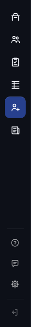
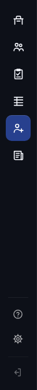

# Navigation fixes from the coverage map — 2026-09-29

Branch `fix/nav-coverage` (from `origin/develop` at `fb17e66e1`). This is frontend navigation only: no sim, finalize or backend change, and no colour or layout change. The three visual-stability jumps (Playbooks skeleton, Scouting re-render, Tutorials hub) are out of scope and untouched.

Source: `reports/coverage-map-2026-09-29.md`, Findings 1–5 and 7, and Recommendation 3.

## Findings → fixes

| Finding | Fix (file::function) |
|---|---|
| 1. Desktop player drill-in is broken | `franchiseContext.js::SessionContextProvider.prototype.absorbLocation` (new) and `FranchiseContext.prototype.absorbLocation`; `gobNav.js::absorbIntoContext`, called from `pushSection`, `syncCurrent` and `onPopState` |
| 2. Office rail button inert from Player / Team | `gobShell.js::TAB_SECTION` (`player-view`/`team-view` → `detail`), `DETAIL_SECTION`, `detailOrigin`, `sync`, `sectionFromReturn` |
| 3. Team drill-in is a full reload; `return_url` nests | `gobTables.js::viewHref` (new), `rosterHref`, `originForReturnTab`; `gobViews.js::drillUrl` / `onDrillClick` (new document click delegate); `officeHome.js::go` / `inAppView` |
| 4. Feedback on `recruiting.html` / `stats.html` | `gobShell.js::revealFeedbackWhenReady` (new), `setShown` (new); the Command Center rail's desktop hide now uses `setShown` too |
| 5. Desktop resume onto a locked tab | `gobShell.js::leaveLockedTab` (new, with `resumePending`), called from `sync` and `refreshTournamentLock` |
| 7. UX_System drift | `UX_System.md` §5 (rail Feedback line), §7 (Prep rows), §9 (redirect notes), §14 (drill-ins, desktop URL sync, locked resume) |
| Rec. 3. Repoint stub links | See "Links changed" below |

### 1. Desktop player drill-in

On desktop, `FranchiseContext` stores its state in `localStorage` and read the URL only once, at boot. Every tab switch (`CommandCenterTabs.show` → `updateUrl`) rebuilt the URL from that stored state, which had never seen `player_id`, so the player view lost its id.

The fix is at the source. Each same-document URL change (push, replace, Back/Forward) now passes through `FranchiseContext.absorbLocation()`, which writes the URL's changes into the desktop session. It applies only what changed between the last URL it saw and this one. A key that was present and is now gone is deleted, a changed value is written, and session-only keys (and keys a screen removed through `commitParams`) are left alone.

The web provider's `absorbLocation` is a no-op, because the query string already is the store there. So online behaviour is unchanged.

- Measured 10/10 on desktop with `--only=player-view` (the full table is below).
- `player-detail.html?id=…` lands on the right player on desktop (Playwright).

### 2. Office from Player / Team, and which section is highlighted

`player-view` and `team-view` now map to a `detail` pseudo-section, so every rail button, Office included, leaves a drill-in.

The rule for which section is highlighted is **the section you came from, taken from `?origin=`**. Every drill link stamps an origin.
- A bare deep link with no origin gets one stamped by the existing `detailBar.stampOrigin` once the data loads: Team for your own player or team, League for anyone else's.
- Nothing is highlighted only in the moment before that data arrives, or if the load fails.

### 3. Team links open in-app

- **Team links are built in-app.** `GOBTables.rosterHref` (used by Standings, Leaders, Team Stats, Rankings, and the FCC builder behind Scouting's "View Team Page") now returns `/franchise-command-center.html?…&tab=team-view&view_team_id=…`.
  - It starts from the current query, minus the previous drill's keys: `player_id`, `view_team_id`, `roster_team_id`, `team_name`, `pager`, `up`, `return_url`, `origin`, `return_tab`, `id`.
- **Clicks open with a push.** `gobViews.js` adds one document-level click delegate. A plain left click on a link to a registered Command Center view opens it with `GOBViews.open(url, 'push')`, with no document load.
  - An old `team-roster-view.html?roster_team_id=…` or `player-detail.html?id=…` link clicked inside the Command Center is read the way its stub reads it, and opens in place too.
  - The delegate skips modified or middle clicks, `target` other than `_self`, `data-gob-up` / `data-gob-replace` links, and anything a view's own handler already handled (`defaultPrevented`).
  - The practice-squad team page (`mode=practice_squad&ps_team_id`) and recruit-mode player pages are left as real pages.
- **No more nesting.** Drill URLs never carry `return_url`, and the delegate runs before `GOBNav`'s window handler that used to stamp it, so it can't nest. Back is the history pop, and it returns to the list.
- **The stub stays.** `team-roster-view.html` is unchanged as a redirect for bookmarks and old links.

### 4. Feedback — the finding was mis-measured

The coverage map read the `hidden` attribute. But `.gob .rail-i { display: flex }` beats `[hidden]`, so the attribute and what's painted disagreed:
- **Web, page-shell screens:** the button was *painted* even though `hidden` was set. That happened whenever the shell mounted before the auth bar (loaded asynchronously by `authGuard`) had added `#feedback-btn`, which is the case the map saw. It came out as a visible button whose state said hidden.
- **Desktop, every shell:** the button was painted despite `hidden = true`. This is the real visible bug. Desktop is supposed to omit Feedback.

The fix is in `gobShell`, not per page:
- `setShown` sets both the attribute and an inline `display: none`.
- `revealFeedbackWhenReady` shows the page-shell button once `#feedback-btn` exists, watching for it (with a 15 s cap) when the auth bar lands after the shell. Pages without an auth bar never show it, because clicking it would do nothing.
- Desktop hides it on both the Command Center rail and page shells.

This is the one visible change, on desktop only. Rail on `recruiting.html` at 1280 on desktop, before and after:

 

### 5. Locked-tab resume

On desktop, opening the Command Center **without `?tab=`** restores the last tab. If that tab is Tournament and the week is before 27, the shell now opens Office with a replace.

- "Without `?tab=`" is read from the document's navigation entry, i.e. the URL that was actually requested.
- It's decided once, when the week is first known, because boot passes through the HTML's default tab first.
- An explicit `?tab=tournament-view` link, or `brackets.html`, still shows the locked Tournament screen. `tournament-view.spec.js` relies on that screen.
- Web has no resume (the URL is the state), so the same rule never fires there. The web test confirms that a URL with no tab opens Office.

## Links changed

| Was | Now |
|---|---|
| `officeHome.js:147` `playerHref` → `/player-detail.html?id=…` | `GOBTables.viewHref({ tab: 'player-view', player_id, origin: 'office', up: 'Office', return_tab: 'home-tab' })` |
| `officeHome.js:158` `teamHref` → `/team-roster-view.html?roster_team_id=…` | `viewHref({ tab: 'team-view', view_team_id, team_id, origin: 'office', return_tab: 'home-tab' })` |
| `officeHome.js:421` `trainingReportHref` → `/training-report.html?…` | `viewHref({ tab: 'training-report-view', mode, franchise_id, team_id, from, week })` |
| `officeHome.js::go` — every Office link went through `GOBNav.go` (full load) | Command Center view URLs open with `GOBViews.open(url, 'push')`; other URLs still use `GOBNav.go` |
| `gobTables.js:237` `rosterHref` → `/team-roster-view.html` | Command Center `tab=team-view` URL (covers Standings, Leaders, Team Stats) |
| `rankingsView.js:84` `buildTeamLink` → `/team-roster-view.html` | `GOBTables.rosterHref(…, 'rankings-view')` |
| `gobAdvance.js:378` Run Training → `/training.html?…` | `/franchise-command-center.html?…&tab=training-view`. It stays a `GOBNav.go` full load on purpose: the Advance flow arms the flow start and reload-on-return, and the embedded `training.js` reads `session_type` once per document. |
| `franchise-command-center.js:398` `buildPlayerDetailUrl` | `GOBTables.viewHref({ tab: 'player-view', player_id })` |
| `franchise-command-center.js:796` `buildFranchiseTeamPageUrl` (also Scouting's "View Team Page") | `GOBTables.rosterHref(…)` |

Each builder keeps its old stub URL as a fallback in case `GOBTables` is absent. The gobViews delegate is a backstop for any remaining stub link clicked inside the Command Center.

## Links left (and why)

| Link | Why it stays |
|---|---|
| `training.js:1196` / `:1201`, `:1545` / `:1547` → `game-plan.html` | Non-franchise branches (tutorial and standalone training). There `game-plan.html` is a real page: the stub doesn't redirect for `mode=tutorial`, and standalone has no Command Center. |
| `box-score.js:2182` → `game-plan.html` | The timeout resume flow. `game-plan.html` with `resume_from_timeout` is a focus page by design. |
| `playbook-report.js:353` → `playbooks.html` | `mode` can be `tutorial`, where `playbooks.html` stays a page. It's also a focus-page exit, so it's a full load either way. |
| `play-details.html:527` `backTo` default `playbooks.html` | The target comes from the `backTo` param, not a fixed link. |
| `franchise-select-team.js:657` → `team-roster-view.html?team_name=…` | Team selection, before a franchise exists. It has no `roster_team_id`, and there is no Command Center to open in. |
| `team-roster-view.js:98` | The stub page's own script. It only runs where the page stays a page (practice squad). |
| `practiceSquadView.js:79`, `practice-squad-standings.js:62` | The practice-squad team page (`mode=practice_squad&ps_team_id`) is a real page. |
| `franchise-command-center.js:1777–1818` (`standings.html`, `rankings.html`, `leaders.html`, `team-stats.html` hrefs) | Anchors in legacy panels the shell no longer opens. |
| `franchise-command-center.js:2260` / `:2274` → `playbooks.html` | Handlers for `#fcc-edit-playbooks-btn` / `#fcc-edit-playcall-center-link`, which aren't in the HTML (dead). |
| `franchise-command-center.js:4387` `navigateToGamePlan` → `game-plan.html` | Bound to legacy-panel buttons. It isn't a one-line swap (flow arming through `GOBNav.go`). |
| `franchise-command-center.js:5349` `brackets.html` | Legacy tournament panel resource link. |
| `set-lineup.js:170`, `cut-players.js:182` → `player-detail.html` | Focus pages outside the Command Center, where a document load is inherent. Not on the coverage-map list. |
| Office week strip `todo.route` (`/training.html`, …) | The server provides the route. Changing it would be a backend change. |
| All redirect stubs | Kept, for bookmarks and old links. |

## Before / after timings

Measured with `scripts/measure_nav_timing.js --pass=probe,smoke,timing --only=player-view,team-view,recruiting.html --runs=10` on a throwaway SQLite server. The before run is develop's frontend (stashed), the after run is this branch, with the same script.

The script was edited only to measure the new behaviour:
- A drill is timed cross-document if its link still points at a stub, and in-page otherwise (so the same script times both versions).
- The Back check for the team drill waits for the view rather than a navigation.
- The smoke pass records whether Feedback is actually painted, not just its attribute.

Values are milliseconds, median / worst of 10.

| Screen | Profile | Before cold | Before warm | After cold | After warm |
|---|---|---|---|---|---|
| player-view | desktop | **10/10 timeouts** | never reached | 211.5 / 307 | 6 / 6 |
| player-view | online | 194.5 / 246 | 5 / 7 | 215.5 / 289 | 5 / 6 |
| team-view | desktop | 124 / 149 (page) | 79 / 95 (page) | 80 / 113 (in-app) | 5 / 8 |
| team-view | online | 133.5 / 135 (page) | 80 / 102 (page) | 71.5 / 99 (in-app) | 7 / 9 |
| recruiting.html | desktop | 297.5 / 334 | 296.5 / 373 | 343.5 / 412 | 324 / 355 |
| recruiting.html | online | 324 / 378 | 301 / 332 | 346.5 / 430 | 335.5 / 404 |

- **Recruiting is unchanged; the gap above is noise.** Nothing on its click path changed. The Command Center's cold load moved by a similar amount between the two runs (223 → 260 ms desktop). Two interleaved before/after pairs of 5 runs each confirm it, reading cold/warm medians:

  | Profile | Before | After |
  |---|---|---|
  | desktop | 329/300, 311/314 | 327/304, 309/295 |
  | online | 360/344, 352/315 | 352/306, 290/293 |
- **The skeleton flag on cold team-view is expected.** "skeleton" flags all 10 cold team-view and player-view opens after the change. That's the designed first-open skeleton (UX_System §14). The before page-reload timing couldn't see it.
- **`stats.html` has no timing.** It has no live entry point (it's an orphan in the coverage map), so there's nothing to click-time. Smoke pass, both runs: it lands on `/stats.html` with no errors. Feedback before: `hidden=true` but painted, in both profiles. After: web shown (`hidden=false`, painted); desktop hidden (`hidden=true`, not painted). `recruiting.html` is the same.

Probe navigation checks (rail button from each drill-in, result tab):

| Profile | Before | After |
|---|---|---|
| desktop | player-view → office / team / league: all timed out; team-view → office stayed on `team-view` | player-view → `home-tab` / `roster-view` / `standings-view`; team-view → the same three |
| online | player-view → office stayed on `player-view`; team-view → office stayed on `team-view` | all six land on the chosen section |

Browser Back after each kind of move is unchanged, and correct in both profiles, before and after:
- A Team rail push or sub-tab returns to `home-tab`.
- Roster → player drill returns to `roster-view`.
- Standings → team drill returns to `standings-view`.
- Recruiting, Tutorials and Exit return to `home-tab`.

## Tests

New: `tests/e2e/nav-coverage-fix.spec.js`, with 14 tests on stubbed API routes. The desktop profile is served from `127.0.0.1` on the same port.

- Desktop: a roster player opens, and Back returns to Roster in the same document. `player-detail.html?id=` lands on that player. Rail Feedback is hidden on the desktop Command Center.
- Office rail from `player-view` and `team-view`, in both profiles, including the origin highlight.
- Team link from Standings opens in-app, in both profiles. No main-frame document request is issued, a same-document marker survives, and Back returns.
- An old `team-roster-view.html` link (with `data-return`) clicked in the app opens in place, with no `return_url`, in both profiles.
- `return_url` doesn't nest after 3 drills (Standings → York → Lancaster → Dover), in both profiles. The URL stays within 40 characters of the first drill's, and three Backs unwind in order.
- Rail Feedback on `recruiting.html` and `stats.html`: visible (and not `hidden`) online even when the auth bar lands 1.5 s after the shell; hidden on desktop.
- Desktop: a resumed locked Tournament tab falls back to Office. Web: no `?tab=` opens Office, and an explicit Tournament link keeps its locked screen.

Against develop's frontend, 11 of the 14 tests fail. The 3 that pass are ones that should: direct `player-detail.html?id=` on desktop (the URL is read at boot), and the two web lock / no-tab behaviours this change must keep.

Existing specs updated for the repointed URLs:
- `office-frontend.spec.js`: Office player and report hrefs; the Advance mirror's training path is now the Command Center.
- `shell-1.spec.js`: Run Training URL.

## Merge gate (UX_System §8)

- **pytest** (`--ignore=tests/e2e`): **3927 passed, 0 failed**, 16 skipped, 109 xfailed, 1 xpassed.
- **Playwright** (full `tests/e2e`, `--workers=1`, port 8231, `CI` unset, no other run going): **565 passed, 0 failed, 3 skipped** (568 total).
- Regenerated report images were restored afterwards, untracked suite output was removed, and no server is left listening.

Outside the gate: `node tests/test_gob_nav.js` has 4 failing `exitFlow` cases (13, 14, 20, 27). These are identical on develop without this change, and neither gate runs that file.

## Notes

- **Desktop carries drill params across a tab switch.** `CommandCenterTabs.show` carries the live params into the next tab, and on desktop the session outlives the document. So after a drill-in, the Office URL still carries its `origin` / `view_team_id` until the next drill overwrites them. Every drill link and stub sets these explicitly, so nothing reads them wrongly. A bare hand-typed `?tab=player-view&player_id=…` on desktop could inherit a stale `origin` highlight. Left as is. Clearing drill keys on every tab switch would change web URLs too.
- **Scouting team links are highlighted as League.** Scouting's "View Team Page" keeps `origin=league`, as before (the old FCC builder always stamped `league`).

STATUS: COMPLETE
