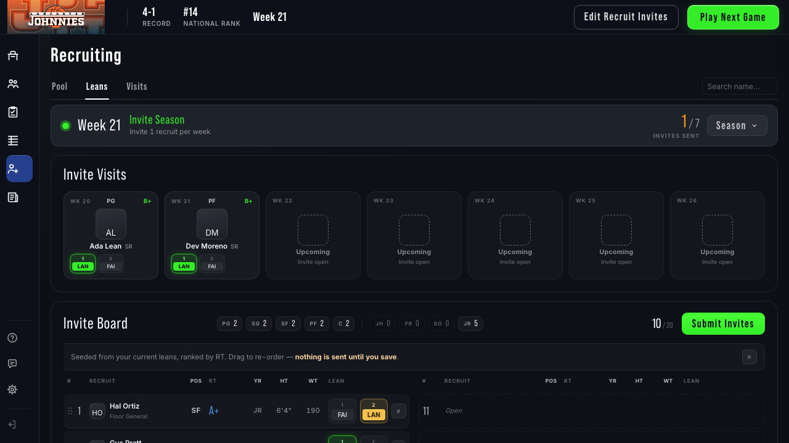
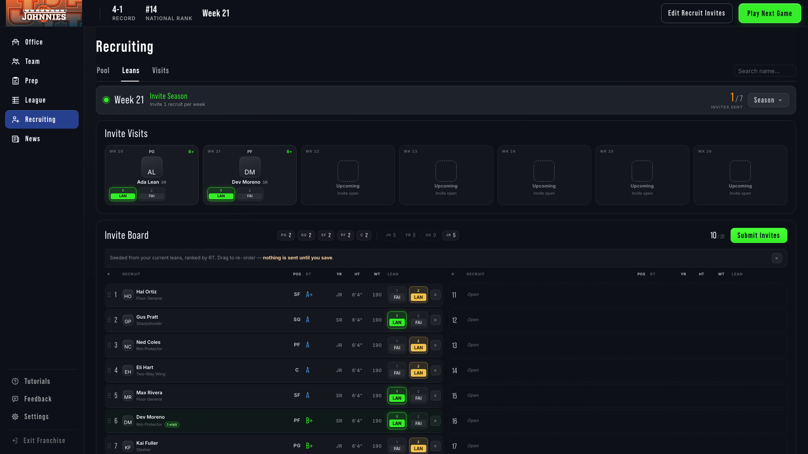

# Remove "This Week's Results" from the invite-season hub — 2026-09-28

Branch `ux/recruit-hide-week-results` (from `origin/develop` a8eac84ce), worktree `~/gob-stats`. Commit **`2d330a786`**.

## Result

The Recruiting Hub no longer renders the weekly visit-results panel in any week. In weeks 20–26 the page now reads, top to bottom:

1. The Week N · Invite Season status bar.
2. Invite Visits.
3. The Invite Board.
4. The pool.

The panel also no longer triggers its extra request to `/franchise/recruiting-results`. The status bar, Invite Visits, Invite Board and everything below it are unchanged. No backend route or payload was touched.





These are the Leans tab in the week-21 processed state: `current_results_week === week`, a week-21 visit landed and one new lean. Before this change, that state is exactly when the panel showed.

## Removed

| What | Where | Why it could go |
|---|---|---|
| `showWeeklyPanel()` | `recruiting-hub.js` | The gate itself. |
| `weeklyPanelHtml()` | `recruiting-hub.js` | The panel: "Week N · Visits processed / This Week's Results", Your visit, What it changed, the contested-region rows. |
| `loadWeeklyPanel()`, including its `GET /franchise/recruiting-results?week=N` fetch | `recruiting-hub.js` | The only frontend caller of that route; it fetched the region → conference → team visit tree for the panel alone. |
| `dismissWeekly()` and the `#weekly-dismiss` hookup | `recruiting-hub.js` | Dismiss handler for the panel. The panel no longer rendered a dismiss button, so this was already unreachable. |
| `state.visitTree`, `state.weeklyDismissed` | `recruiting-hub.js` state | Written and read only by the functions above. |
| `state.currentResultsWeek` and its assignment from `data.current_results_week` | `recruiting-hub.js` | Read only by `showWeeklyPanel()`. The payload field itself is untouched on the backend. |
| `#hub-weekly` mount in `shellBodyHtml()` and its call in `renderShell()` | `recruiting-hub.js` | Panel host. It sat **outside** the column, so removing it adds no leftover margin. |
| `.wpanel*`, `.whero*`, `.wvisit*`, `.wmeta*`, `.wregion*`, `.wvrow*` rules, plus their two `@media (max-width:1080px)` overrides | `recruiting-results-hub.css` | Used by no other markup (grep across `FrontEnd/`). `recruiting-spine.css` and `recruiting.css` had no panel rules. |

Net: 127 lines deleted, no new code in the hub.

## Kept, and why

| What | Why |
|---|---|
| `state.newLeanIds` / `new_lean_recruit_ids` | Drives the pool's "New" flag and the passive-phase story's gains list. |
| `ARROW_UP`, `DOT_SVG` | Story items and the preflight warnings. |
| `INVITE_WEEKS` | The status bar's N/7 invites-sent count and the Invite Visits preview. |
| `REGION_ORDER`, `regionOf` | Pool filters, grouping and the board. |
| `Spine.Lean.deriveAbbr` | Lives in `recruiting-spine.js` and is used by the lean ladders. |
| `/franchise/recruiting-results` in `gobStore.js` `BROWSE_PREFIXES` | A generic cache-prefix list for browse GETs, not a fetch. It is inert now that nothing calls the route, but the route still exists, so the entry stays with it. |
| The `/franchise/recruiting-results` backend route and `current_results_week` in `/franchise/recruiting-data` | Out of bounds (no backend route or payload changes). |
| `.res-switch` and the Week-36 `.sign*` rules in `recruiting-results-hub.css`, and the file's `<link>` in `recruiting.html` | Week-36 final signings still use the file. `.res-switch` has no markup today, but it was never part of the weekly panel, so it is left alone. |
| Invite Visits calendar (`visitCalendarHtml`, `visit_history`), status bar (`Spine.Phase.stripHtml`), Invite Board (`renderDock`) and pool | Untouched, as required. |

## Spacing (no gap)

The panel's mount came before `columnHtml(...)`, which is the one wrapper for Invite Visits, the board and the pool. With it gone, a processed week produces the same markup as an unprocessed one. Invite Visits sits under the status bar with the column's normal `padding-top:14px` and the standard 14px section gap.

The new e2e test measures the status-bar-bottom → Invite Visits top distance in both states and requires them to match within 0.5px. It passes.

## Tests and specs

`tests/e2e/recruiting-tabs.spec.js` was the only test that asserted the panel (grep across `tests/` for `hub-weekly`, `current_results_week`, `recruiting-results`, `This Week`, `Visits processed`, `wpanel`).

- Its three `#hub-weekly` `toBeVisible()` checks in the week-22 Pool / Leans / Visits test now assert `toHaveCount(0)`. The rest of that test's coverage (tabs, URL, calendar, board, pool, masks, screenshots) is unchanged.
- New test, **"a processed invite week has no results panel and no gap above the visits"**, runs week 21 with visits processed on a 14-recruit mixed pool and checks:
  - the status bar still shows Invite Season, "Invite 1 recruit per week", `1 / 7`, "Invites sent" and the Season button;
  - there is no `#hub-weekly`, no "This Week's Results" and no "Visits processed";
  - Invite Visits, the board and the pool are visible;
  - the spacing matches the unprocessed week;
  - no request to `/franchise/recruiting-results` is made across Leans, Pool and Visits.

  It also writes the two screenshots above.

**Scope run.** Recruiting-related only, `--workers=1`, port **8157**. Playwright started its own `seed_and_serve` and stopped it afterwards, and 8157 was free once the run finished. The one other `seed_and_serve` on the machine belongs to `~/gob-audit` on 8010 and was not touched.

| Suite | Files | Result |
|---|---|---|
| Playwright | `fcc-invite-step`, `fcc-recruiting-buttons`, `fcc-recruiting-layout`, `invite-board-layout`, `invite-board`, `invite-seed-modal`, `invite-visit-calendar`, `recruit-visit-modal`, `recruiting-button-state`, `recruiting-draft`, `recruiting-tabs`, `recruits-pool`, `training-report-no-recruiting`, `signing-day`, `signing-day-hub`, `signing-reveal` | **252 passed** |
| pytest (mongomock) | `test_player_detail_recruit_background`, `test_recruit_archetypes`, `test_recruit_detail_endpoint`, `test_recruit_manager`, `test_recruiting_lean_events`, `test_recruiting_report_news`, `test_recruiting_watchlist`, `test_recruiting_week36`, `test_recruiting_wire_payload`, `test_season_recruiting_reset`, `test_weekly_recruiting_training_flow` | **122 passed, 3 xfailed**. All three are pre-listed in `tests/known_failures.py` (two stale recruit IDs, one broken harness). |

- The full suite was not run, as instructed.
- `recruiting-tabs.spec.js` regenerates its own `reports/recruiting-tabs/*.png` every run. I reverted those 14 images; they are not part of the commit.

## Docs

- `_documentation_master/04_Franchise_Mode_Systems/Recruiting_System.md`: notes that no page reads `/franchise/recruiting-results` now, and that invite weeks show visits through the Invite Visits calendar only.
- `_documentation_master/projects/Recruiting_Hub_Redesign/recruiting_hub_implementation_spec.md`: the weekly-visit panel entry is marked removed (2026-09-28), keeping the as-built description for history.

## Not touched

- No backend route or payload.
- No Prep files (training, game plan, playbooks), minutes code, sim engine, `cpu_week_pool`, `sim_rng` or finalize.
- Not committed: `.DS_Store`, `FrontEnd/static/sounds/`, or any other report images.

## Commit

`2d330a786` Drop the This Week's Results panel so Invite Visits sits under the invite-season strip. This report is committed on top of it.

## Full suite before merge (2026-09-28)

**Merge.** `git fetch origin` then `git merge origin/develop`: already up to date. `origin/develop` is still `a8eac84ce`, the commit this branch was cut from, so no merge commit was needed and nothing had to be reconciled.

**Command.** UX_System §8, "Running the suite": one worker, `CI` unset (retries 0), port 8157. This worktree has no `.venv` or `node_modules`, so the Python and Playwright paths point at `~/gob-simplified`:

```
env -u CI PORT=8157 BASE_URL=http://localhost:8157 PLAYWRIGHT_BROWSERS_PATH="$HOME/Library/Caches/ms-playwright" PYTHON_PATH="$HOME/gob-simplified/venv/bin/python" NODE_PATH="$HOME/gob-simplified/node_modules" ~/gob-simplified/node_modules/.bin/playwright test tests/e2e --workers=1 --reporter=line
```

**Result.** **502 passed, 0 failed, 0 flaky, 0 skipped** in 7.4 min; exit 0. As the default config specifies, `desktop-*.spec.js` is excluded; this change doesn't touch the desktop play flow.

**Server.** Playwright's `seed_and_serve` on 8157 exited with the run, and port 8157 was free afterwards. The only other `seed_and_serve` running was `~/gob-ux`'s, which I left alone.

**Regenerated artifacts: not committed.** The suite rewrote 67 tracked images under `reports/`, including `reports/recruiting-tabs/*.png` and this report's own two screenshots. I restored all of them with `git checkout -- reports`. It also created nine untracked folders of fresh output: `app-router`, `court-sound`, `game-start-frames`, `office-frontend`, `office-v3c`, `shell-1`, `shell-1b`, `shell-2`, `shell-2b` (186 png, 3 json, 6 txt, all written during this run). I deleted those.

**Doc fix.** `_documentation_master/11_Design_Systems/UX_System.md` §7 still said invite weeks show "the weekly results panel" on Pool and Visits. §8 item 10 requires the doc to match what shipped, so it now says the calendar sits directly under the phase strip and that there is no weekly results panel. It is committed with this section.

STATUS: COMPLETE
