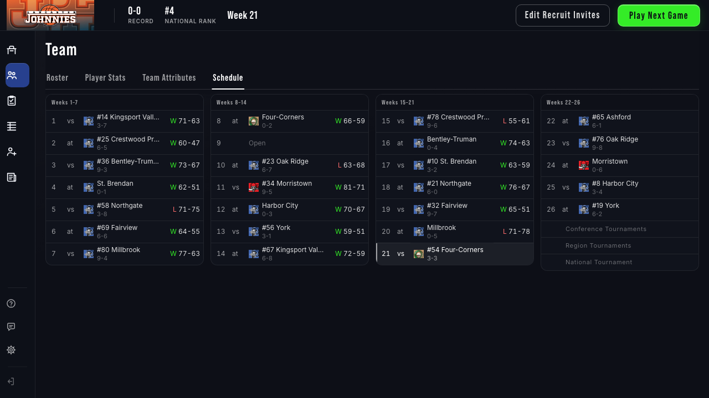
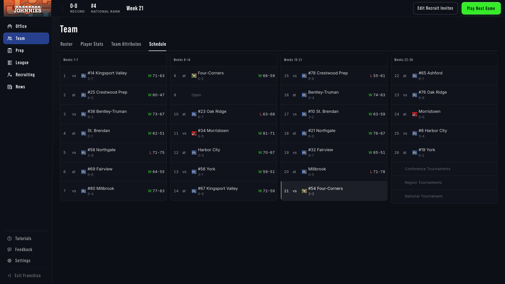
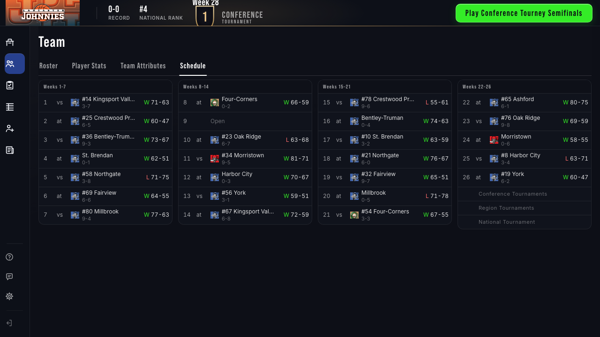
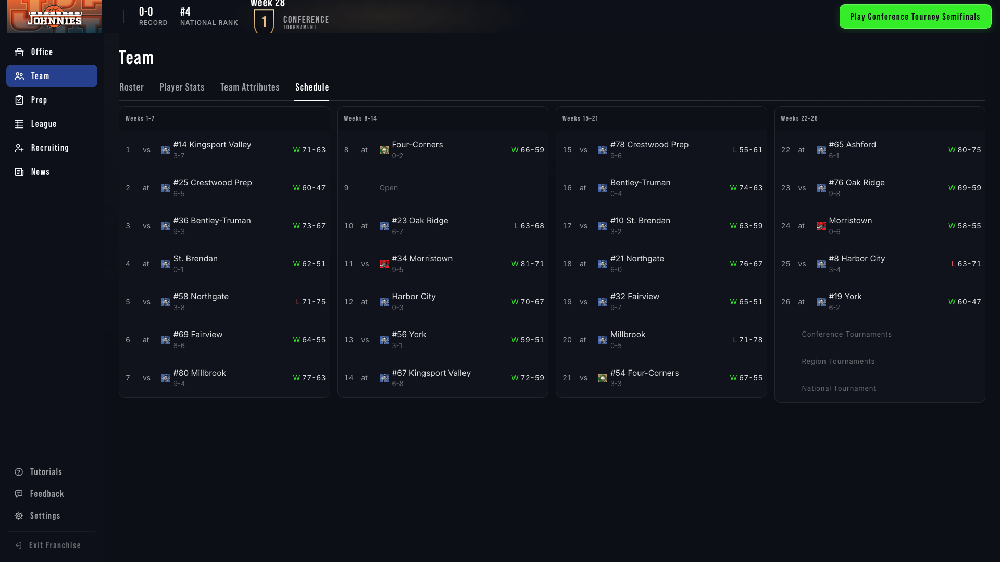
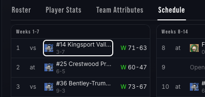
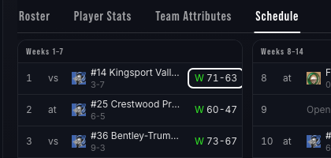
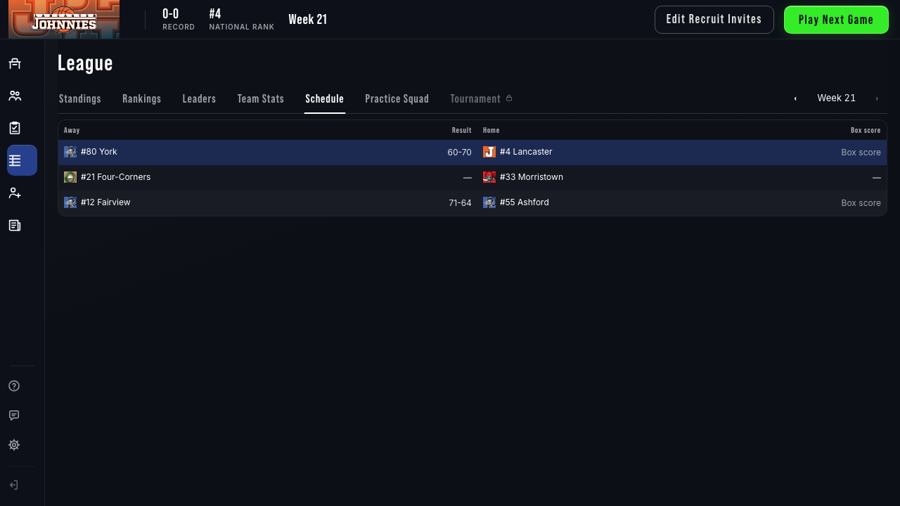
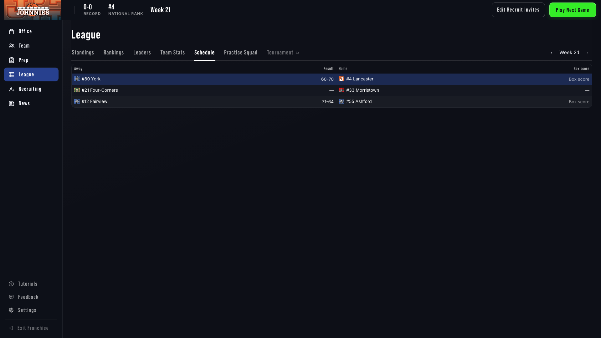

# Team › Schedule in four week columns — 2026-09-28

Branch `ux/team-schedule-columns` (from `origin/develop` 9b35faedc), worktree `~/gob-stats`. Commit **`cffc45a9d`**.

## Result

Team › Schedule is back to the old FCC structure: four equal columns, Weeks 1–7 · 8–14 · 15–21 · 22–26, with the three tournament rows under 22–26. It is restyled with the browse-template T1 table: the table card, a quiet column head, hairline row dividers and luminance-only ink. The whole regular season plus the tournament rows fit 1280×720 with nothing below the fold (tested: the lowest column bottom is within the viewport, and `.main` has no vertical scroll). At 1920 it stays four columns with taller rows and a larger name size. Below 1100px wide it drops to two columns.

**Week 21** (20 played, the current week, 5 upcoming, a week-9 bye):





**Week 28** (tournament; all 26 regular-season games played):





**Keyboard focus** on an opponent link and on a result link:

 

## What changed

**`FrontEnd/static/js/shared/views/teamScheduleView.js`** (formatting only; same route, same payload, same data flow):

- `COLUMNS` defines the four week ranges. `columnHtml()` renders each as `section.gob-tcard.gob-schcol > table.gob-tbl.gob-schwk`, with a one-cell quiet head ("Weeks 1–7" etc.) and a `colgroup` for the fixed short columns.
- Each row is Wk · site (`vs` / `at`) · team logo, or the monogram fallback, via the existing `GOBTables.markHtml`, plus "#rank Opponent" with `W-L` on a quieter second line · result. The name has a `title` with the full text, because long names ellipsize at 1280.
- **Result:** "W 75-65" / "L 54-63" with the existing `.gob-wl up/dn` letter. When the row has a `game_id`, the whole result is `a.gob-res`, pointing at the same `box-score.html?game_id=…&mode=franchise&franchise_id=…&team_id=…` the old Box score link used. The separate Box score column is gone.
- **Future games** (`next_game`, `upcoming`) have an empty result cell. The old "Next" text is removed, and no time is shown (decision 29).
- A bye week is an `is-open` row reading "Open", with no site and no result. The old em-dash fillers are gone.
- The opponent is still `a.gob-team[data-gob-drill]` and pushes `team-view` through `GOBViews.open(…, 'push')`, as before.
- **Current week:** the `next_game` row keeps `tr.is-next`, the same source as before.

**`FrontEnd/static/css/gob-tables.css`**:

- **New scoped block `#team-schedule-view .gob-schcols / .gob-schwk`.** It uses tokens only: `--dsp-*`/`--dsz-*` density sizes, `--text-100/87/60/38` ink, `--line` hairlines, and `--white-5/7` luminance fills.
  - The column head uses the T1 header surface, `--text-60` ink and a hairline underneath. Rows have a hairline between them and no zebra.
  - Result link hover: a `--white-7` fill with `--text-100` ink.
  - Result and opponent links on `:focus-visible` get `outline: 2px solid var(--text-100)`, the handoff's ring.
  - **Current week:** a `--white-5` row tint, `--text-100` ink, and a 2px `--text-60` inset marker on the week cell. It is neutral (not navy, green or orange) and checked in the spec.
  - At `html.gob-shell.gob-1920`, rows are 65px (44+21) and the name is `--fs-13`, so they breathe. `@media (max-width: 1099px)` sets two columns.
  - Selectors carry `#team-schedule-view` plus an extra class where needed, to outrank the generic FCC `#franchise-container .tab-content td / th / tr:hover / tr:nth-child(odd)` rules. Those had been overriding ink and fills.
- **Removed `#team-schedule-view` from the rules it shared with League › Schedule** (`.gob-sched` width, `th/td.team`, `th/td.num`, `th/td.box`, `a.gob-box`, `a.gob-box:hover`, `.sub`). I also deleted the team-only single-table rules: `.gob-id`, `tr.is-next td`, and the `th/td.wk`/`th/td.site` widths. No league declaration was edited, and the old `fcc-schedule` CSS was not revived.

**Docs:** `_documentation_master/11_Design_Systems/UX_System.md`. The section-map row and the module-view paragraph now describe four columns and the result-as-link row, not the single table.

## League › Schedule unchanged

The shared CSS changed, so I proved the league view is unchanged in two ways, at 1280 and 1920, using the same fixture both times.

1. **Computed styles.** The spec captured the computed style of every node in `#league-schedule-view` (46 nodes; colour, background, font, spacing, size, border, alignment, decoration, shadow, outline, display, position, top, white-space). I ran it once with `origin/develop`'s `gob-tables.css` swapped in and once with this branch's. **0 differing nodes at 1280 and at 1920.**
2. **Screenshots.** Before (develop CSS) and after:

| Before | After |
|---|---|
|  |  |
|  |  |

At 1280 the two screenshots were pixel-identical. At 1920 one pixel differed, at (184, 219): `rgb(34,47,82)` vs `rgb(36,48,83)`. Screenshots aren't a stable proof on their own: two back-to-back runs of the same code also differed in the top bar and row area. That is why the computed-style comparison above is the proof.

`leagueScheduleView.js` was not touched.

## Weeks ≥ 27 and tournament games

**What the view did before.** It always drew weeks 1–26 from `results`, `next_game` and `upcoming`, then three fixed label rows: "Conference Tournaments", "Region Tournaments", "National Tournament", with dashes in every other cell. It never listed tournament games.

**What the payload carries.** `build_team_detail` (`BackEnd/utils/t3_detail.py`) builds `results` from every `franchise.results` week. EOS games are written to `results.{27..34}` (for example, `_eos_sync_missing_result_rows_from_games_for_week`). So once tournament games are played, `results` can contain the user's week-27+ games. I read that from the code; I did not see it in a real save, since none on this machine is past week 26. The old view silently dropped them, because it only looped weeks 1–26.

**What I did.** I kept today's data behaviour. The grid shows weeks 1–26, and the same three tournament labels appear as extra rows under Weeks 22–26, as in the old FCC layout. The labels have no dashes, but otherwise nothing is added. From week 27 on there is no `next_game` in the regular season, so no row gets the current-week emphasis. The week-28 spec feeds two week-27/28 tournament results and asserts that the grid still has exactly 26 week rows.

Listing the actual tournament games under those labels would be a data-behaviour change, so I left it for a follow-up decision. `results` has no field saying which round a game is (`tournament_context`, the round label); the league route has one, this one does not. Rows could only be placed by week number, which comes close to deriving a field.

## Tests

**Updated `tests/e2e/schedule-views.spec.js`.** "both schedule tabs open from the row" now expects:

- four `.gob-schcol`s;
- the `is-next` row showing the opponent, with an empty result (previously the text "Next");
- the week-1 result link `a.gob-res` reading `W 70-60` and pointing at `box-score.html?game_id=g-team` (previously the `.gob-box` "Box score" link).

The skeleton/error-retry test now waits for the next row's opponent instead of "Next". Its other checks (opponent push and scroll restore, no sideways scroll, and all league-schedule assertions) are unchanged.

**New `tests/e2e/team-schedule-columns.spec.js`** (10 tests):

- **Four equal columns at 1280 and at 1920:** same top, widths within 1.5px, heads, week ranges, tournament rows, bottom ≤ viewport, no `.main` scroll, no sideways scroll, no Box score column. Saves the week-21 screenshots.
- **Week 28 at 1280 and at 1920:** 22–26 plus the tournament rows, 26 week rows, no current-week row, week 26 has a result link, fits the viewport. Saves the week-28 screenshots.
- **Row content:** vs/at, logo or monogram, "#rank Name" (the name alone when unranked, rank 999), record line, the result text and exact box-score href, the W/L class, the bye row, and empty future results.
- **Current week:** exactly one row (week 21), neutral background and ink, a marker present, brighter week and name ink than a normal row.
- **Keyboard:**
  - all 19 result links and 25 opponent links are tabbable (`tabIndex` 0);
  - Tab from the opponent reaches the result, and Shift+Tab goes back;
  - both show a solid 2px ring;
  - result hover has a fill;
  - Enter on the opponent pushes `team-view` with `return_tab=team-schedule-view`.
- **At 1024px:** two columns by two rows, no sideways scroll.
- **League schedule reference at 1280 and at 1920:** the screenshots and computed-style dump above.

**Targeted run.** Schedule specs, plus every spec that visits `team-schedule-view` or references League › Schedule, since the shared CSS changed. `--workers=1`, port 8157, `CI` unset:

| Specs | Result |
|---|---|
| `schedule-views`, `team-schedule-columns`, `shell-1`, `shell-1b`, `store-client`, `t1-tables`, `app-router`, `office-frontend`, `shell-2` | **76 passed, 1 skipped.** The skip is `shell-1`'s "office before and after at both sizes", which that spec skips itself. |

**Full suite: not run.** Right after the targeted run, `ps` showed another agent's Playwright in progress: `~/gob-audit`, `playwright test tests/e2e/practice-squad-view.spec.js` on port 8010 (PIDs 57771/57777, with its `seed_and_serve` 57793). As instructed, I stopped there. The full suite still needs to run before merge.

**Server.** Playwright's `seed_and_serve` on 8157 exited with each run; port 8157 was free at the end.

**Regenerated images.** The targeted run rewrote tracked images I did not intend to change. I restored `reports/office-tweaks-4/*.png` and `reports/t1-tables/*` (including `timings.txt`) with `git checkout`. I deleted the new untracked output folders `reports/app-router`, `office-frontend`, `office-v3c`, `shell-1`, `shell-1b`, `shell-2` and `shell-2b`. Only `reports/team-schedule-columns/` is committed. `.DS_Store` and `FrontEnd/static/sounds/` were not touched.

## Not changed

- No backend route or payload. Every value shown comes from `GET /franchise/team-detail` as it was, and no field is derived.
- `leagueScheduleView.js`.
- The old `.fcc-schedule-grid` CSS and `buildScheduleColumnMarkup` in `franchise-command-center.js`, which is still dead code there.

## Commit

`cffc45a9d` Lay Team › Schedule out as four week columns so the whole season fits above the fold. This report is committed on top of it.

## Full suite before merge (2026-09-28)

**Playwright check.** Before starting, `ps` showed no other agent's `playwright test` or `seed_and_serve`, and I checked again immediately before launch. No wait was needed.

**Merge.** `git fetch origin`, then `git merge origin/develop`, bringing in `d3da2a517` (Merge app/prep-v2 PR1: Prep editors in the browse shell, Game Plan tracks). Merge commit: **`22af4edfa`**.

- One conflict, in `_documentation_master/11_Design_Systems/UX_System.md` §7's section-map table. The branch had changed the Team › Schedule row, and develop had changed the four Prep rows next to it. I kept this branch's Team › Schedule row and develop's Prep rows.
- Nothing else conflicted. Develop's changes don't touch `gob-tables.css`, `teamScheduleView.js` or either schedule spec.

**Command.** UX_System §8, "Running the suite": one worker, `CI` unset (retries 0), port 8157, with this worktree's Python and Playwright paths pointed at `~/gob-simplified`:

```
env -u CI PORT=8157 BASE_URL=http://localhost:8157 PLAYWRIGHT_BROWSERS_PATH="$HOME/Library/Caches/ms-playwright" PYTHON_PATH="$HOME/gob-simplified/venv/bin/python" NODE_PATH="$HOME/gob-simplified/node_modules" ~/gob-simplified/node_modules/.bin/playwright test tests/e2e --workers=1 --reporter=line
```

**Result.** **513 passed, 0 failed, 0 flaky, 2 skipped** in 7.5 min; exit 0.

- Both skips are environment-gated in their own specs, not failures:
  - `t3-detail.spec.js:633` skips when the offline loopback isn't running.
  - `office-frontend.spec.js:693` skips when there's no live digest dump.
- `desktop-*.spec.js` is excluded by the default config, and this change doesn't touch the desktop play flow.

**Server.** Playwright's `seed_and_serve` on 8157 exited with the run. Afterwards port 8157 was free, and no `playwright test` or `seed_and_serve` process was left.

**Regenerated artifacts: not committed.** The suite rewrote 65 tracked files under `reports/`, including this change's `reports/team-schedule-columns/*.png`. I restored all of them to their committed versions with `git checkout -- reports`. It also created nine untracked folders of fresh output, which I deleted: `app-router`, `court-sound`, `game-start-frames`, `office-frontend`, `office-v3c`, `shell-1`, `shell-1b`, `shell-2`, `shell-2b`. The working tree was clean before this report edit.

STATUS: COMPLETE
